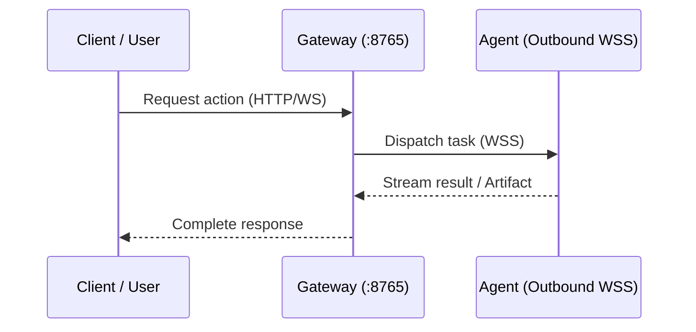

# RACP Documentation Standards & Governance

This skill provides step-by-step standards, directory architectures, templates, and lifecycle policies for technical documentation across the RACP repository.

---

## 1. Documentation Principles

1. **Single Source of Truth (SSOT)**: Each topic, architecture decision, or status update has one authoritative document.
2. **Anti-Bloat & Aggregation**: Do **not** create transient milestone or phase result files (`phase-*-result.md`, `core-*-result.md`). All milestone completions, test numbers, and verification evidence MUST be aggregated into `docs/quality/implementation-status.md`.
3. **Structured & Navigable**: Every technical document must include a standardized metadata block, table of contents (for documents > 50 lines), visual diagrams (Mermaid) where applicable, and bidirectional reference links.
4. **Resilient Linking**: Use relative markdown links between docs. Never break existing contract schemas in `docs/protocol/`.

---

## 2. Directory Architecture

All documentation resides under the `docs/` root with explicit domain segregation:

```
docs/
├── README.md                      # Documentation Hub & Central Index
├── spec/                          # System Architecture & Engineering Specifications
│   ├── README.md                  # Specifications Directory Index
│   ├── racp-specification-v1.1.md # Master Technical Specification v1.1
│   └── windows-engineering-plan.md# Windows Engineering & Verification Plan v1.0
├── guides/                        # Operational, Deployment & User Guides
│   ├── README.md                  # Guides Directory Index
│   ├── desktop-client-guide.md    # Cross-Platform Desktop Client User Manual
│   ├── pc-connect-guide.md        # Device Enrollment & Setup Guide
│   ├── named-workspaces-guide.md  # Multi-Workspace Isolation & Permissions Guide
│   ├── background-agent-guide.md  # User Background Agent Lifecycle Guide
│   ├── two-pc-lab-guide.md        # Two-PC Physical Lab Verification Guide
│   └── remote-mcp-oauth-setup.md  # Remote MCP & OAuth/OIDC Configuration Guide
├── quality/                       # QA, Verification Matrices & Implementation Status
│   ├── README.md                  # Quality Directory Index
│   ├── implementation-status.md   # Unified Implementation & Verification Matrix (SSOT)
│   ├── compatibility.md           # Runtime & Platform Compatibility Matrix
│   └── windows-release-gates.md   # Windows Release Acceptance Gates
├── adr/                           # Architecture Decision Records
│   ├── README.md                  # ADR Index & Decision Registry
│   ├── ADR-0001-bootstrap-and-verification.md
│   └── ... (ADR-0001 through ADR-0029)
└── protocol/                      # Protocol Contracts & JSON Schemas
    ├── README.md                  # Protocol Schema & OpenAPI Overview
    ├── agent-protocol-v1.schema.json
    ├── console-openapi-v1.json
    └── ... (JSON Schemas - immutable paths required by tests)
```

---

## 3. File Naming Conventions

- **General Documents & Guides**: Lowercase `kebab-case.md` (e.g., `desktop-client-guide.md`, `windows-engineering-plan.md`).
- **Architecture Decision Records**: Uppercase prefix with 4-digit sequence: `ADR-XXXX-topic-name.md` (e.g., `ADR-0028-connection-file-onboarding.md`).
- **Directory Index Files**: `README.md` inside each subfolder.
- **Protocol Schemas**: `*-v{N}.schema.json` or `*-v{N}.json`.

---

## 4. Standard Document Template

All markdown documents (excluding raw JSON schemas) must adhere to the standard template structure:

```markdown
# [Document Title]

> **Document ID**: `DOC-[CATEGORY]-[CODE]`  
> **Status**: [Active | Draft | Superseded | Deprecated] · **Target Version**: v0.1.8  
> **Last Updated**: YYYY-MM-DD · **Classification**: [Architecture Specification | User Guide | Quality Assurance | Architecture Decision Record]

---

## Executive Summary / Overview

[Brief summary of what this document covers, its goals, and key highlights.]

---

## Table of Contents

- [1. Section Title](#1-section-title)
- [2. Next Section](#2-next-section)
- [3. Security & Safety Considerations](#3-security--safety-considerations)
- [4. Related Documents](#4-related-documents)

---

## 1. Section Title

[Structured content with clear H2/H3 hierarchies, tables, and callouts.]

> [!NOTE]
> Contextual information or operational notes.

> [!IMPORTANT]
> Critical configuration parameters or mandatory security rules.

> [!WARNING]
> Breaking changes or operational hazards.

### System Workflow / Architecture Diagram



---

## 2. Next Section

[Code snippets with explicit language identifiers: `bash`, `powershell`, `python`, `json`, `typescript`.]

```powershell
uv run --package racp-agent racp-connect --gateway https://gateway.example:8765
```

---

## 3. Security & Safety Considerations

- Identity isolation and token TTL guarantees.
- Idempotency key requirements for mutation operations.
- Principle of least privilege (default read-only).

---

## 4. Related Documents

- [Master Specification](../../../docs/spec/racp-specification-v1.1.md)
- [Implementation Status](../../../docs/quality/implementation-status.md)
- [ADR Index](../../../docs/adr/README.md)
```

---

## 5. Document Lifecycle & Anti-Bloat Policy

### 5.1 No Transient Result Files
- Agents and contributors must **never** create one-off milestone completion files like `phase-X-result.md` or `test-result-*.md`.
- All test counts, execution logs, passing/skipping gates, and hardware test proofs must be appended or updated directly in `docs/quality/implementation-status.md`.

### 5.2 Deprecation & Superseding
- When a plan or specification is revised, mark its status as `Superseded` in the metadata block and link to the replacement document.
- Delete temporary notes or scratch reviews that have been fully absorbed into core specifications.

---

## 6. Pre-Commit Documentation Checklist

Before completing documentation work:
1. [ ] **Folder Structure**: File is located in the appropriate subfolder (`spec/`, `guides/`, `quality/`, `adr/`, `protocol/`).
2. [ ] **Metadata Block**: Standard metadata header (Document ID, Status, Target Version, Last Updated, Classification) is present.
3. [ ] **Table of Contents**: Present for documents longer than 50 lines.
4. [ ] **Link Verification**: All relative markdown links point to existing valid files.
5. [ ] **Code Blocks**: Every code block specifies an explicit syntax language (`powershell`, `bash`, `json`, etc.).
6. [ ] **Protocol Schema Integrity**: Ensure no JSON schema files under `docs/protocol/` were moved or renamed without updating contract tests.
