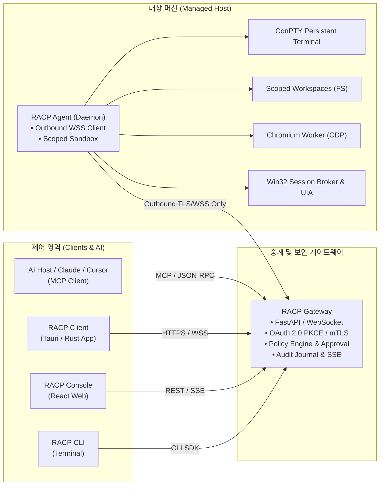

<div align="center">

# Remote Desktop Commander
### Remote AI Control Platform (RACP)

**AI 어시스턴트와 엔지니어를 위한 안전하고 통제된 원격 PC 제어·실행 인프라**

[](LICENSE)
[](pyproject.toml)
[](Cargo.toml)
[](apps/client/src-tauri)
[](docs/protocol)
[%20%7C%20Linux%20%7C%20macOS-222222.svg?style=flat-square)](docs/quality/compatibility.md)


<p align="center">
  <a href="#주요-특징">주요 특징</a> •
  <a href="#시스템-아키텍처">아키텍처</a> •
  <a href="#빠른-시작">빠른 시작</a> •
  <a href="#보안-및-권한-모델">보안 모델</a> •
  <a href="#컴포넌트-구성">컴포넌트 구성</a> •
  <a href="#문서">문서</a>
</p>

</div>

---

## 개요

<strong>Remote Desktop Commander (RACP)</strong>는 대규모 언어 모델(LLM) 기반 AI 어시스턴트(Claude Desktop, Cursor, 자체 AI 호스트 등)와 인간 운영자가 방화벽 너머의 원격 PC를 안전하게 조작할 수 있도록 중계하는 원격 실행 오케스트레이션 플랫폼입니다.

기존 원격 제어 도구와 달리, 인바운드 포트 개방 없이 <strong>역방향 보안 웹소켓(Outbound-only WSS)</strong>을 통해 연결되며, <strong>디렉터리 스코프 격리(Scoped Workspaces)</strong>와 <strong>사전 정책 승인(Approval Gate)</strong>, <strong>전수 감사 추적(Audit Trail)</strong>을 통해 제로 트러스트(Zero-Trust) 수준의 통제력을 제공합니다.

> [!NOTE]
> 본 프로젝트는 현재 **v0.1.x** 개발 및 검증 단계입니다. v0.1.21 클라이언트는 Rust/Tauri로 전환했습니다. Windows 네이티브 패키징은 성공했으며 현재 사용자 요청으로 실행 테스트와 인수 시험은 보류합니다.

---

## 주요 특징

| 분류 | 핵심 기능 | 설명 |
|---|---|---|
| **통합 프로토콜** | **Model Context Protocol (MCP)** | Claude Desktop, Cursor 등 표준 MCP 지원 클라이언트와 즉시 연동 |
| **네트워크 보안** | **Outbound-only WSS Reverse Tunnel** | 공유기 포트포워딩이나 공인 IP 노출 없이 게이트웨이로 역방향 보안 세션 수립 |
| **파일 격리** | **Named Scoped Workspaces** | 임의 파일시스템 접근 차단. 인가된 폴더 경로(최대 15개) 내 작업만 허용 |
| **터미널 제어** | **ConPTY 기반 영속 터미널** | 세션 단절 복구, 스트림 크레딧 제어, 백그라운드 작업 관리를 지원하는 가상 PTY |
| **브라우저 제어** | **격리된 Chromium 자동화** | 독립 프로필 및 핸들 기반 Chromium 브라우저/페이지 탐색, 폼 입력, 스크린샷 캡처 |
| **데스크톱 제어** | **Win32 세션 브로커 & UIA** | 활성 사용자 세션 화면 캡처, 안전 입력 시뮬레이션, 프로세스 메모리 검사 |
| **거버넌스** | **Policy Engine & Approval Gate** | 파괴적 명령 실행 전 사용자 승인 인터셉트 및 SHA-256 기반 변경 저널 기록 |

---

## 시스템 아키텍처

RACP는 **클라이언트-게이트웨이-에이전트** 분리 구조를 채택하여 원격 머신의 신뢰 경계를 명확하게 보호합니다.



### 아키텍처 핵심 원칙
- **Agent는 수신 포트를 열지 않습니다**: 방화벽을 뚫고 들어오는 인바운드 공격 표면을 원천 차단합니다.
- **다단계 인가 파이프라인**: Gateway 정책 검사와 Agent 로컬 샌드박스 정책을 모두 통과한 요청만 실행됩니다.
- **상태 보존 및 비재실행 보장**: 고유 idempotency key 및 epoch 기반 재연결 설계를 통해 네트워크 단절 시에도 중복 명령 실행을 방지합니다.

---

## 컴포넌트 구성

본 저장소는 `cargo` (Rust), `uv` (서버 Python) 및 `pnpm` (React/빌드) 기반의 모노레포로 구성되어 있습니다.

```
Remote-Desktop-Commander/
├── apps/
│   ├── gateway/         # 중앙 오케스트레이션 및 정책 게이트웨이 (FastAPI, MCP Server)
│   ├── agent-rust/      # 대상 PC 네이티브 Agent/Broker/Guardian (Rust, Win32)
│   ├── client/          # 크로스 플랫폼 데스크톱 UI (Tauri, Rust, React 19, TypeScript)
│   ├── console/         # 디바이스 관리 및 실시간 승인 웹 콘솔 (React 19, TanStack Query)
│   └── cli/             # 관리자용 통합 커맨드라인 인터페이스 (racp)
├── crates/              # Rust protocol, protected state, providers, runtime
├── packages/
│   ├── domain/          # 도메인 모델, 엔터티, 불변 규칙 정의
│   ├── protocol/        # WebSocket 프레임, JSON-RPC, MCP 규약 스키마
│   ├── policy/          # RBAC/ABAC 권한 평가 엔진 및 경로 검증기
│   ├── observability/   # 감사 로그(Audit Trail), 저널링, 이벤트 스트림
│   └── sdk/             # 외부 애플리케이션 통합용 Python 클라이언트 SDK
└── docs/                # 아키텍처 결정 레코드(ADR) 및 모듈별 기술 문서
```

---

## 빠른 시작

### 시스템 요구사항
- **Python**: Gateway/CLI 개발에 3.12.x (대상 PC의 클라이언트에는 불필요)
- **패키지 매니저**: [uv](https://docs.astral.sh/uv/) (v0.12 이상 권장)
- **빌드**: Rust 1.90.0, Node 22.23.0 및 pnpm 11.19.0 (배포 클라이언트 실행에는 불필요)
- **운영체제**: Windows 10/11 x64 (네이티브 개발 빌드), Linux / macOS (설계 지원)

---

### 1. 저장소 클론 및 의존성 동기화

```powershell
git clone https://github.com/tlsdbcjs/Remote-Desktop-Commander.git
cd Remote-Desktop-Commander

# Python 가상환경 및 워크스페이스 패키지 동기화
uv sync --all-packages --frozen
```

---

### 2. 게이트웨이 초기화 및 실행

게이트웨이는 보안 자격 증명과 데이터베이스를 초기화한 후 서비스를 시작합니다.

```powershell
# 초기 설정 및 관리자 키 생성
uv run racp gateway init

# 게이트웨이 서버 실행 (개인 신뢰 모드 활성화 예시)
uv run racp-gateway --enable-trusted-personal
```

> [!TIP]
> 웹 브라우저에서 `https://localhost:8765`에 접속하여 RACP Console에 로그인할 수 있습니다.

---

### 3. 대상 PC에 Agent 연결

원격 제어 대상 PC에서 허용할 작업 폴더를 지정하고 게이트웨이에 역방향 연결합니다.

#### 방법 A. GUI 데스크톱 클라이언트 활용 (.racp 파일 방식)
1. 게이트웨이 Console에서 <strong>장치 등록</strong>을 진행하고 `.racp` 연결 설정 파일을 발급받습니다.
2. 대상 PC에서 `racp-client.exe`를 실행하고 `.racp` 파일을 선택합니다.
3. 원격 접근을 허용할 로컬 폴더(Workspaces)를 지정하고 연결을 시작합니다.

#### 방법 B. 네이티브 CLI 연결

Rust Agent의 bridge는 표준 입력 JSON으로 등록과 설정을 처리합니다. 토큰은 프로세스 인수나 셸 히스토리에 저장하지 않습니다.

```powershell
.\racp-agent.exe bridge --state-dir 'C:\RACP\agent-state'
```

실행 후 등록 JSON을 한 줄로 입력합니다. 필드와 기동/종료 명령은 [Rust Agent 가이드](docs/guides/rust-agent-guide.md)를 따릅니다.

---

### 4. AI 어시스턴트 (MCP) 연동

Anthropic Claude Desktop 등 MCP 지원 애플리케이션의 설정 파일(`claude_desktop_config.json`)에 게이트웨이 MCP 엔드포인트를 등록합니다.

```json
{
  "mcpServers": {
    "racp-commander": {
      "command": "uv",
      "args": [
        "--directory", "E:/Project/30_VS_Project/Remote-Desktop-Commander",
        "run", "racp", "mcp-proxy",
        "--gateway", "https://gateway.example:8765"
      ]
    }
  }
}
```

---

## 보안 및 권한 모델

RACP는 시스템 손상 및 비인가 접근을 차단하기 위해 3단계 실행 프로파일 체계를 적용합니다.

```
[ read_only ] ──────> [ standard ] ──────> [ trusted_personal ]
(읽기/조회 전용)        (사전 승인 워크플로우)      (신뢰 장치 전체 제어)
```

1. **`read_only` (기본값)**
   - 인가된 폴더 내 파일 읽기 및 환경 관측만 가능
   - 파일 수정, 삭제, 신규 프로세스 실행 원천 차단
2. **`standard`**
   - 인가된 폴더 내 파일 생성/수정 및 일반 CLI 명령 실행 가능
   - 시스템 위험 명령은 게이트웨이의 **사전 승인(Human-in-the-Loop)** 승인이 완료된 후 실행
3. **`trusted_personal`**
   - 개발자 본인의 전용 신뢰 머신에서 사용
   - 확장 터미널, 브라우저 조작, 데스크톱 세션 제어 등 포괄적 작업 허용

---

## 문서 및 가이드

상세한 아키텍처 및 세부 운영 가이드는 [`docs/`](docs/README.md) 디렉터리에서 확인할 수 있습니다.

- **시스템 설계 명세**: [RACP 마스터 개발정의서 v1.1](docs/spec/racp-specification-v1.1.md) · [Windows 엔지니어링 계획서](docs/spec/windows-engineering-plan.md)
- **클라이언트 가이드**: [데스크톱 클라이언트 사용 설명서](docs/guides/desktop-client-guide.md)
- **온보딩 가이드**: [PC 등록 및 에이전트 연결 절차](docs/guides/pc-connect-guide.md)
- **워크스페이스 보안**: [다중 작업 폴더 격리 가이드](docs/guides/named-workspaces-guide.md)
- **백그라운드 에이전트**: [백그라운드 에이전트 수명주기 가이드](docs/guides/background-agent-guide.md)
- **프로토콜 및 인증**: [MCP 및 OAuth/OIDC 인증 설정 가이드](docs/guides/remote-mcp-oauth-setup.md)
- **2-PC 실증 가이드**: [물리 2-PC 테스트 랩 구축 매뉴얼](docs/guides/two-pc-lab-guide.md)
- **구현 현황 (SSOT)**: [단계별 개발 현황 및 테스트 검증 매트릭스](docs/quality/implementation-status.md)
- **품질 및 호환성**: [OS 및 플랫폼 호환성 보고서](docs/quality/compatibility.md) · [Windows 릴리스 인수 게이트](docs/quality/windows-release-gates.md)
- **아키텍처 결정 레코드**: [ADR 총람 (ADR-0001 ~ ADR-0029)](docs/adr/README.md)


---

## 현재 구현 및 검증 현황

| 영역 | 상태 | 검증 내용 |
|---|:---:|---|
| **Windows 10/11 x64** | **Build** | Rust Agent 및 Tauri 설치/포터블/ZIP 패키징 성공; 현재 실행 테스트 보류 |
| **Outbound WSS / TLS** | **Verified** | mTLS 상호 인증, 일회용 토큰 기반 자동 등록, 연결 재수립 검증 |
| **MCP Integration** | **Verified** | Claude 및 외부 MCP 클라이언트 명령 중계 프로토콜 적합성 통과 |
| **Linux (Ubuntu)** | *Deferred* | 서버/CLI Python 유지; Rust 데스크톱 네이티브 빌드 보류 |
| **macOS** | *Planned* | 아키텍처 설계 완료, 네이티브 번들링 및 공증(Notarization) 파이프라인 대기 |

---

## 라이선스

이 프로젝트는 [MIT License](LICENSE)에 따라 배포됩니다.