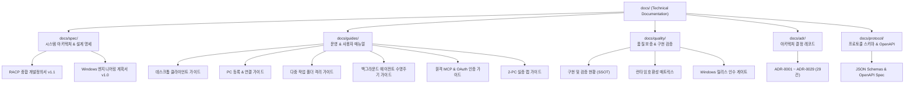

# RACP 기술 문서 포털 (Documentation Portal)

> **Document ID**: `DOC-HUB-INDEX`  
> **Status**: Active · **Target Version**: v0.1.9  
> **Last Updated**: 2026-10-07 · **Classification**: Documentation Portal & Index

---

## 목차

- [1. 개요](#1-개요-overview)
- [2. 문서 분류 및 디렉터리 안내](#2-문서-분류-및-디렉터리-안내)
- [3. 문서 작성 및 거버넌스 규칙](#3-문서-작성-및-거버넌스-규칙)

## 1. 개요 (Overview)

> [!IMPORTANT]
> **[Windows 작업 및 테스트 계획서 바로 열기](spec/windows-engineering-plan.md)** — 공식 위치는 `docs/spec/windows-engineering-plan.md`다. 이전 한글 파일 경로 대신 이 링크를 사용한다.

**Remote-Desktop-Commander (RACP - Remote Access and Control Protocol)**의 공식 기술 문서 포털입니다.  
RACP는 원격 PC(Windows / Linux / macOS)를 AI 에이전트(Codex, ChatGPT 등) 및 데스크톱 관리자가 안전하게 원격 제어, 파일 관리, 프로세스 실행, 콘솔 스트리밍, 화면 관측 및 분석할 수 있도록 설계된 엔터프라이즈급 원격 제어 프로토콜 및 런타임 플랫폼입니다.

저장소의 모든 문서는 엄격한 도메인 분류 기준에 따라 체계적으로 분리 및 관리됩니다.

---

## 2. 문서 분류 및 디렉터리 안내

### 2.1 [시스템 설계 명세 (docs/spec/)](spec/README.md)
RACP 플랫폼의 핵심 설계 원칙, 프로토콜 계약, 상태 머신, 권한 모델 및 엔지니어링 계획을 수록합니다.
- [RACP 종합 개발정의서 v1.1](spec/racp-specification-v1.1.md) (`DOC-SPEC-CORE-v1.1`): 시스템 마스터 설계서
- [Windows 작업 및 테스트 계획서](spec/windows-engineering-plan.md) (`DOC-SPEC-WIN-v1.0`): 문서 개정 1.1 / 코드 기준 v0.1.9 · 작업·시험·실제 두 PC 인수·배포 완료 기준
- [Client·Agent Rust 전환 설계안](spec/client-rust-migration.md) (`DOC-SPEC-CLIENT-RUST`, Draft): 전환 범위, 기존 기능·데이터 호환성, Python 제거 및 완료 조건

### 2.2 [운영 및 사용자 가이드 (docs/guides/)](guides/README.md)
실제 사용자 및 운영자를 위한 실전 가이드라인입니다.
- [데스크톱 클라이언트 사용 가이드](guides/desktop-client-guide.md): Electron 기반 3-OS 데스크톱 앱 운용
- [PC 등록 및 온보딩 가이드](guides/pc-connect-guide.md): 신규 장비 안전 등록, 토큰 발급, 연결 수립
- [다중 작업 폴더(Named Workspaces) 가이드](guides/named-workspaces-guide.md): 작업 폴더 권한 격리 및 경로 보안
- [백그라운드 에이전트 가이드](guides/background-agent-guide.md): `racp-agentctl` 수명주기 제어 및 데몬 관리
- [원격 MCP & OAuth 인증 가이드](guides/remote-mcp-oauth-setup.md): AI Client(Codex 등) 연동을 위한 OAuth/OIDC 및 MCP 설정
- [2-PC 실증 랩 가이드](guides/two-pc-lab-guide.md): Gateway와 원격 Agent 간 물리 네트워크 실증 환경 구성

### 2.3 [품질 보증 및 구현 현황 (docs/quality/)](quality/README.md)
릴리스 품질 검증 증거, 테스트 매트릭스 및 호환성 기준을 관리합니다.
- [RACP 구현 작업 및 검증 현황](quality/implementation-status.md) (`DOC-QA-STATUS`): 전 페이즈(Phase 0~9, 확장) 구현 및 검증 단일 진실 공급원(SSOT)
- [런타임 및 플랫폼 호환성 매트릭스](quality/compatibility.md) (`DOC-QA-COMPAT`): OS, Python, Node, 브라우저 호환성 검증 기준표
- [Windows 배포 릴리스 게이트](quality/windows-release-gates.md) (`DOC-QA-GATES`): 릴리스 필수 충족 게이트(AUTH, RPC, LIFE, DESK 등)

### 2.4 [아키텍처 결정 레코드 (docs/adr/)](adr/README.md)
RACP 개발 과정에서 합의된 기술적 의사결정 기록(총 29건)을 일관된 포맷으로 보존합니다.
- [ADR-0001: 부트스트랩 및 검증 기준](adr/ADR-0001-bootstrap-and-verification.md)부터 [ADR-0029: 로컬 설정 복구](adr/ADR-0029-local-settings-repair.md)까지 전수 수록

### 2.5 [프로토콜 계약 및 스키마 (docs/protocol/)](protocol/README.md)
엄격한 discriminated schema 및 OpenAPI 명세입니다.
- 에이전트 프로토콜 스키마 (`agent-protocol-v1.schema.json`)
- 콘솔 OpenAPI 계약 (`console-openapi-v1.json`)
- 총 21개 정규 스키마 파일 보존 (자동화 테스트 drift 검증 대상)

---

## 3. 문서 작성 및 거버넌스 규칙

RACP 프로젝트의 모든 문서는 [`.agents/skills/documentation-standards/SKILL.md`](../.agents/skills/documentation-standards/SKILL.md) 및 [`AGENTS.md`](../AGENTS.md)의 거버넌스를 준수합니다.

1. **임시 결과 파일 생성 금지**: `phase-*-result.md` 같은 일회성 파일 생성을 지양하고, 모든 테스트 및 구현 증거는 [`docs/quality/implementation-status.md`](quality/implementation-status.md)에 통합 누적합니다.
2. **표준 문서 헤더 필수**: 문서 ID, 상태, 기준 버전, 갱신일, 분류 메타데이터 블록을 문서 서두에 명시합니다.
3. **상대 링크 정합성**: 깨진 링크가 발생하지 않도록 상호 참조 링크를 최신화합니다.
