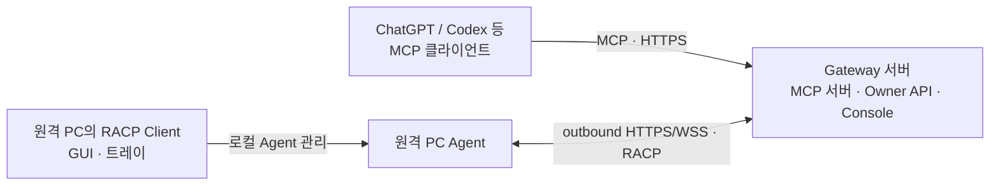

# RACP 데스크톱 클라이언트

2026-10-06 · unsigned 개발 빌드 · Windows 실제 검증 / macOS·Linux native gate 미검증

사용자의 최신 지시에 따라 Windows 배포를 우선한다. macOS/Linux 추가 빌드·인수시험은 후순위다.
Linux 컨테이너의 runtime staging/Node 3개/Python bridge 5개와 AppImage 생성까지 확인했지만,
deb는 필수 homepage metadata 누락으로 실패했고 해당 빌드 결과는 export하지 않았다.
Windows 설치 EXE/ZIP에는 이 Linux 실패가 영향을 주지 않는다.

사용자 PC에는 Node/npm/pnpm/Python을 따로 설치하지 않는다. Electron UI와 Python Agent,
의존성과 Chromium이 패키지에 포함된다. OS별 native 런타임으로 빌드해야 한다.

| OS | 배포 구성 | 현재 증거 |
|---|---|---|
| Windows x64 | NSIS 설치 EXE / ZIP과 RACP Client.exe | Windows 10에서 실행 파일·실제 등록/원격 작업/정리 확인 |
| macOS | DMG / ZIP | 구성 및 native CI 작성, 실행·서명/notarization 미검증 |
| Linux | AppImage / deb | 구성 및 Ubuntu native CI 작성, 실행·배포판 의존성 미검증 |

## 실행

현재 Windows 설치 파일은 `dist/client-desktop-0.1.7-final/RACP Client Setup 0.1.7.exe`다.
현재 포터블 배포는 `dist/client-desktop-0.1.7-final/RACP Client-0.1.7-win.zip`이다.
새 폴더에 ZIP 전체를 풀고 `RACP Client.exe`를 실행한다. 설치나 Node/Python 추가 설치가 필요 없다.
현황·최근 활동·트레이·완전 종료 기능이 포함된다. 기존 앱과 Agent는 종료한 뒤 실행한다.
등록 정보는 설치형과 동일한 Windows 사용자 AppData에 저장하므로 같은 계정에서는 재사용한다.
다른 PC로 ZIP을 복사하면 그 PC에서 별도 등록한다. credential은 Windows 사용자에 보호되어 있다.
포터블 폴더를 이동할 때 로그인 자동 시작을 사용했다면 먼저 해제하고 새 위치에서 다시 설정한다.
ZIP 교체는 installer의 자동 정리·백업을 실행하지 않으므로 교체 전에 완전 종료한다.
EXE만 단독으로 복사하면 주변 DLL/resources가 없어 실행되지 않는다.

1. Gateway Console에서 연결 파일을 발급·다운로드하고 연결할 PC에 전달한다. Client의 연결 파일 선택에서 `.racp` 파일을 선택한다.
2. 실제 사용할 기본 폴더와 추가 허용 폴더(최대 15개)를 직접 선택한다.
3. 표시된 Gateway 주소와 포함된 공개 CA를 확인한다. private CA는 Gateway의 `--client-ca-file`로 파일에 포함한다. TLS hostname 검증은 유지한다.
4. 실행 profile을 선택하고 PC 등록을 누른다. 주소·토큰·CA를 직접 입력할 필요가 없다. 파일은 1회/10분 등록 token을 포함하므로 해당 PC에만 전달하고 등록 후 삭제한다.
5. 등록 후 Agent 시작을 누르고 Gateway 연결됨을 확인한다.

직접 입력 모드에서는 이전처럼 Gateway/CA/token을 따로 입력할 수 있다.
연결 파일의 CA는 Agent 설정 폴더에 보존하므로 원본 파일을 삭제해도 다음 연결에 영향을 주지 않는다.
파일을 선택한 뒤 수정하면 등록을 거부하고 다시 선택하도록 안내한다.
[연결 파일 근거](adr/ADR-0028-connection-file-onboarding.md).

최초 한 번만 등록한다. 이후 같은 Windows 계정에서는 저장된 설정으로 현황과 Agent 시작/종료/
완전 종료를 사용한다. PC 선택과 명령 전달은 Gateway에서 수행하며 Agent가 먼저 맺은 연결을 사용한다.
Agent가 inbound 포트를 열고 Gateway가 PC를 스캔하는 방식으로 바꾸지 않았다.

0.1.4는 만료·사용·미발급 token의 거부, 인증서/연결/로컬 파일 문제를 구분하는 안내를 제공한다.
오류 뒤 등록 토큰은 화면에서 지운다. 이미 썼거나 만료된 토큰은 Gateway에서 새로 발급한다.
저장된 등록 설정을 읽을 수 없으면 새 등록 form을 표시하지 않고 상태 확인/복구 안내를 표시한다.
같은 Windows 계정인지, 이전 CA 파일/허용 폴더가 존재하는지 확인한다. credential은 삭제하지 않는다.
[최초 등록·진단 근거](adr/ADR-0027-one-time-setup-and-safe-diagnostics.md).

UI는 연결 관리 역할이다. AI/MCP client의 요청은 Gateway → outbound WSS Agent로 전달된다.
두 클라이언트가 서로 직접 peer 통신하는 구조가 아니다. 창을 닫아도 Agent는 유지된다.
Agent 종료 버튼은 관리 중 작업의 정리를 기다린다. Windows 0.1.1은 사용자가 선택한
로그인 후 Agent 연결 설정을 추가했다. 0.1.0에는 없으며 자동 업데이트는 제공하지 않는다.
Windows 0.1.1 설치 파일은 `dist/client-desktop-0.1.1-logon/RACP Client Setup 0.1.1.exe`다.
Windows 0.1.2는 현황/최근 활동과 트레이를 추가한다. 새 설치 파일은
`dist/client-desktop-0.1.2/RACP Client Setup 0.1.2.exe`다. 설치 전 기존 Agent를 종료하고 기존 앱도 닫는다.
현황에는 실제 연결 상태/작업 수/PID/최근 확인 시각과 현재 작업, 최근 40개 활동을 표시한다.
명령 인자/파일 내용/인증 정보는 활동창에 표시하지 않는다. 상태는 3초마다 확인한다.
0.1.2에서 창 닫기는 트레이로 숨긴다. 아이콘 클릭으로 창을 열고 우클릭 메뉴에서 Agent 시작/종료,
완전 종료를 사용할 수 있다. UI의 완전 종료도 Agent/관리 중 작업 정리를 확인한 뒤 앱을 닫는다.
정리를 확인할 수 없으면 오류와 앱을 유지한다. 아이콘은 연결 녹색/작업 황색/미연결 회색이다.
Windows가 아이콘을 숨김 영역에 배치하면 작업 표시줄의 위쪽 화살표에서 찾을 수 있다.
등록 후 자동 연결 checkbox를 켜거나 끌 수 있다. 기본은 꺼짐이다. 실제 OS reboot/logon은 미검증이다.
Agent 종료 버튼으로 멈춰도 checkbox가 켜져 있으면 다음 로그인에서 다시 시작한다.
설정과 보호된 credential은 Electron userData의 agent 하위에 보존된다.
0.1.7에서는 **PC 설정 → 등록 정보 편집**에서 Gateway 주소, 기본/추가 허용 폴더, 실행 권한,
CA 파일을 변경한다. **Agent 중지 → 설정 저장 → Agent 시작** 순서로 적용한다.
저장 뒤 편집기가 닫히므로 Agent 시작을 누르면 된다. 실행 중 저장은 거부하며 자동 중지하지 않는다.
저장 설정 검증이 실패하면 별도 **등록 정보 복구 / 상태 확인 / 완전 종료** 중간 화면을 표시하지 않고
**등록 정보 편집** 폼을 바로 연다. 보호된 인증 정보가 정상이라면 사라진 폴더/CA나 Gateway 주소를
바로 수정할 수 있다. 인증 정보 자체가 손상되었거나 다른 OS 계정이라 해독할 수 없으면 파일을
덮어쓰지 않고 편집 폼 안에서 오류를 표시한다.
Device ID와 Device credential은 유지한다. Gateway 주소/포트 변경은 같은 Gateway 서버의
접속 주소를 수정하는 용도이며, 다른 Gateway 서버로 이동하려면 새 등록이 필요하다. 저장 전
보호된 백업을 agent/settings-backups 아래에 남긴다. 원본 credential을 직접 삭제하지 않는다.
등록 해제는 후속 구현이다.
[설정 수정·복구 근거](adr/ADR-0029-local-settings-repair.md).
0.1.3 설치·제거는 기존 background Agent의 정리를 확인하고 상태 파일을 SHA-256 백업한다.
GUI가 실행 중이면 트레이/창의 완전 종료를 안내하고 설치를 중단한다. 이전 0.1.0에서는
Agent 종료를 누른 뒤 창을 닫고 새 설치 파일을 실행한다. 등록 정보는 기본적으로 보존한다.
제거 시 해당 설치의 로그인 자동 시작 항목도 정리한다. [설치 수명 근거](adr/ADR-0026-windows-installer-maintenance.md).
파일 도구는 선택 폴더를 검사하지만 임의 shell은 현재 OS 계정 권한으로 실행한다.

## 두 PC 시험

141 PC에는 위 설치 파일 또는 ZIP과 public `ca.pem`을 전달한다.
Gateway는 `https://192.168.29.140:8765`다. private CA를 선택하고 새 일회용 토큰을 입력한다.
원격 141의 client 0.1.0으로 실제 파일/명령/ConPTY/Artifact/Job 취소를 확인했다.
0.1.2의 tray/log UI를 141에서 확인하는 것은 후속 인수시험이다.
Windows 로그인 비밀번호는 Agent 등록이나 RACP 프로토콜에 사용하지 않는다.
파일 수정/명령 실행 시험에는 개인용 profile을 명시적으로 선택한다.
연결이 차단되면 [두 PC 안내](two-pc-client-guide.md)의 제한된 방화벽 절차를 따른다.

## 개발 빌드

고정 Node 22.23.0/pnpm 11.19.0과 uv 0.12.11/Python 3.12.11을 사용한다.
각 OS에서 아래 순서로 실행한다. 출력 staging 폴더가 이미 있으면 별도 clean checkout을 사용한다.

```text
uv sync --all-packages --frozen
pnpm install --frozen-lockfile
node apps/client/node_modules/electron/install.js
uv run python scripts/build.py
uv run python -m playwright install --with-deps chromium
uv run python scripts/stage_client_agent.py --browser-cache <browser-cache>
pnpm --dir apps/client build
pnpm --dir apps/client test
uv run python scripts/client_e2e.py --node <absolute-node-path>
pnpm --dir apps/client package --win --publish never
```

macOS는 마지막 target을 --mac, Linux는 --linux로 사용한다. Linux E2E는 Xvfb가 필요하다.
`.github/workflows/client.yml`에 OS별 native build/E2E/artifact matrix를 작성했다.
signed release 또는 자동 updater를 구성했다고 주장하지 않는다.

## 실제 확인한 범위

Python private IPC 5개, Node bridge/login 6개, 실제 Electron E2E와 packaged Windows EXE smoke를 통과했다.
후속 E2E는 saved Agent의 login launcher 재시작 뒤 실제 원격 파일 쓰기·정상 정리를 확인했다.
고유 fixture를 사용한 실제 Windows startup 등록/해제·args도 통과했다(ADR-0024).
packaged 0.1.1의 실제 UI/버전/자동 시작 상태 API와 자동 시작이 꺼진 launcher의 정상 종료도 확인했다.
0.1.1 설치 EXE는 399,502,733 bytes이며 `client-desktop-0.1.1-logon/build-manifest.json`에 SHA-256를 기록한다.
설치 EXE 생성과 packaged 실행 확인은 실제 installer upgrade/제거 시험과 구분한다.
0.1.2의 추가 범위/근거는 ADR-0025에 기록한다. 최근 활동은 원시 로그 전체를 보여주는 콘솔이 아니다.
0.1.2의 전체 Python 298 passed/18 skipped, Node 9 passed, Windows/Linux 타입 128개를 확인했다.
Electron E2E에서 실제 활동/장기 Job/트레이 객체 콜백/숨김·복원/완전 종료와 자기 Job PID 소멸,
다음 연결에서 CANCELLED 복구·비재실행을 확인했다. Windows symlink activity 시험 1개는 OS 권한으로 skip이다.
packaged 0.1.2의 native Tray와 ASAR ICO, activity bridge와 정상 종료도 확인했다.
설치 파일은 399,046,111 bytes, SHA-256는 `client-desktop-0.1.2/build-manifest.json`에 있다.
physical tray mouse 클릭/실제 OS 로그오프·재부팅은 별도 인수시험이다.
0.1.3 설치·업그레이드·제거의 native 시험 범위는 ADR-0026에 기록한다.
0.1.3 설치 파일은 399,045,068 bytes이며 Authenticode는 NotSigned다.
SHA-256와 maintenance 소스 hash는 `dist/client-desktop-0.1.3/build-manifest.json`에 기록한다.
동일 버전의 포터블 ZIP은 546,299,642 bytes다. ZIP CRC, Agent 5,171개 파일의 SHA-256와
EXE/app.asar가 packaged 0.1.3과 일치하는 것을 확인했다. ZIP SHA-256도 같은 manifest에 기록한다.
0.1.3의 전체 Python은 302 passed/18 skipped, mypy 129개와 Node 9개다.
고유 Windows fixture에서 버전 교체, Agent 정리·재접속, 저장된 journal·비재실행과 credential 보존,
startup 제거, 긴 경로 bundle 파일과 이전 설치 임시 폴더 정리를 통과했다.
0.1.4는 전체 Python 307 passed/18 skipped, Node 10 passed와 mypy 129개를 확인했다.
실제 Electron의 만료/사용 token 거부 → 새 등록, 저장된 등록 재실행, 손상된 fixture 등록의
보존/재등록 금지와 원격 파일/실행·tray/Job 정리를 통과했다. packaged EXE smoke도 통과했다.
포터블 ZIP은 546,173,563 bytes다. CRC, Agent 5,171개 SHA-256와 EXE/app.asar 일치를 확인했다.
0.1.4 배포 SHA-256는 `dist/client-desktop-0.1.4/build-manifest.json`에 기록한다.
0.1.5의 연결 파일 기본 등록은 private CA의 실제 HTTPS/WSS에서 검증했다. 원본 파일 삭제 후
saved Agent 재실행, 변조/만료 거부, token 없는 preview와 기존 credential 보존을 확인했다.
Console 14개와 production build/생성 타입 drift, packaged connection preview도 통과했다.
포터블 ZIP은 546,183,296 bytes이며 CRC와 Agent 5,175개 SHA-256, EXE/app.asar 일치를 확인했다.
설치 EXE는 399,013,445 bytes다. SHA-256는 `dist/client-desktop-0.1.5/build-manifest.json`에 있다.
설치 EXE는 NotSigned 개발 빌드다. 실제 141의 0.1.5 재접속은 별도 후속 인수시험이다.
최신 전체 Python은 315 passed/18 skipped, Node 10 passed, Windows/Linux mypy 131개다.

## 서버·클라이언트 역할

0.1.8은 등록 정보 편집에 현재 Windows 로그인 세션의 화면·입력 허용 설정을 추가한다.
기존 등록을 유지하고 Agent를 다시 시작하면 적용된다.
[사용 방법과 실제 검증 범위](remote-pc-windows-0.1.8.md).



Gateway가 중앙 서버이며 MCP server endpoint를 제공한다. AI 앱은 MCP client다.
원격 PC Agent는 Gateway에 접속하는 네트워크 client지만 MCP client 역할은 아니다.
RACP Client GUI는 그 PC의 Agent 등록/폴더/profile/로그인 시작/현황/종료를 관리한다.
파일·명령·브라우저·desktop provider는 원격 PC Agent에서 실행한다.
GUI들끼리 직접 peer 프로토콜로 통신하는 구조가 아니다.
현재 두 PC 인수시험은 Owner API 방식이다. 실제 ChatGPT/Codex host의 OAuth MCP 등록은 별도 gate다.
별도로 bundle 내부 Python/Playwright/Chromium의 sandbox launch도 확인했다.
설치 EXE는 약 381 MiB, ZIP은 약 521 MiB이며 ZIP CRC와 5,172개 Agent 파일 SHA-256가 일치한다.
두 배포 파일의 SHA-256는 `dist/client-desktop/build-manifest.json`에 기록한다. Authenticode는 NotSigned다.
E2E는 실제 UI 등록/토큰 제거, native folder dialog 결과 연결, renderer isolation,
다른 frame IPC 거부, 실제 원격 파일 저장/명령 실행, UI 종료 뒤 Agent 유지와 정상 종료를 확인했다.
폴더 dialog 자체의 사용자 입력은 자동화하지 않고 시험에서 자체 dialog 결과만 선택한 fixture로 바꿨다.
스크린샷은 `dist/client-desktop-e2e.png`다. native 패키지에는 owner secret/Device credential,
등록 토큰/사용자 state/Gateway private key를 넣지 않는다.

위 UI E2E는 같은 Windows PC의 분리된 Gateway/Agent process다. 별도로 사용자가 141에서 실행한
client 0.1.0의 실제 두 PC 파일·명령·터미널·Artifact·Job 취소를 확인했다. [두 PC 결과](two-pc-141-result.md).
실제 AI host,
Windows 11/macOS/Ubuntu, clean VM/서비스/실제 로그온/전체 업데이트·복구/soak/전체 license·SBOM은 남아 있다.


0.1.6에서 설정 수정/복구 백엔드를 구현했고 전체 Python 322 passed/18 skipped,
Node 10 passed, mypy 132 source files를 확인했다. 0.1.7은 같은 백엔드를 유지하면서
오류 상태에서 **등록 정보 편집**으로 바로 진입하도록 UI를 바꿨다. 0.1.7에서 Client build,
Node 10개, 핵심 설정 Python 17개, 실제 Electron HTTPS/WSS 복구·Gateway 편집·동일 Device
재연결 E2E, packaged smoke와 ZIP CRC/4,790개 file hash를 다시 확인했다. 기존 App/Agent를
완전 종료한 뒤 새 버전을 실행한다. 정상 credential은 재등록 token 없이 유지한다.
인증 정보 해독 실패는 원본을 덮어쓰지 않는다. 실제 141의 0.1.7 실행과 전체 제품 인수는
미검증이다. [전체 gate](windows-release-gates.md).
