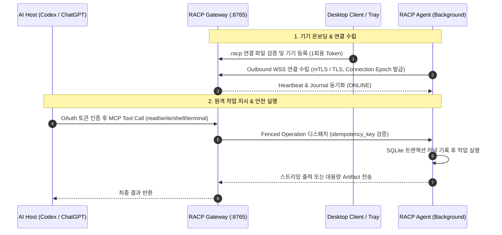

# RACP 운영 및 사용자 매뉴얼 가이드 (Guides)

> **문서 ID**: `DOC-GUIDES-INDEX`  
> **상태**: Active · **기준 버전**: v0.1.8  
> **최종 개정일**: 2026-10-07 · **분류**: Guides Index

---

## 1. 개요 (Overview)

본 디렉터리는 **RACP** 시스템을 설치, 구성, 등록, 운영 및 검증하기 위한 사용자 및 엔지니어용 실전 매뉴얼 가이드를 수록합니다.

---

## 2. 가이드 목록 및 목적

| 가이드명 | 대상 독자 | 핵심 내용 |
| :--- | :--- | :--- |
| [Windows Gateway 배포 및 운영](gateway-deployment-guide.md) | 호스트 관리자 | 자체 Python·Console 포함 ZIP, CMD 시작/상태/발급, Codex MCP 운영 순서 |
| [데스크톱 클라이언트 가이드](desktop-client-guide.md) | 엔드유저 / 관리자 | Electron 데스크톱 앱 실행, 연결 파일(`.racp`) 등록, 시스템 트레이 운용, 설정 수정 및 완전 종료 |
| [Rust Agent 실행 가이드](rust-agent-guide.md) | 개발자 / 실기 검증 담당자 | Python 없는 Windows Agent ZIP, 명시적 상태 폴더와 등록·실행·종료, 테스트 보류 중 빌드 절차 |
| [PC 등록 및 온보딩 가이드](pc-connect-guide.md) | 장비 관리자 | Gateway Console 토큰 발급, `racp-connect` CLI를 통한 초기 기기 등록 및 인증서 저장 |
| [다중 작업 폴더 격리 가이드](named-workspaces-guide.md) | 보안 / 운영자 | 최대 15개 허용 워크스페이스 등록, `workspace_id` 기반 파일/프로세스 경로 격리 |
| [백그라운드 에이전트 가이드](background-agent-guide.md) | 시스템 엔지니어 | `racp-agentctl`을 통한 백그라운드 데몬 수명주기(`start`, `status`, `stop`) 및 프로세스 락 제어 |
| [원격 MCP & OAuth 인증 가이드](remote-mcp-oauth-setup.md) | AI 연동 엔지니어 | Keycloak/OIDC 및 Codex/ChatGPT 연동을 위한 PKCE S256 기반 OAuth Protected Resource 구성 |
| [2-PC 실증 랩 가이드](two-pc-lab-guide.md) | QA / 통합 테스터 | 현재 Gateway(141)와 원격 Agent(121)의 LAN 시험 및 과거 140→141 증거 구분 |

---

## 3. 공통 시스템 아키텍처 흐름

---

## 4. 관련 문서

- [기술 문서 포털](../README.md)
- [시스템 명세서](../spec/README.md)
- [품질 보증 및 현황](../quality/README.md)
