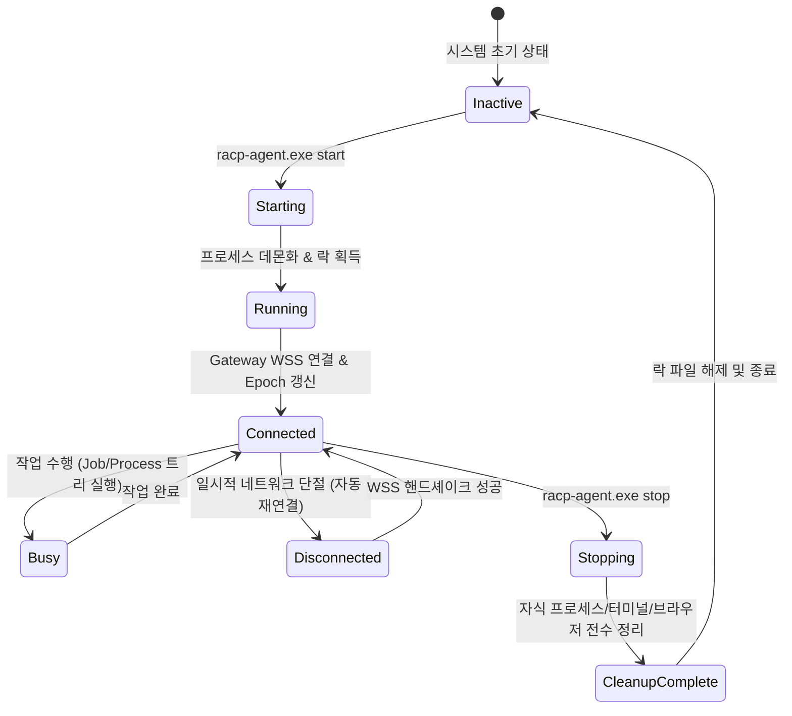

# RACP 백그라운드 에이전트 수명주기 관리 가이드 (Background Agent Guide)

> **문서 ID**: `DOC-GDE-DAEMON`  
> **상태**: Active · **기준 버전**: v0.1.21  
> **최종 개정일**: 2026-10-10 · **분류**: User & Operations Guide

---

## 개요 (Overview)

본 가이드는 CLI 환경에서 **RACP Agent**를 백그라운드 데몬 프로세스로 구동하고 상태 모니터링, 단일 인스턴스 락(Lock) 제어, 안전한 리소스 회수 및 정상 종료(Graceful Shutdown)를 수행하는 `racp-agent.exe` 도구의 사용법을 설명합니다.

---

## 목차 (Table of Contents)

- [1. 백그라운드 프로세스 아키텍처](#1-백그라운드-프로세스-아키텍처)
- [2. 기본 제어 명령어 (start, status, stop)](#2-기본-제어-명령어-start-status-stop)
- [3. 상태 플래그 및 연결 검증](#3-상태-플래그-및-연결-검증)
- [4. 다중 인스턴스 충돌 방지 (Locking Mechanism)](#4-다중-인스턴스-충돌-방지-locking-mechanism)
- [5. 진단 로그 및 장애 격리](#5-진단-로그-및-장애-격리)
- [6. 관련 문서](#6-관련-문서)

---

## 1. 백그라운드 프로세스 아키텍처

`racp-agent.exe`은 터미널 세션이 종료되더라도 OS 백그라운드에서 지속 동작하며, 종료 요청 시 관리 중인 모든 하위 자식 프로세스(Shell, ConPTY, Browser, Reverse Engineering Plugin 등)를 누수 없이 전수 정리합니다.



---

## 2. 기본 제어 명령어 (start, status, stop)

[기기 온보딩](pc-connect-guide.md)이 완료된 환경에서 사용합니다. `$State`는 등록된 `credential.bin`을 포함하는 절대 상태 경로입니다. 배포된 Rust 실행 파일을 사용하며 Python을 요구하지 않습니다:

### 2.1 에이전트 백그라운드 시작
```powershell
.\racp-agent.exe start --state-dir $State
```
- 저장된 기본 Gateway 주소, 인증서, 허용 워크스페이스 및 프로필을 사용하여 백그라운드 프로세스를 기동합니다.
- 이미 동일한 인자가 실행 중인 경우 기존 프로세스의 PID를 반환하며 중복 생성되지 않습니다.

### 2.2 실시간 상태 조회
```powershell
.\racp-agent.exe status --state-dir $State
```
- 로컬 프로세스 PID, 실행 상태(`RUNNING`), Gateway WSS 연결 여부(`connected: true`), 최신 Heartbeat 타임스탬프를 JSON 또는 요약 텍스트로 출력합니다.

### 2.3 안전한 정상 종료 (Graceful Shutdown)
```powershell
.\racp-agent.exe stop --state-dir $State
```
- 진행 중인 모든 작업을 안전하게 취소하고, 실행 중인 터미널 세션, 브라우저 샌드박스, 플러그인 프로세스를 정리한 후 정식 영수증(`cleanup_status: complete`)을 확인하고 종료됩니다.

---

## 3. 상태 플래그 및 연결 검증

> [!NOTE]
> `racp-agent.exe start` 완료 직후의 로컬 `RUNNING` 상태는 프로세스 기동 성공을 의미하며, 원격 Gateway와의 실시간 연결 수립은 `status` 조회의 `connected: true` 플래그로 최종 확인해야 합니다.

```json
{
  "ok": true,
  "result": {
  "state": "RUNNING",
  "pid": 14592,
  "connected": true,
  "gateway_url": "https://gateway.example:8765",
  "connection_epoch": 4,
  "profile": "standard",
  "workspaces": ["default", "docs"]
  }
}
```

---

## 4. 다중 인스턴스 충돌 방지 (Locking Mechanism)

RACP는 동일한 자격 증명 스토리지(`credential.bin`) 및 로컬 데이터베이스(`agent.db`)에 대해 동시 다중 실행이 일어나는 것을 원천 방지합니다.

- **포그라운드/백그라운드 상호 배제**: 포그라운드 `racp-agent`가 이미 실행 중인 경우 백그라운드 `start`는 즉시 거부됩니다.
- **비정상 종료 후 복구**: OS 크래시나 강제 종료가 발생하더라도, 다음 시작 시 미완료된 변경 작업은 `UNKNOWN` 상태로 안전하게 보존되며 멋대로 자동 재실행되지 않습니다.

---

## 5. 진단 로그 및 장애 격리

백그라운드 에이전트의 구동 로그는 로컬 상태 디렉터리에 롤링 로그로 보존됩니다:
- **로그 경로**: `$State\background\agent.log` (Windows)
- **로테이션 정책**: 최대 1 MiB 크기, 직전 3개 파일까지 보존 (총 4 MiB 상한).
- **보안 감사**: 비밀 토큰, 패스워드, 사용자 인증 키 등 민감 정보는 마스킹 처리되어 로그 파일에 기록되지 않습니다.

---

## 6. 관련 문서

- [데스크톱 클라이언트 가이드](desktop-client-guide.md)
- [PC 등록 및 온보딩 가이드](pc-connect-guide.md)
- [다중 작업 폴더 격리 가이드](named-workspaces-guide.md)
- [아키텍처 결정 레코드: ADR-0022 (백그라운드 수명 제어)](../adr/ADR-0022-user-background-agent-control.md)
