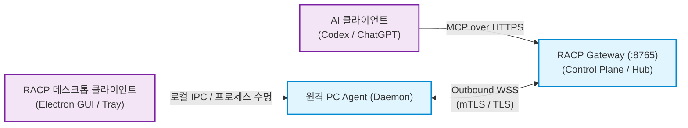
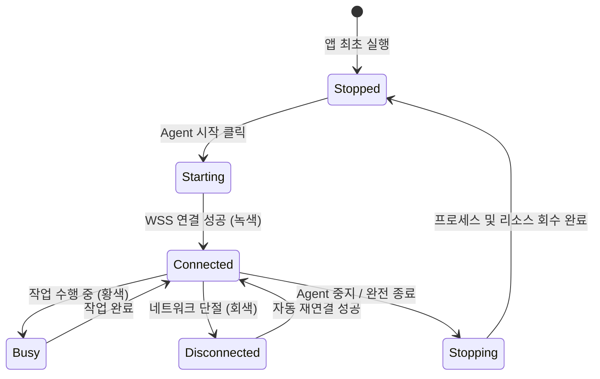

# RACP 데스크톱 클라이언트 운용 가이드 (Desktop Client Guide)

> **문서 ID**: `DOC-GDE-DESKTOP`  
> **상태**: Active · **기준 버전**: v0.1.8  
> **최종 개정일**: 2026-10-07 · **분류**: User & Operations Guide

---

## 개요 (Overview)

본 가이드는 **RACP 크로스 플랫폼 데스크톱 클라이언트(Electron + React)**의 아키텍처, 설치 및 포터블 실행, 기기 온보딩(`.racp` 연결 파일), 시스템 트레이 수명주기, 등록 설정 수정/복구, 그리고 문제 해결 절차를 상세히 안내합니다.

데스크톱 클라이언트는 사용자 환경에 Python, Node.js, Chromium 등의 별도 런타임을 요구하지 않는 All-in-One 번들 패키지로 제공됩니다.

---

## 목차 (Table of Contents)

- [1. 시스템 아키텍처 및 역할 관계](#1-시스템-아키텍처-및-역할-관계)
- [2. 배포 패키지 구성 및 플랫폼 지원](#2-배포-패키지-구성-및-플랫폼-지원)
- [3. 클라이언트 실행 및 최초 등록 (.racp)](#3-클라이언트-실행-및-최초-등록-racp)
- [4. 시스템 트레이 및 백그라운드 수명주기](#4-시스템-트레이-및-백그라운드-수명주기)
- [5. 등록 정보 편집 및 안전 복구](#5-등록-정보-편집-및-안전-복구)
- [6. 개발 빌드 및 패키징 절차](#6-개발-빌드-및-패키징-절차)
- [7. 보안 및 안전 고려사항](#7-보안-및-안전-고려사항)
- [8. 관련 문서](#8-관련-문서)

---

## 1. 시스템 아키텍처 및 역할 관계

RACP 데스크톱 클라이언트는 원격 제어 명령을 직접 수신하는 P2P 서버가 아니라, 원격 PC의 로컬 Agent 수명주기를 제어하고 Gateway로의 아웃바운드 WSS 연결 상태를 모니터링하는 **로컬 관리자 인터페이스**입니다.



> [!NOTE]
> - **Gateway**: 중앙 제어 평면이자 MCP Server 엔드포인트를 호스팅합니다.
> - **원격 PC Agent**: Gateway로 보안 연결(WSS)을 먼저 시작하는 아웃바운드 클라이언트입니다 (인바운드 포트 불필요).
> - **데스크톱 UI**: 로컬 Agent의 실행, 중지, 트레이 상주, 워크스페이스 폴더 인가 및 상태를 관리합니다.

---

## 2. 배포 패키지 구성 및 플랫폼 지원

| 플랫폼 | 배포 패키지 포맷 | 런타임 번들 구성 | 검증 상태 |
| :--- | :--- | :--- | :---: |
| **Windows x64** | NSIS 설치형 EXE / 포터블 ZIP | Electron 44, CPython 3.12, Chromium 1243 | **실증 검증 완료 (Verified)** |
| **macOS** | DMG / 포터블 ZIP | Electron 44, macOS Python/Chromium | 구성 완료 (Native CI 작성) |
| **Linux (Ubuntu)** | AppImage / deb | Electron 44, Linux Python/Chromium | 구성 완료 (Native CI 작성) |

> [!IMPORTANT]
> Windows용 공식 산출물은 `dist/client-desktop-0.1.7-final/` (또는 최신 빌드 산출 디렉터리)에서 제공됩니다:
> - 설치형: `RACP Client Setup 0.1.8.exe`
> - 포터블형: `RACP Client-0.1.8-win.zip` (압축 해제 후 `RACP Client.exe` 즉시 실행 가능)

---

## 3. 클라이언트 실행 및 최초 등록 (.racp)

### 3.1 원클릭 온보딩 절차
1. **연결 파일 발급**: Gateway Console 관리자 화면에서 `새 PC 연결`을 선택하고 `.racp` 연결 설정 파일을 발급받아 원격 PC로 전달합니다.
2. **클라이언트 실행**: `RACP Client.exe`를 실행하고 첫 화면에서 **[연결 파일 선택]**을 클릭하여 전달받은 `.racp` 파일을 로드합니다.
3. **허용 폴더 인가**: Agent가 접근을 허용할 기본 작업 폴더(Default Workspace) 및 추가 허용 폴더(최대 15개)를 선택합니다.
4. **실행 프로필 선택**: `read_only`, `standard`, `trusted_personal` 중 권한 프로필을 지정합니다.
5. **등록 및 시작**: **[PC 등록]**을 클릭하면 Gateway에 1회용 등록 토큰을 제출하고 DPAPI 암호화 자격 증명을 로컬에 저장합니다. 이후 **[Agent 시작]**을 클릭합니다.

> [!TIP]
> - 연결 파일에 포함된 일회용 토큰은 10분간만 유효하며, 1회 등록 성공 후 무효화됩니다.
> - 연결 파일의 CA 인증서는 로컬 보안 스토리지에 복사되므로 원본 `.racp` 파일은 등록 후 즉시 안전하게 삭제해도 무방합니다.

---

## 4. 시스템 트레이 및 백그라운드 수명주기



1. **창 닫기 동작**: 메인 윈도우의 닫기(`X`) 버튼을 누르면 프로그램이 종료되지 않고 **시스템 트레이(System Tray)**로 안전하게 최소화됩니다.
2. **트레이 아이콘 상태**:
   - 🟢 **녹색**: Gateway와 WSS 정상 연결 완료 (Online/Ready)
   - 🟡 **황색**: 원격 작업(Shell/PTY/Job/Browser) 실행 중 (Busy)
   - ⚪ **회색**: 미연결 또는 Agent 중지 상태 (Offline)
3. **완전 종료 (Full Exit)**:
   - 시스템 트레이 우클릭 → `완전 종료` 또는 UI 내부의 `완전 종료` 버튼을 누릅니다.
   - 실행 중인 백그라운드 Agent 및 관리 중인 하위 자식 프로세스 트리가 안전하게 정리되었음을 확인(Receipt 수신)한 후 Electron 프로세스가 종료됩니다.

---

## 5. 등록 정보 편집 및 안전 복구

0.1.7 이후 버전에서는 설정 불일치나 오류 발생 시 번거로운 중간 안내 단계 없이 **[등록 정보 편집]** 폼으로 즉시 진입할 수 있습니다.

### 5.1 수정 절차
1. **[Agent 중지]** 클릭 (실행 중인 상태에서의 강제 저장은 거절됩니다).
2. **PC 설정 → 등록 정보 편집**에서 Gateway 주소, 기본/추가 허용 폴더, 사설 CA 파일 경로를 수정합니다.
3. **[설정 저장]** 클릭 (자동으로 이전 설정의 SHA-256 백업이 생성됩니다).
4. **[Agent 시작]** 클릭하여 새 설정으로 Gateway에 재접속합니다.

> [!WARNING]
> - 기기 고유 식별자(`Device ID`)와 암호화 자격 증명(`credential.bin`)은 변경되지 않고 그대로 유지됩니다.
> - 다른 Gateway 서버로 장비를 완전히 이전하고자 할 때는 기존 등록을 재사용할 수 없으며 신규 기기 등록을 진행해야 합니다.

---

## 6. 개발 빌드 및 패키징 절차

개발 환경에서 데스크톱 클라이언트를 빌드하고 패키징하는 표준 절차입니다:

```powershell
# 1. 의존성 동기화
uv sync --all-packages --frozen
pnpm install --frozen-lockfile

# 2. Electron 네이티브 바인딩 및 런타임 빌드
node apps/client/node_modules/electron/install.js
uv run python scripts/build.py
uv run python -m playwright install --with-deps chromium

# 3. 클라이언트 Agent 스테이징
uv run python scripts/stage_client_agent.py

# 4. 프론트엔드 빌드 및 단위 테스트
pnpm --dir apps/client build
pnpm --dir apps/client test

# 5. E2E 통합 테스트 및 Windows 설치본 패키징
uv run python scripts/client_e2e.py
pnpm --dir apps/client package --win --publish never
```

---

## 7. 보안 및 안전 고려사항

- **자격 증명 보호**: Windows의 DPAPI(Data Protection API)를 통해 현재 로그인한 사용자 계정 영역에 자격 증명을 암호화 보존합니다. 다른 사용자 계정이나 PC로 복사 시 복호화되지 않습니다.
- **활동 감사 분리**: 데스크톱 UI의 '최근 활동' 스트림은 원격 명령 식별자 및 실행 결과 상태만을 표기하며, 명령어 인자, 원시 파일 데이터, 비밀 토큰 등 민감 정보는 화면에 노출하지 않습니다.
- **사용자 우선권 (Input Interruption)**: 원격 화면/입력 제어 중 사용자가 로컬 마우스/키보드를 조작하면 원격 제어가 즉시 일시 정지됩니다.

---

## 8. 관련 문서

- [PC 등록 및 온보딩 가이드](pc-connect-guide.md)
- [다중 작업 폴더 격리 가이드](named-workspaces-guide.md)
- [2-PC 실증 랩 가이드](two-pc-lab-guide.md)
- [아키텍처 결정 레코드: ADR-0023 (크로스플랫폼 클라이언트)](../adr/ADR-0023-cross-platform-desktop-client.md)
- [아키텍처 결정 레코드: ADR-0028 (연결 파일 온보딩)](../adr/ADR-0028-connection-file-onboarding.md)
- [아키텍처 결정 레코드: ADR-0029 (로컬 설정 복구)](../adr/ADR-0029-local-settings-repair.md)
