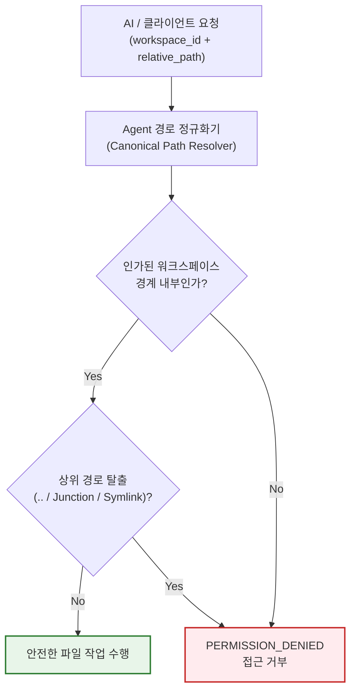

# RACP 다중 작업 폴더 격리 가이드 (Named Workspaces Guide)

> **문서 ID**: `DOC-GDE-WORKSPACES`  
> **상태**: Active · **기준 버전**: v0.1.8  
> **최종 개정일**: 2026-10-07 · **분류**: User & Operations Guide

---

## 개요 (Overview)

본 가이드는 원격 PC의 특정 디렉터리만을 안전하게 인가하고, 복수의 작업 폴더를 식별자(`workspace_id`) 기반으로 분리하여 관리하는 **네임드 워크스페이스(Named Workspaces)** 보안 모델과 사용법을 설명합니다.

원격 AI 에이전트(Codex 등)나 관리자는 임의의 전체 파일 시스템을 탐색할 수 없으며, 사전에 로컬 PC 소유자가 명시적으로 인가한 폴더 내에서만 안전하게 작업을 수행할 수 있습니다.

---

## 목차 (Table of Contents)

- [1. 워크스페이스 보안 격리 모델](#1-워크스페이스-보안-격리-모델)
- [2. 명명 규칙 및 제한 규격](#2-명명-규칙-및-제한-규격)
- [3. 워크스페이스 등록 및 설정 방법](#3-워크스페이스-등록-및-설정-방법)
- [4. MCP 도구 및 API 호출 규격](#4-mcp-도구-및-api-호출-규격)
- [5. 워크스페이스 간 파일 복사/이동](#5-워크스페이스-간-파일-복사이동)
- [6. 프로세스 및 터미널 CWD 바인딩](#6-프로세스-및-터미널-cwd-바인딩)
- [7. 관련 문서](#7-관련-문서)

---

## 1. 워크스페이스 보안 격리 모델

RACP 파일 시스템 도구(`fs_read`, `fs_write`, `fs_list` 등)는 요청된 경로가 인가된 워크스페이스 루트 내부에 완벽히 포함되는지 실시간 정규화(Canonical Path) 검사를 수행합니다.



> [!IMPORTANT]
> - 인가된 디렉터리 범위를 벗어나는 경로 탐색(`../`), 심볼릭 링크(Symlink), Windows Junction 및 UNC 경로는 보안 정책에 의해 즉시 차단됩니다.
> - 임의 셸 명령 실행(`shell_exec`)의 경우 워크스페이스가 기본 작업 디렉터리(cwd)를 결정하지만, OS 사용자 계정 차원의 완전한 시스템 권한 격리를 의미하지는 않으므로 프로필 정책과 병행해야 합니다.

---

## 2. 명명 규칙 및 제한 규격

- **식별자 형식**: 영문자로 시작하는 영문 소문자, 대문자, 숫자, 밑줄(`_`), 하이픈(`-`) 조합 (1~32자).
- **기본 워크스페이스**: 별도 명시가 없을 경우 기본 워크스페이스 ID는 항상 `default`입니다.
- **수량 제한**: `default` 외에 추가로 최대 **15개**의 네임드 워크스페이스를 등록할 수 있습니다 (총 16개).
- **절대 경로 필수**: 모든 워크스페이스는 등록 시 원격 PC의 정규화된 로컬 절대 경로로 지정되어야 합니다.

---

## 3. 워크스페이스 등록 및 설정 방법

### 3.1 CLI 온보딩 시 복수 워크스페이스 지정
기기 초기 등록 시 `--allow-workspace ID=PATH` 옵션을 반복하여 추가 폴더를 인가합니다:

```powershell
uv run racp-connect `
    --gateway https://gateway.example:8765 `
    --workspace E:\Projects `
    --allow-workspace docs=D:\Documents `
    --allow-workspace data=E:\Datasets `
    --profile standard
```

- 기본 워크스페이스(`default`): `E:\Projects`
- 추가 워크스페이스 1 (`docs`): `D:\Documents`
- 추가 워크스페이스 2 (`data`): `E:\Datasets`

### 3.2 데스크톱 클라이언트 GUI에서 설정
데스크톱 앱의 **PC 설정 → 등록 정보 편집** 화면에서 `+ 허용 폴더 추가` 버튼을 클릭하여 직관적으로 폴더를 추가/제거할 수 있습니다.

---

## 4. MCP 도구 및 API 호출 규격

AI 에이전트(Codex 등)는 `device_list` 조회를 통해 해당 기기가 노출하는 워크스페이스 ID 목록을 파악한 후, 파일 조작 도구 호출 시 `workspace_id`를 지정합니다.

### 4.1 파일 읽기 (`fs_read`)
```json
{
  "device_id": "dev_01j7...",
  "workspace_id": "docs",
  "path": "quarterly-report.md"
}
```

### 4.2 파일 쓰기 (`fs_write`)
파일 생성 및 수정 시에는 멱등성 보장을 위해 `idempotency_key`를 반드시 지정합니다:

```json
{
  "device_id": "dev_01j7...",
  "workspace_id": "docs",
  "path": "summary.txt",
  "content": "2026 Q3 Summary Data\n",
  "execution_profile_id": "standard",
  "idempotency_key": "write-summary-20261007-01"
}
```

---

## 5. 워크스페이스 간 파일 복사/이동

`fs_copy` 및 `fs_move` 도구는 출발지(`workspace_id`)와 목적지(`destination_workspace_id`)를 서로 다르게 지정하여 워크스페이스 간 데이터 전송을 지원합니다.

```json
{
  "device_id": "dev_01j7...",
  "workspace_id": "data",
  "source": "raw-log.json",
  "destination_workspace_id": "docs",
  "destination": "backup-log.json",
  "execution_profile_id": "standard",
  "idempotency_key": "copy-data-to-docs-01"
}
```

> [!WARNING]
> - 서로 다른 드라이브/볼륨 간(`C:` ↔ `D:`) 파일 이동(`fs_move`) 시 원자적(Atomic) Rename이 불가능하므로, `copy_and_delete: true` 및 `execution_mode: "job"` 옵션을 명시해야 안전하게 처리됩니다.

---

## 6. 프로세스 및 터미널 CWD 바인딩

- **셸 명령 및 터미널 세션**: `shell_exec` 또는 `terminal_open` 호출 시 지정한 `workspace_id`의 루트 경로가 초기 작업 디렉터리(`cwd`)로 자동 설정됩니다.
- **세션 지속성**: 영속 터미널 세션(Persistent Terminal Handle)은 세션 생성 시 바인딩된 cwd를 유지하며, 후속 입력이나 스트림 조회 시 다른 `workspace_id`를 전달하더라도 기존 작업 디렉터리가 임의로 변경되지 않습니다.

---

## 7. 관련 문서

- [데스크톱 클라이언트 가이드](desktop-client-guide.md)
- [PC 등록 및 온보딩 가이드](pc-connect-guide.md)
- [백그라운드 에이전트 가이드](background-agent-guide.md)
- [아키텍처 결정 레코드: ADR-0021 (네임드 워크스페이스)](../adr/ADR-0021-explicit-named-workspaces.md)
