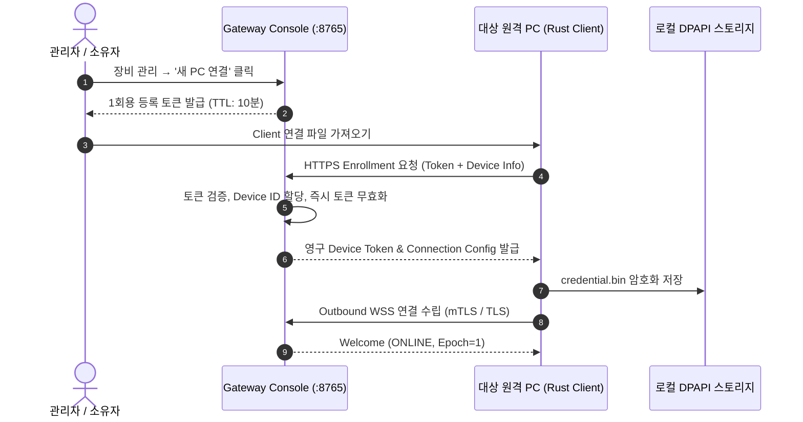

# RACP 기기 온보딩 및 PC 연결 가이드 (Device Enrollment Guide)

> **문서 ID**: `DOC-GDE-ONBOARD`  
> **상태**: Active · **기준 버전**: v0.1.21\
> **최종 개정일**: 2026-10-10 · **분류**: User & Operations Guide

---

## 개요 (Overview)

본 가이드는 신규 PC를 **RACP 플랫폼**에 안전하게 등록(Enrollment)하고, Gateway와의 암호화된 아웃바운드 WSS 통신 채널을 수립하는 전 과정을 안내합니다. 패키지 사용자는 RACP Client의 연결 파일 가져오기/권한 선택 UI를 사용하고, source 개발자는 Rust `racp-agent.exe bridge`를 사용할 수 있습니다. 두 경로 모두 대상 PC의 인바운드 방화벽 개방 없이 Agent가 Gateway로 outbound WSS를 연결합니다.

---

## 목차 (Table of Contents)

- [1. 온보딩 아키텍처 및 보안 시퀀스](#1-온보딩-아키텍처-및-보안-시퀀스)
- [2. 사전 준비 사항](#2-사전-준비-사항)
- [3. 1회용 등록 토큰 발급 및 초기 등록](#3-1회용-등록-토큰-발급-및-초기-등록)
- [4. 권한 실행 프로필 (Execution Profiles)](#4-권한-실행-프로필-execution-profiles)
- [5. 자격 증명 저장소 및 지속 재시작](#5-자격-증명-저장소-및-지속-재시작)
- [6. 장애 진단 및 복구 가이드](#6-장애-진단-및-복구-가이드)
- [7. 관련 문서](#7-관련-문서)

---

## 1. 온보딩 아키텍처 및 보안 시퀀스

RACP의 기기 등록은 양방향 신뢰를 수립하기 위해 **1회용 유효시간(TTL 10분) 토큰**과 **DPAPI/0600 로컬 암호화 자격 증명**을 결합합니다.



---

## 2. 사전 준비 사항

- Gateway가 HTTPS/TLS 인증서를 갖추고 구동 중이어야 합니다 (`https://gateway.example:8765`).
- **패키지 운영 경로**: 대상 PC에는 현재 Windows Client/Agent 배포본만 필요하며 저장소 clone, Python, Node, `uv`는 요구하지 않는다.
- **source 개발 경로**: 아래 CLI 예제를 사용할 때만 Rust 1.90.0으로 빌드한 Agent 실행 파일가 필요하다.
- 사설 CA를 사용하는 Gateway의 경우, 해당 `ca.pem` 인증서 파일을 대상 PC에 준비합니다.

Setup/Portable Gateway 운영자는 먼저 [Windows Gateway 배포 및 운영](gateway-deployment-guide.md)에 따라 서비스/readiness와 Console 로그인을 확인한다. 웹 Console에서 발급한 `.racp` 연결 파일은 1회용·10분 제한이며, 원문 등록 token을 메신저/셸 히스토리/지원 bundle에 복사하지 않는다.

---

## 3. 1회용 등록 토큰 발급 및 초기 등록

### 3.1 패키지 Client 온보딩

1. Gateway Console에서 대상 PC 이름을 확인하고 `.racp` 연결 파일을 새로 발급한다.
2. 대상 Windows PC의 RACP Client에서 연결 파일 가져오기를 선택한다. 원문 token을 수동으로 명령행에 복사하지 않는다.
3. 로컬 workspace와 실행 프로필, 필요한 화면/입력 권한을 **대상 PC 사용자**가 선택한다.
4. 등록 완료 뒤 Agent를 시작하고 Console에서 새 stable device ID가 ONLINE인지 확인한다.
5. 같은 `.racp` 파일의 재사용은 거절되어야 한다. 재등록/rotation이 필요하면 새 파일을 발급한다.

패키지 운영자는 이 절만으로 온보딩할 수 있으며 아래 CLI 절은 개발/진단용 대안이다.

### 3.2 Rust CLI 온보딩

[Rust Agent 실행 가이드](rust-agent-guide.md)의 표준 입력 bridge를 사용한다. 등록 token은 명령행·환경 변수·셸 히스토리에 넣지 않는다. `enroll` 또는 `enroll_connection` 요청으로 설정을 저장하고, 실행은 별도 `start` 명령으로 시작한다.

```powershell
$State = 'C:\RACP\agent-state'
.\racp-agent.exe bridge --state-dir $State
# 프로세스가 시작된 뒤 JSON 등록 요청을 표준 입력으로 직접 입력한다.
.\racp-agent.exe start --state-dir $State
```

---

## 4. 권한 실행 프로필 (Execution Profiles)

원격 PC 등록 시 기본 및 상한 권한 프로필을 지정할 수 있습니다:

| 프로필 | 권한 수준 | 적용 범위 및 규칙 |
| :--- | :--- | :--- |
| `read_only` | 읽기 전용 (기본값) | 파일 조회(`fs_read`), 시스템 상태 조회만 가능. 모든 변경/명령 거절 |
| `standard` | 관리자 승인 모드 | 파일 쓰기 및 셸 실행 시 Gateway/소유자의 1회성 명시적 승인 필요 |
| `trusted_personal` | 신뢰된 개인 기기 | 승인 대기 없이 사전에 인가된 워크스페이스 내에서 자유로운 작업 허용 |

> [!WARNING]
> Gateway 정책과 Agent 로컬 정책의 **교집합(최소 권한)**이 최종 유효 권한으로 적용됩니다. Gateway가 `read_only`인 경우 Agent가 `trusted_personal`로 등록되어 있어도 변경 작업은 수행할 수 없습니다.

관리 Console의 owner/operator가 추가하는 device/output/operation grant도 Agent 로컬 capability 상한을 확장하지 않는다. 장비가 revoke/rotate된 뒤에는 기존 브라우저 캐시의 ONLINE 표시나 과거 grant를 신뢰하지 말고 현재 Gateway 상태와 새 auth revision을 확인한다.

---

## 5. 자격 증명 저장소 및 지속 재시작

등록이 완료되면 기기 고유 식별자와 인증 토큰이 암호화된 파일에 저장됩니다:
- **Windows**: `<state-dir>\credential.bin` (Windows DPAPI 암호화)
- **Linux / macOS**: `<state-dir>/credential.bin` (POSIX 0600 권한)

### 5.1 저장된 설정을 통한 일상적 실행
등록 후에는 주소나 토큰을 다시 입력할 필요 없이 아래 명령으로 에이전트를 가동합니다:

```powershell
.\racp-agent.exe run --state-dir 'C:\RACP\agent-state'
```

---

## 6. 장애 진단 및 복구 가이드

1. **토큰 만료 (Token Expired)**:
   - 10분이 지나거나 이미 1회 등록에 사용된 토큰은 `TOKEN_EXPIRED` 또는 `TOKEN_ALREADY_USED` 오류를 반환합니다. Console에서 새 토큰을 재발급받아야 합니다.
2. **기존 등록 충돌 (Already Configured)**:
   - 이미 `credential.bin`이 존재하는 상태에서 등록 요청을 다시 전송하면 덮어쓰기 방지를 위해 거부됩니다.
   - 새 설정으로 교체하려면 기존 `credential.bin`을 백업 후 제거하거나 데스크톱 클라이언트의 **[등록 정보 편집]** 폼을 사용하십시오.
3. **인증서 신뢰 오류 (TLS Handshake Failed)**:
   - 사설 인증서를 사용하는 Gateway인 경우 등록 JSON의 `ca_file`에 올바른 루트 CA 경로를 지정했는지 확인하십시오. RACP는 TLS 검증 우회 옵션을 의도적으로 제공하지 않습니다.

---

## 7. 관련 문서

- [데스크톱 클라이언트 가이드](desktop-client-guide.md)
- [다중 작업 폴더 격리 가이드](named-workspaces-guide.md)
- [백그라운드 에이전트 가이드](background-agent-guide.md)
- [원격 MCP OAuth 설정 가이드](remote-mcp-oauth-setup.md)
- [아키텍처 결정 레코드: ADR-0019 (한 명령 PC 등록)](../adr/ADR-0019-protected-one-command-pc-enrollment.md)
- [아키텍처 결정 레코드: ADR-0027 (최초 등록 및 진단)](../adr/ADR-0027-one-time-setup-and-safe-diagnostics.md)
