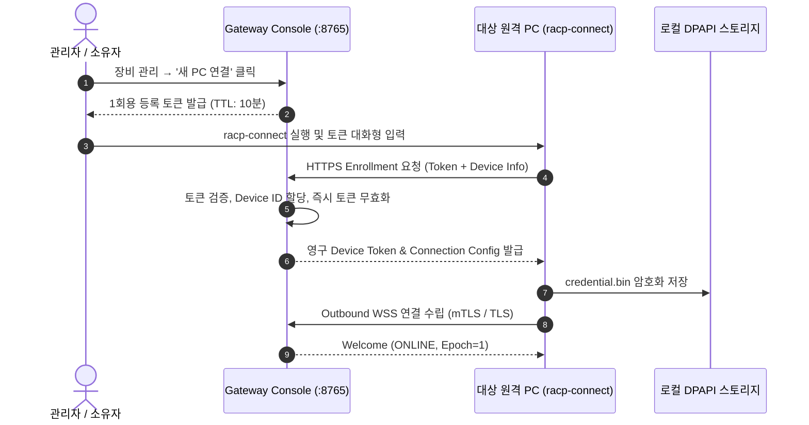

# RACP 기기 온보딩 및 PC 연결 가이드 (Device Enrollment Guide)

> **문서 ID**: `DOC-GDE-ONBOARD`  
> **상태**: Active · **기준 버전**: v0.1.8  
> **최종 개정일**: 2026-10-07 · **분류**: User & Operations Guide

---

## 개요 (Overview)

본 가이드는 신규 PC를 **RACP 플랫폼**에 안전하게 등록(Enrollment)하고, Gateway와의 암호화된 아웃바운드 WSS 통신 채널을 수립하는 전 과정을 안내합니다.  
개발자/관리자는 CLI 도구(`racp-connect`, `racp-agent`)를 사용하여 인바운드 방화벽 개방 없이 장비를 원격 관리 체계에 편입시킬 수 있습니다.

---

## 목차 (Table of Contents)

- [1. 온보딩 아키텍처 및 보안 시퀀스](#1-온보딩-아키텍처-및-보안-시퀀스)
- [2. 사전 준비 사항](#2-사전-준비-사항)
- [3. 1회용 등록 토큰 발급 및 초기 등록](#3-1회용-등록-토큰-발급-및-초기-등록)
- [4. 권한 실행 프로필 (Execution Profiles)](#4-권한-실행-프로필-execution-profiles)
- [5. 자격 증명 저장소 및 지속 재시작](#5-자격-증명-저장소-및-지속-재시작)
- [6. 장애 진단 및 복구 가이드](#6-장애-진단-및-복구-가이드)
- [7. 관련 문서](#7-관련-문서)

---

## 1. 온보딩 아키텍처 및 보안 시퀀스

RACP의 기기 등록은 양방향 신뢰를 수립하기 위해 **1회용 유효시간(TTL 10분) 토큰**과 **DPAPI/0600 로컬 암호화 자격 증명**을 결합합니다.



---

## 2. 사전 준비 사항

- Gateway가 HTTPS/TLS 인증서를 갖추고 구동 중이어야 합니다 (`https://gateway.example:8765`).
- 원격 PC에 Python 3.12+ 및 `uv` 환경이 준비되어 있어야 합니다.
- 사설 CA를 사용하는 Gateway의 경우, 해당 `ca.pem` 인증서 파일을 대상 PC에 준비합니다.

---

## 3. 1회용 등록 토큰 발급 및 초기 등록

### 3.1 CLI 대화형 온보딩 명령
터미널에서 아래 명령을 실행합니다:

```powershell
# 패키지 동기화
uv sync --package racp-agent --frozen

# 기기 등록 및 즉시 연결 시작
uv run --package racp-agent racp-connect `
    --gateway https://gateway.example:8765 `
    --workspace E:\MyDocuments `
    --profile standard
```

> [!IMPORTANT]
> - 명령 실행 시 터미널에 **마스킹된 보안 프롬프트**(`Token: `)가 표시됩니다. Console에서 발급받은 1회용 토큰을 붙여넣습니다.
> - 토큰을 셸 히스토리나 환경 변수, 명령 인자로 직접 전달하는 것은 보안 정책상 금지되어 있습니다.
> - 사설 CA를 사용하는 경우 `--ca-file E:\RACP\ca.pem` 옵션을 추가합니다.

### 3.2 등록 전용 모드 (`--configure-only`)
등록 후 에이전트를 즉시 포그라운드에서 실행하지 않고 설정만 저장하려면 `--configure-only` 플래그를 사용합니다:

```powershell
uv run --package racp-agent racp-connect `
    --gateway https://gateway.example:8765 `
    --workspace E:\MyDocuments `
    --configure-only
```

---

## 4. 권한 실행 프로필 (Execution Profiles)

원격 PC 등록 시 기본 및 상한 권한 프로필을 지정할 수 있습니다:

| 프로필 | 권한 수준 | 적용 범위 및 규칙 |
| :--- | :--- | :--- |
| `read_only` | 읽기 전용 (기본값) | 파일 조회(`fs_read`), 시스템 상태 조회만 가능. 모든 변경/명령 거절 |
| `standard` | 관리자 승인 모드 | 파일 쓰기 및 셸 실행 시 Gateway/소유자의 1회성 명시적 승인 필요 |
| `trusted_personal` | 신뢰된 개인 기기 | 승인 대기 없이 사전에 인가된 워크스페이스 내에서 자유로운 작업 허용 |

> [!WARNING]
> Gateway 정책과 Agent 로컬 정책의 **교집합(최소 권한)**이 최종 유효 권한으로 적용됩니다. Gateway가 `read_only`인 경우 Agent가 `trusted_personal`로 등록되어 있어도 변경 작업은 수행할 수 없습니다.

---

## 5. 자격 증명 저장소 및 지속 재시작

등록이 완료되면 기기 고유 식별자와 인증 토큰이 암호화된 파일에 저장됩니다:
- **Windows**: `%LOCALAPPDATA%\RACP\agent\credential.bin` (Windows DPAPI 암호화)
- **Linux / macOS**: `$XDG_STATE_HOME/racp/agent/credential.bin` (POSIX 0600 권한)

### 5.1 저장된 설정을 통한 일상적 실행
등록 후에는 주소나 토큰을 다시 입력할 필요 없이 아래 명령으로 에이전트를 가동합니다:

```powershell
uv run --package racp-agent racp-agent
```

---

## 6. 장애 진단 및 복구 가이드

1. **토큰 만료 (Token Expired)**:
   - 10분이 지나거나 이미 1회 등록에 사용된 토큰은 `TOKEN_EXPIRED` 또는 `TOKEN_ALREADY_USED` 오류를 반환합니다. Console에서 새 토큰을 재발급받아야 합니다.
2. **기존 등록 충돌 (Already Configured)**:
   - 이미 `credential.bin`이 존재하는 상태에서 `racp-connect`를 재실행하면 덮어쓰기 방지를 위해 거부됩니다.
   - 새 설정으로 교체하려면 기존 `credential.bin`을 백업 후 제거하거나 데스크톱 클라이언트의 **[등록 정보 편집]** 폼을 사용하십시오.
3. **인증서 신뢰 오류 (TLS Handshake Failed)**:
   - 사설 인증서를 사용하는 Gateway인 경우 `--ca-file`에 올바른 루트 CA 경로를 지정했는지 확인하십시오. RACP는 TLS 검증 우회 옵션을 의도적으로 제공하지 않습니다.

---

## 7. 관련 문서

- [데스크톱 클라이언트 가이드](desktop-client-guide.md)
- [다중 작업 폴더 격리 가이드](named-workspaces-guide.md)
- [백그라운드 에이전트 가이드](background-agent-guide.md)
- [원격 MCP OAuth 설정 가이드](remote-mcp-oauth-setup.md)
- [아키텍처 결정 레코드: ADR-0019 (한 명령 PC 등록)](../adr/ADR-0019-protected-one-command-pc-enrollment.md)
- [아키텍처 결정 레코드: ADR-0027 (최초 등록 및 진단)](../adr/ADR-0027-one-time-setup-and-safe-diagnostics.md)
