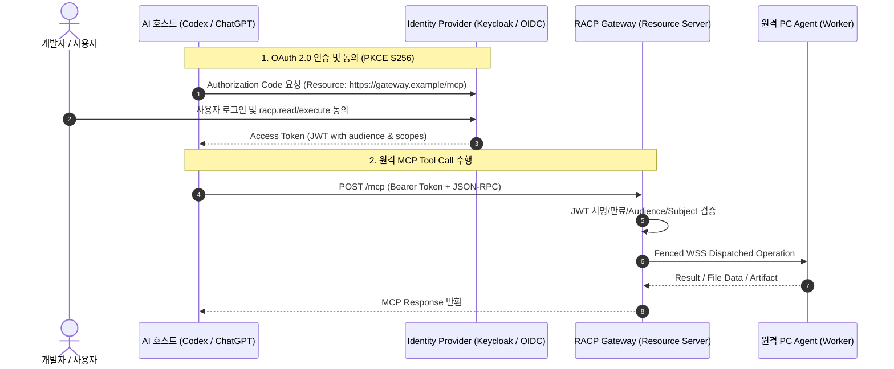

# RACP 원격 MCP 및 OAuth/OIDC 인증 설정 가이드 (Remote MCP & OAuth Setup)

> **문서 ID**: `DOC-GDE-OAUTH`  
> **상태**: Active · **기준 버전**: v0.1.19\
> **최종 개정일**: 2026-10-09 · **분류**: Integration & Security Guide

---

## 개요 (Overview)

본 가이드는 외부 AI 클라이언트(OpenAI ChatGPT, Anthropic Claude, OpenAI Codex 등)가 **RACP Gateway**의 원격 MCP(Model Context Protocol) 도구들을 안전하게 호출할 수 있도록, **OAuth 2.0 / OIDC 기반 Protected Resource Server** 환경을 구성하는 절차를 설명합니다.

Gateway는 RFC 8707(Resource Indicators for OAuth 2.0) 및 RFC 7636(PKCE S256)을 준수하며, 원격 PC의 물리적 자격 증명이나 관리자 토큰을 AI 클라이언트에 절대 직접 노출하지 않습니다.

---

## 목차 (Table of Contents)

- [1. 인증 아키텍처 및 트러스트 바운더리](#1-인증-아키텍처-및-트러스트-바운더리)
- [2. ID 공급자(IdP) 및 Gateway 설정](#2-id-공급자idp-및-gateway-설정)
- [3. Gateway OAuth 구동 명령어](#3-gateway-oauth-구동-명령어)
- [4. AI 호스트(Codex / ChatGPT) 클라이언트 연동](#4-ai-호스트codex--chatgpt-클라이언트-연동)
- [5. 진단 및 보안 검증 (Doctor CLI)](#5-진단-및-보안-검증-doctor-cli)
- [6. 관련 문서](#6-관련-문서)

---

## 1. 인증 아키텍처 및 트러스트 바운더리



> [!IMPORTANT]
> AI 호스트는 Gateway와만 통신하며, 원격 PC의 OS 사용자 계정 비밀번호나 Agent 기기 토큰은 AI 호스트에 전달되지 않습니다.

---

## 2. ID 공급자(IdP) 및 Gateway 설정

### 2.1 JSON 리소스 구성 파일 (`oauth.json`)
아래 서식에 맞춰 IdP 설정 파일(`oauth.json`)을 생성합니다 (스키마: [`docs/protocol/oauth-resource-config-v1.schema.json`](../protocol/oauth-resource-config-v1.schema.json)):

```json
{
  "version": 1,
  "issuer": "https://identity.example/realms/racp",
  "jwks_uri": "https://identity.example/realms/racp/protocol/openid-connect/certs",
  "owner_subject": "usr_9981a8b2-c741-4890-a3fe-...",
  "client_ids": ["ai-assistant-client-id"],
  "read_scope": "racp.read",
  "execute_scope": "racp.execute",
  "algorithms": ["RS256"],
  "max_token_seconds": 3600
}
```

- `owner_subject`: 토큰의 `sub` 필드와 일치하는 소유자 식별자.
- `client_ids`: 인가된 AI 클라이언트 ID 화이트리스트.
- `read_scope` / `execute_scope`: 읽기/실행 권한 범위 지정.

---

## 3. Gateway OAuth 구동 명령어

Setup/서비스형 Gateway는 운영자가 관리 Console의 상태·설정 화면과 배포 설정 파일을 통해 OAuth resource 구성을 준비한 뒤 서비스를 재기동한다. Portable도 배포본의 PowerShell 진입점과 동일한 versioned config를 사용한다. 아래 `uv run` 명령은 **source 개발/진단 실행 예시**이며 Setup/Portable 운영자가 Python·uv 개발 환경을 준비해야 한다는 뜻이 아니다. 배포 절차는 [Windows Gateway 배포 및 운영](gateway-deployment-guide.md)을 따른다.

Gateway 기동 시 `--oauth-config` 옵션을 전달하여 OAuth 보호 리소스 모드로 실행합니다:

```powershell
uv run racp-gateway `
    --host 0.0.0.0 `
    --port 8765 `
    --public-origin https://gateway.example:8765 `
    --tls-cert E:\RACP\tls\gateway.pem `
    --tls-key E:\RACP\tls\gateway.key `
    --oauth-config E:\RACP\oauth.json
```

- **Protected Resource Metadata**: `https://gateway.example:8765/.well-known/oauth-protected-resource/mcp`
- **Resource Indicator URL**: `https://gateway.example:8765/mcp`

인증 헤더 없이 엔드포인트에 접근 시 `401 Unauthorized`와 함께 RFC 규격의 `WWW-Authenticate` 챌린지 헤더가 반환됩니다.

---

## 4. AI 호스트(Codex / ChatGPT) 클라이언트 연동

1. **엔드포인트 등록**: AI 호스트의 MCP 커스텀 서버 등록 화면에 `https://gateway.example:8765/mcp`를 입력합니다.
2. **콜백 URL 등록**: AI 호스트가 제공하는 Redirect URI를 IdP 관리자 콘솔에 등록합니다.
3. **인증 진행**: AI 호스트에서 최초 연결 시 웹 브라우저가 열리며 사용자 로그인 및 권한 동의 화면이 표시됩니다.
4. **도구 카탈로그 동기화**: 동의 완료 후 AI 컨텍스트에 RACP 84개 이상의 원격 제어 도구 카탈로그가 즉시 로드됩니다.

---

## 5. 진단 및 보안 검증 (Doctor CLI)

CLI의 `racp doctor` 명령을 통해 OAuth 및 엔드포인트 무결성을 즉시 검증할 수 있습니다:

```powershell
uv run racp doctor --gateway https://gateway.example:8765
```

진단 결과에서 인증 모드(`OAuth 2.0`), Metadata URL 수신 여부, IdP Issuer 및 지원 Scope 목록이 정상 표기되는지 확인합니다.

외부 IdP, callback, TLS trust 또는 실제 AI client가 준비되지 않은 환경에서는 MCP 운영 인수를 `BLOCKED_ENV`로 남긴다. v0.1.19 final-native3 Portable smoke에서 loopback owner-bearer MCP catalog **86 tools**는 확인했지만, local-owner Console 로그인이나 loopback catalog 성공을 외부 OAuth/Codex 인수 PASS로 대체하지 않는다. 2026-10-09 실제 검증 host의 Codex CLI에는 `racp` MCP server가 등록되어 있지 않아 `codex mcp get racp`가 `No MCP server named 'racp' found`를 반환했다. 따라서 이 상태에서는 먼저 실제 IdP/TLS/callback과 Codex MCP 등록·로그인을 완료해야 하며, Overview의 `MCP not_configured`도 readiness와 별개인 인증 준비 상태로 처리한다.

---

## 6. 관련 문서

- [데스크톱 클라이언트 가이드](desktop-client-guide.md)
- [PC 등록 및 온보딩 가이드](pc-connect-guide.md)
- [프로토콜 스키마: oauth-resource-config-v1.schema.json](../protocol/oauth-resource-config-v1.schema.json)
- [아키텍처 결정 레코드: ADR-0018 (외부 OAuth MCP 서버)](../adr/ADR-0018-external-oauth-mcp-resource-server.md)
