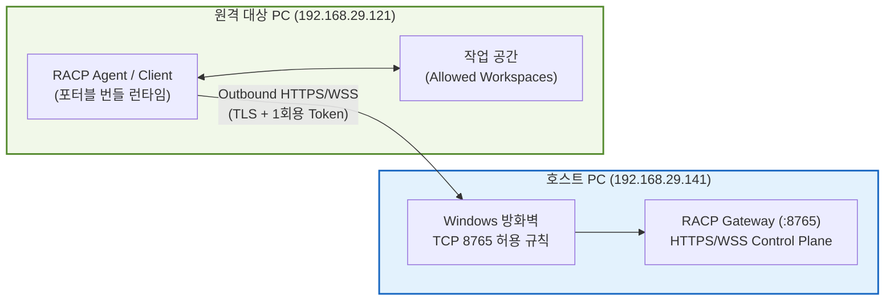

# RACP 2-PC 실증 랩 구성 및 검증 가이드 (Two-PC Lab Guide)

> **Document ID**: `DOC-GDE-TWOPC`\
> **Status**: Active · **Target Version**: v0.1.15\
> **Last Updated**: 2026-10-07 · **Classification**: Integration & Test Guide

---

## 개요 (Overview)

본 가이드는 실제 2대의 물리적 Windows PC 환경(Gateway 호스트 PC와 원격 Agent PC)에서 **RACP 시스템**의 네트워크 관통, 원격 파일 송수신, 프로세스 제어, PTY 터미널 스트리밍, 대용량 아티팩트 전송 및 멱등성 검증을 수행하는 테스트 랩 환경 구축 절차를 안내합니다.

---

## 목차 (Table of Contents)

- [1. 랩 토폴로지 및 테스트 환경 구성](#1-랩-토폴로지-및-테스트-환경-구성)
- [2. Gateway 호스트 PC (141) 설정 및 방화벽](#2-gateway-호스트-pc-141-설정-및-방화벽)
- [2.1 호스트에서 연결 파일 생성](#21-호스트에서-연결-파일-생성)
- [2.2 관리 Console 접속](#22-관리-console-접속)
- [3. 원격 Agent PC (121) 포터블 클라이언트 구동](#3-원격-agent-pc-121-포터블-클라이언트-구동)
- [3.1 독립 결과를 기록하는 화면 입력 fixture](#31-독립-결과를-기록하는-화면-입력-fixture)
- [4. 실증 검증 시나리오 및 확인 항목](#4-실증-검증-시나리오-및-확인-항목)
- [5. 시험 종료 및 방화벽 규칙 롤백](#5-시험-종료-및-방화벽-규칙-롤백)
- [6. 관련 문서](#6-관련-문서)

---

## 1. 랩 토폴로지 및 테스트 환경 구성



- **Gateway 호스트**: `192.168.29.141` (포트 TCP `8765` 리스닝)
- **원격 Agent PC**: `192.168.29.121` (아웃바운드 WSS 연결 시작)
- **보안 원칙**: RDP, WMI, OS 계정 비밀번호는 사용하지 않으며, 오직 RACP 프로토콜만을 통해 통신합니다.

---

## 2. Gateway 호스트 PC (141) 설정 및 방화벽

Gateway PC에서 테스트 전용 랩 환경을 초기화하고 실행합니다:

```powershell
# 새 호스트에 별도 랩 생성 (기존 랩과 credential을 덮어쓰지 않음)
$env:UV_PROJECT_ENVIRONMENT = '.venv-acceptance'
uv run --frozen python scripts/prepare_two_pc_lab.py --host 192.168.29.141 --output .racp/two-pc-141-121

# Gateway 서버 실행: 인증·승인 기본 정책 유지
uv run --frozen racp-gateway `
    --host 192.168.29.141 `
    --port 8765 `
    --data-dir .racp/two-pc-141-121/gateway `
    --public-origin https://192.168.29.141:8765 `
    --tls-cert .racp/two-pc-141-121/server.pem `
    --tls-key .racp/two-pc-141-121/server.key `
    --client-ca-file .racp/two-pc-141-121/ca.pem
```

121에서 연결이 차단되는 경우 Windows 관리자 PowerShell에서 시험 대상 하나로 제한한 방화벽 규칙을 추가한다:

```powershell
New-NetFirewallRule -Name 'RACP-Acceptance-141-from-121' `
    -DisplayName 'RACP acceptance 141 from 121' -Direction Inbound -Action Allow `
    -Protocol TCP -LocalAddress 192.168.29.141 -LocalPort 8765 -RemoteAddress 192.168.29.121
```

> [!IMPORTANT]
> 새 경로는 141 호스트→121 대상이다. 과거 140→141 기록은 [구현 현황](../quality/implementation-status.md#windows-plan-baseline)에만 기준선으로 보존한다. ping 응답은 Agent ONLINE이나 실제 MCP 인수의 증거가 아니다. OAuth MCP는 별도로 [설정 가이드](remote-mcp-oauth-setup.md)에 따라 연결한다.

### 2.1 호스트에서 연결 파일 생성

Gateway를 준비한 **141 호스트의 PowerShell에서** [Create-Connection-File.ps1](../../scripts/host/Create-Connection-File.ps1)을 실행한다. 저장소 루트 기준 명령은 `.\scripts\host\Create-Connection-File.ps1`이며 토큰을 직접 입력할 필요 없다. 기존 Gateway 설정과 보호된 owner 상태를 자동으로 찾고, TLS·인증·readiness를 확인한 뒤 일회용 연결 파일을 발급한다.

`connection-files/` 폴더에 날짜와 고유 번호가 있는 `.racp` 파일 하나를 생성하고 탐색기에서 그 파일을 선택한다. Gateway 주소·일회용 토큰·공개 CA 인증서가 이 파일에 포함되므로 해당 `.racp`만 121로 전달한다. 기존 파일은 덮어쓰지 않고, 토큰은 터미널이나 별도 txt에 출력하지 않는다. 생성 폴더는 Git 추적에서 제외한다.

> [!NOTE]
> 유효 시간은 10분이며 등록에 한 번만 사용할 수 있다. 만료되면 같은 PowerShell 스크립트를 다시 실행한다. 호스트 Gateway가 중지되어 있으면 시작 안내를 표시하고 발급하지 않는다. 초기화된 Gateway 설정은 하나여야 하며, `scripts/host/`와 Python helper는 저장소의 원래 구조를 유지한다.

121의 Client에서 **연결 파일 선택 → 허용 폴더·권한 선택 → Windows 화면 제어 허용 선택 → PC 등록 → Agent 시작** 순서로 진행한다. v0.1.13부터 초기 등록에도 설정 편집과 같은 화면 제어 체크박스가 있다. 연결 파일은 등록 후 삭제해도 된다.

---

### 2.2 관리 Console 접속

브라우저에서 **https://192.168.29.141:8765/console/** 을 연다. 현재 141에서 웹 Console을 빌드하고 Gateway를 같은 data-dir·TLS·owner 설정으로 재시작해 페이지와 정적 assets의 HTTP 200을 확인했다. 기존 Device ID를 유지한 원격 PC의 ONLINE 재연결도 확인했다.

처음 로그인하거나 세션이 만료되면 호스트에서 [Create-Console-Login.ps1](../../scripts/host/Create-Console-Login.ps1)을 PowerShell에서 실행한다(저장소 루트: `.\scripts\host\Create-Console-Login.ps1`). 탐색기에서 선택된 텍스트 파일의 **로그인 코드**를 Console의 **일회성 setup secret** 칸에 붙여넣고 로그인한다. 이 코드는 5분 유효·1회 사용이며 PC 등록용 `.racp` 파일의 token과 별개다. 코드 파일은 `.racp/<host-lab>/console-login/`에 저장되고 Windows DACL로 현재 사용자에게만 읽기/쓰기를 허용한다. owner secret은 파일이나 콘솔에 출력하지 않는다.

> [!NOTE]
> Console 사용에 필요한 TLS 신뢰는 브라우저의 인증서 정책을 따른다. 인증서 경고 화면은 자동으로 우회하지 않는다. 페이지 배포와 실제 사용자 브라우저의 표시/로그인은 구분하여 확인한다.

---

## 3. 원격 Agent PC (121) 포터블 클라이언트 구동

원격 PC에는 Python이나 Node.js를 설치할 필요가 없습니다.

1. 배포 패키지(`RACP-Client-0.1.10-win-x64.zip` 또는 포터블 번들)를 원격 PC에 복사하고 압축을 해제합니다.
2. `RACP Client.exe`를 실행합니다.
3. Gateway에서 발급한 `.racp` 파일을 선택하고 인가할 작업 폴더를 지정한 뒤 **[PC 등록]** → **[Agent 시작]**을 클릭합니다.
4. 화면 입력 시험을 할 때는 설정의 **[이 PC의 Windows 화면 캡처·마우스·키보드 조작 허용]**을 선택·저장한 뒤 Agent를 시작합니다. 변경 시 Agent를 먼저 중지합니다.
5. 클라이언트의 트레이 아이콘이 녹색(Online)으로 전환되고 Gateway Console에 해당 기기가 `ONLINE`으로 표시되는지 확인합니다.

---

> [!NOTE]
> 설치형·단일 포터블 EXE와 ZIP의 배포 절차는 [Desktop Client 가이드](desktop-client-guide.md)를 기준으로 한다. 시험 창은 Agent ZIP에 자동 포함되는 것으로 가정하지 않고 별도로 복사한다.

### 3.1 독립 결과를 기록하는 화면 입력 fixture

121의 허용 폴더에 [시험 창 script](../../scripts/desktop_acceptance_fixture.py)를 복사한다. Client에 내장된 Agent Python 또는 별도 검사용 Python으로 실행한다. 실제 런타임 경로는 설치 후보에서 확인한다.

```powershell
# 실행은 121에서 수행; Python 경로는 실제 내장 런타임으로 치환
& '<Agent-Python-경로>' desktop_acceptance_fixture.py `
    --run-id RUN-YYYYMMDD-HHMM-121 --output '<허용-폴더>\owned-results.json' --timeout 900
```

새 결과 경로만 허용한다. 고유 title, PID/생성 시각/session/HWND를 새 MCP window 관측과 대조하고 lease를 얻은 뒤 해당 창에만 입력한다. 결과 JSON의 text/clicks/double_clicks/right_clicks/scroll_offset/drag_position을 읽어 판정한다. `os_boot_time`은 OS 관측값이며 Agent `boot_id`를 대신하지 않는다. UIA의 edit/button automation ID는 `101`/`102`다. 스크롤·드래그 영역의 사각형은 `control_bounds.scroll_drag`, 시작 사각형 중심은 `control_client_origins.scroll_drag`에 `(60,80)`을 더한 좌표다. 정상 close 또는 timeout 후 `closed=true`와 process/window 부재를 함께 확인한다. 로컬 fixture 통과를 실제 Codex→121 입력 PASS로 대체하지 않는다.

## 4. 실증 검증 시나리오 및 확인 항목

Gateway 및 AI 클라이언트에서 다음 항목을 검증합니다:

1. **파일 시스템 원격 조작**: 원격 121 PC의 한글 경로 파일 읽기/쓰기 및 SHA-256 해시 검증.
2. **원격 셸 명령 실행**: `whoami`, `dir`, 환경 변수 조회 및 nonzero 종료 코드 수집.
3. **가상 터미널(ConPTY) 스트리밍**: 대화형 PowerShell 세션 개방, 입력 송신 및 실시간 출력 수신.
4. **동일 Key 멱등성 검증**: 동일한 `idempotency_key`로 중복 요청 전송 시 부작용 카운터가 1회로 유지되는지 확인.
5. **대용량 아티팩트 전송**: 100 MiB 이상 파일의 전송 중단 및 재개(Resume) 검증.

> [!NOTE]
> 과거 140→141 물리 실증 결과와 새 141→121 시험 현황은 [`docs/quality/implementation-status.md`](../quality/implementation-status.md)에서 확인할 수 있습니다.

---

## 5. 시험 종료 및 방화벽 규칙 롤백

테스트가 완료되면 이번 시험에서 추가한 규칙만 제거합니다 (기존 규칙을 재사용했다면 제거하지 않습니다):

```powershell
Remove-NetFirewallRule -Name 'RACP-Acceptance-141-from-121'
```

---

## 6. 관련 문서

- [데스크톱 클라이언트 가이드](desktop-client-guide.md)
- [PC 등록 및 온보딩 가이드](pc-connect-guide.md)
- [구현 작업 및 검증 현황](../quality/implementation-status.md)
- [Windows 릴리스 인수 게이트](../quality/windows-release-gates.md)
