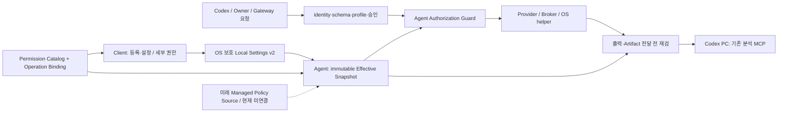

# RACP Agent 세부 권한 및 원격 OS 기능 아키텍처

> **Document ID**: `DOC-SPEC-AGENT-PERMISSIONS`\
> **Status**: Draft · **Target Version**: v0.1.20 구현 진행 / v0.1.19 기준선\
> **Last Updated**: 2026-10-10 · **Classification**: Architecture Specification\
> **참조**: [종합 개발정의서](racp-specification-v1.1.md) · [Windows 계획](windows-engineering-plan.md) · [구현·시험 현황](../quality/implementation-status.md)

> [!IMPORTANT]
> 2026-10-10 사용자 요청으로 Client 전체의 후속 구현은 [Rust Client 전환 계획](rust-client-migration-plan.md)을 따른다. GUI·Agent·OS Provider·Client 배포를 Rust로 교체하고 Python/Electron 레거시 실행 경로를 제거한다. 본문의 기능/권한 요구는 유지하고 Python v0.1.20 구현 설명은 전환 기준선으로 읽는다. Gateway는 Python 유지, Server→Client 조직 정책 배포는 이번 범위에서 제외한다.

## 1. 목적과 이번 범위

사용자가 Client에서 카테고리와 세부 항목별 권한을 선택하고, AI가 그 권한 안에서 원격 PC의 파일·실행·화면·메모리·네트워크·OS 상태를 일관되게 다루도록 설계한다. 첨부한 파일 보기/변경, 데스크톱, 클립보드, 명령 실행 화면은 UI 방향을 설명하는 예시이며 해당 도구 이름이나 기본 허용 상태를 제품 계약으로 복사하지 않는다.

이 문서는 권한·설정 아키텍처, 기능 분류, 실제 제공 수준과 구현 순서를 정의한다. [구현 계획](agent-permissions-implementation-plan.md)에 따라 v0.1.20에서 공통 catalog·로컬 ceiling·보호 설정 v2·공통 UI·Agent 실행/출력 검사를 추가하고 있다. 아래 후보 기능이 이미 모두 구현됐다는 뜻이 아니다. 기존 승인된 결함 수정·리버싱 시험도 계속 진행한다.

> [!IMPORTANT]
> 향후 Gateway 관리자가 Server→Client 정책을 배포할 수 있는 경계는 설계한다. **이번에는 정책 배포 API, 관리 콘솔의 장비별 정책 편집, 정책 push/pull, 중앙 정책 캐시·동기화, 원격 설정 덮어쓰기를 구현하지 않는다.** OAuth 제공자 신설도 이 설계의 전제가 아니다.

원격 Client에는 완전한 IDA/Ghidra/WinDbg/Wireshark 설치를 기본 요구하지 않는다. 기본 모델은 **Agent가 OS 작업과 자료 수집을 수행하고, Codex PC의 기존 MCP 분석 도구가 회수 자료를 분석**하는 것이다. 실시간 디버깅처럼 원격 실행 보조 런타임이 필요한 기능은 Agent 관리 구성요소로 별도 선언한다.

## 목차

- [2. 현재 구현 기준선](#2-현재-구현-기준선)
- [3. 권한·기능·OS 권한의 분리](#3-권한기능os-권한의-분리)
- [4. 구성요소와 검사 경로](#4-구성요소와-검사-경로)
- [5. 카테고리별 세부 기능·권한 후보](#5-카테고리별-세부-기능권한-후보)
- [6. Client 권한 설정 화면](#6-client-권한-설정-화면)
- [7. 설정 저장과 기존 등록의 이전](#7-설정-저장과-기존-등록의-이전)
- [8. 실행·정책 합성 및 우회 경계](#8-실행정책-합성-및-우회-경계)
- [9. AI가 원격 PC를 다루는 계약](#9-ai가-원격-pc를-다루는-계약)
- [10. 기존 리버싱 MCP와의 결합](#10-기존-리버싱-mcp와의-결합)
- [11. 향후 Enterprise 정책 경계](#11-향후-enterprise-정책-경계)
- [12. 단계별 구현 및 검증](#12-단계별-구현-및-검증)

## 2. 현재 구현 기준선

현재 `AgentSettings`는 저장 버전 1, Device/Gateway identity, 작업 폴더, 추가 workspace, data_dir, CA, `read_only/standard/trusted_personal`, `desktop_enabled`를 저장한다. 등록 credential과 설정은 OS 보호 저장소에 함께 보관하고 revision과 lifetime lock을 이용해 Agent가 중지된 상태에서 편집한다. 현재 설정 JSON의 한도는 16 KiB다.

실제 검사 경로는 `racp_protocol.registry`의 operation/input schema, Gateway 승인·실행 profile, Agent 자신의 profile, workspace/path guard, Provider 및 Desktop Broker/Guardian의 session·target·lease 검사다. Agent도 로컬 profile을 검사하므로 Gateway의 요청 profile 하나만으로 권한을 늘릴 수 없다.

이 표의 기준선은 v0.1.19다. v0.1.20의 세부 권한 ID 저장·공통 UI·Agent 검사 진행과 검증은 [구현 현황의 세부 권한 항목](../quality/implementation-status.md#agent-permissions-v020)에서 추적한다. 로컬 승인 UI, 전체 Provider 확대, 실시간 MCP transport와 실행 중 설정 변경은 별도 미완료 항목으로 유지한다.

| 실제 기준선 | 상태와 적용 범위 |
|---|---|
| 파일·process·shell·terminal·browser·desktop RPC | Registry와 Provider에 기존 구현 존재. operation별 시험 증거는 구현 현황 참조 |
| 메모리 regions/read | 기존 Windows RPC; identity·보호 대상·크기·승인 경계 존재 |
| 리버싱 plugin | 기존 GDB/Ghidra plugin 경로는 해당 backend runtime 설치 조건이 있다. 기본 host-tool 모드와 구분 |
| 원격 PE→IDA, 실행·dump→WinDbg | 실제 기존 Codex MCP 조합 검증. B live attach의 증거는 아님 |
| 원격 회수 PE→Ghidra, HTTP HAR→mitmproxy | 추가 실제 host MCP 조회 검증. HAR 분석은 live proxy interception과 다름 |
| Windows IPv4 패킷 수집 | v0.1.19 내장 CLI 기준선. v0.1.20 `network.capture` RPC/MCP·별도 local capture/export grant·contained worker를 추가하며 현재 증거는 구현 현황 참조 |
| service·registry·storage 관리·범용 tunnel | 아래의 후속 기능 후보. 기존 Gateway 서비스 관리와 Client OS 관리의 구현을 혼동하지 않음 |

## 3. 권한·기능·OS 권한의 분리

다음 여섯 개를 별도로 모델링한다.

| 개념 | 의미 |
|---|---|
| Capability | Agent가 구현한 기능 및 backend/runtime 버전 |
| Availability | 현재 OS·권한·session·장치·설치 조건에서 실제 사용 가능한지 |
| Local grant/ceiling | 로컬 장비 소유자·관리자가 허용한 권한 및 대상·예산 상한 |
| Request authority | 호출자·Device·execution profile·승인에 의해 허용된 요청 범위 |
| Managed policy ceiling | 미래 Enterprise 모드에서 조직이 추가로 적용할 제약. 현재는 미사용 |
| OS authority | 실제 실행 token, filesystem ACL, 보호 process, secure desktop 등 OS가 허용하는 범위 |

**Effective permission은 모든 활성 상한의 교집합**이다. 한 계층의 allow가 다른 계층의 deny를 취소하지 않는다. 하나라도 승인 조건이 있으면 그 승인도 충족해야 한다. 기능이 없거나 OS 접근이 불가능한 경우는 checkbox를 켜도 사용 가능으로 바꾸지 않는다.

안정적인 `permission_id`와 operation 이름을 분리한다. permission은 사용자 의도를 표현하고, 하나의 operation은 payload에 따라 여러 permission이 필요할 수 있다. 예를 들어 `filesystem.write(mode=create)`와 `mode=replace`는 각각 생성·편집 권한으로 구분하고 copy/move는 출발지와 목적지의 권한을 모두 검사한다.

Permission descriptor에는 ID, category, 한글 label/description, 위험·민감도, 기본 decision, 필요한 OS/runtime, operation+payload selector, constraints schema, 시행 수준을 둔다. UI와 설명은 같은 catalog에서 생성한다. plugin이 새 tool을 광고했다고 자동으로 allow하지 않는다.

## 4. 구성요소와 검사 경로



후속 모듈 경계는 `PermissionCatalog`, `LocalPermissionSettings`, `PermissionCompiler`, `AuthorizationGuard`, `CapabilityProbe`, `AuditDecision`로 나눈다. 위 이름은 설계상의 책임이며 현재 존재하는 클래스라고 가정하지 않는다.

1. 등록/설정 UI는 credential을 포함하지 않는 편집 snapshot과 revision만 받는다.
2. Agent는 로컬 설정을 읽고 immutable permission snapshot과 revision hash를 만든다.
3. 접수 및 실제 dispatch 직전에 operation·payload·target·snapshot revision을 검사한다.
4. 오래 기다린 요청은 await 이후 실행/전달 전에 다시 검사한다. 터미널 인증 경합 수정과 같은 원칙을 적용한다.
5. 지속 session의 입력·renew와 민감한 출력 전달에서도 현재 권한을 확인한다.
6. 권한 축소는 새 접수부터 적용하고 관련 lease/session을 폐기한다. 소유 입력·socket·browser·job을 제한된 시간 안에 정리한다.
7. 이미 완료된 작업을 되돌리거나 재실행하지 않는다. 이미 committed된 파일/Artifact의 보존과 이후 접근 허용은 별도로 판단한다.

현재 v0.1.20에서는 retained output을 실제 전달하기 전에도 새 ceiling을 적용한다. Agent가 별도 SQLite scope binding에 실제 workspace·root fingerprint·소유 identity를 기록해 재시작 후에도 호출 context와 혼동하지 않는다. 동일 workspace ID의 root가 바뀌거나 이전 버전 결과에 검증된 binding이 없으면 미전송 bytes를 차단한다. 기록된 실행 상태는 유지하고 전달 거절만 별도 error로 보고한다. 만료된 outcome의 scope proof는 기존 task/upload pin 보존 이후 제한된 개수씩 회수한다.

권한 축소·lease 만료 이후에도 Agent 내부의 **기존 소유 자원 정리**는 수행해야 한다. 이를 새 사용자 작업의 allow로 취급하지 않으며, cleanup 예외로 다른 process/파일을 변경할 수 없게 ownership과 identity를 고정한다.

Agent뿐 아니라 Broker/OS helper에도 검증된 대상·허용 action·revision을 전달한다. helper가 요청의 임의 `allow=true`, `trusted=true`를 권한 근거로 사용하지 않게 한다.

## 5. 카테고리별 세부 기능·권한 후보

아래의 ID는 **권한 catalog 설계 후보**다. `기존`은 해당 작업의 기존 primitive가 있다는 뜻이며 세부 권한 enforcement/UI가 완료됐다는 뜻이 아니다. `CLI`는 승인된 shell로 이용하는 Agent 내장 helper, `후속`은 operation·Provider 추가가 필요한 기능이다. 파괴적·민감한 기능은 별도 opt-in과 실제 backend 검증 없이는 노출하지 않는다.

### 5.1 장비·OS·사용자 상태

| ID | 세부 항목 | 범위/조건 | 기준선 |
|---|---|---|---|
| `system.identity.read` | hostname·OS·아키텍처·Agent 버전 | 원격 Device 출처 포함 | 기존 정보 일부 / 통합 후속 |
| `system.resources.read` | CPU·메모리·uptime·부하 | 시점·샘플 주기·항목 수 제한 | 후속 |
| `system.sessions.read` | 로그인 사용자·session·잠금 상태 | SID/session identity, 민감한 계정 정보 구분 | 기존 desktop 일부 |
| `system.locale.read` | 시간대·언어·환경 기본 경로 | 환경 전체 dump와 credential 출력 금지 | 후속 |
| `system.environment.read` | 허용된 환경 변수 조회 | allowlist, 민감 변수 값 비노출 | 후속 |

### 5.2 파일 보기

| ID | 세부 항목 | 범위/조건 | 기준선 |
|---|---|---|---|
| `files.list` | 폴더 탐색 | named workspace·page limit | 기존 `filesystem.list` |
| `files.search.names` | 이름/glob 검색 | 루트·깊이·결과 수·시간 제한 | 기존 search 일부 |
| `files.search.content` | 텍스트 내용 검색 | bytes/encoding·파일 크기 제한 | 후속 · 현재 search는 이름/glob만 지원 |
| `files.read.text` | 텍스트 구간 읽기 | encoding·BOM·줄바꿈·truncate 명시 | 기존 read |
| `files.read.binary` | binary 읽기·회수 | hash·Artifact·전송 예산 | 기존 read |
| `files.preview.image` | 원격 이미지 보기 | binary read + host preview, Device/hash 대응 | 기존 회수 / 전용 UX 후속 |
| `files.metadata.read` | stat·크기·수정 시각·revision | 내용 읽기와 별도 권한 | 기존 stat |
| `files.hash` | SHA-256 등 무결성 확인 | 대상 revision과 hash 연결 | 기존 hash |

v0.1.20 source의 `filesystem.search_content`는 별도 검색·text read 권한을 요구하는 literal line 검색이다. named workspace와 anchored file handle을 사용하고 링크를 따르지 않는다. 파일·전체 scan bytes·깊이·결과 수를 제한하고 binary/encoding/크기/변경 중 파일의 skip 및 도달한 한계를 보고한다. Unicode casefold의 확장도 원문 codepoint 열 번호로 변환하고 match 주변 preview를 반환한다. OS 전체의 일관된 snapshot이라고 주장하지 않는다.

### 5.3 파일 변경

| ID | 세부 항목 | 범위/조건 | 기준선 |
|---|---|---|---|
| `files.create` | 새 파일 생성 | 기존 파일 덮어쓰기 금지 | 기존 write create |
| `files.directory.create` | 폴더 생성 | 허용 workspace 내 | 기존 mkdir |
| `files.edit` | replace·append·truncate | expected revision/offset, 원본 보존 | 기존 일부 |
| `files.patch` | 검토 가능한 diff·여러 파일 편집 | batch 실패 계약·원자성 별도 구현 | 후속 |
| `files.copy` | 복사 | 출발 read + 목적 create/edit 모두 검사 | 기존 copy |
| `files.move` | 이동·이름 변경 | 양쪽 workspace·revision 검사 | 기존 move |
| `files.delete` | 파일·폴더 삭제 | recursive 별도 제약·정확한 대상 | 기존 delete |
| `files.trash` | 휴지통으로 이동·복원 | Windows 사용자/session 지원 확인 | 후속 |
| `files.acl.read` / `files.acl.modify` | ACL 조회/변경 | 변경은 강한 opt-in, 권한 상향과 분리 | 후속 |

v0.1.20 source의 `filesystem.patch`는 1..16개 기존 파일의 SHA-256 전제와 exact text edits를 받는다. 모든 파일을 먼저 검증하고 dry-run diff 또는 순차 적용을 제공한다. UTF-8 BOM과 편집하지 않은 줄바꿈 bytes를 보존하며 `files.patch`, `files.edit`, `files.read.text`를 모두 요구한다. 각 파일의 교체는 원자적이지만 OS의 여러 파일을 한 트랜잭션으로 교체하지 않는다. 적용 중 실패는 완료 파일·새 hash·실패 대상과 partial 상태를 반환하며 이미 완료된 파일을 자동 rollback하거나 외부 변경을 덮어쓰지 않는다. 기존 write의 `newline=verbatim`도 명시한 줄바꿈을 그대로 쓴다. 파일 worker는 현재 권한/revision을 budget check와 교체 직전에 재검하며 임시 파일 cleanup은 권한 폐기 뒤에도 수행한다. 설정 UI는 여전히 다음 Agent 시작부터 적용하는 cold 설정이다.

### 5.4 디스크·볼륨

| ID | 세부 항목 | 범위/조건 | 기준선 |
|---|---|---|---|
| `storage.volumes.read` | volume·filesystem·용량 | filesystem 경로 읽기와 분리 | 후속 |
| `storage.health.read` | 디스크·SMART·오류 상태 | 실제 장치/driver 지원에 의존 | 후속 |
| `storage.usage.read` | 폴더별 사용량 분석 | traversal·시간·결과 예산 | 후속 |
| `storage.mount.modify` | mount·drive letter 관리 | Agent state/workspace 영향 검토 | 후속 |
| `storage.raw.read` | raw volume/disk 읽기 | admin·장치 allowlist·정확한 offset/bytes | 후속 |
| `storage.partition.modify` / `storage.format` / `storage.raw.write` | partition·format·raw write | 기본 off, maintenance·현지 확인·별도 복구 절차 | 후속 / 고위험 |

### 5.5 프로세스 관측·제어

| ID | 세부 항목 | 범위/조건 | 기준선 |
|---|---|---|---|
| `process.list` | process 목록 | snapshot·page limit | 기존 |
| `process.inspect` | exe·사용자·상태·생성 시각 | 민감 cmdline은 분리·redaction | 기존 |
| `process.arguments.read` | command line 관측 | token/password 인자 포함 가능, 명시 opt-in | 기존 반환 범위 분리 필요 |
| `process.tree` | 부모·자식 tree | PID/create_time/boot, 보호 대상 | 기존 |
| `process.wait` | 종료 대기 | wait timeout은 target을 종료하지 않음 | 기존 |
| `process.spawn` | 프로그램 시작 | 실행 정책·cwd/env·Job 소유권 | 기존 |
| `process.stop.owned` | RACP 소유 process/tree 종료 | kernel 종료 확인, 동일 principal | 기존 |
| `process.stop.external` | 외부 process 종료 요청 | 보호 process 거부, exact identity·추가 승인 | 기존 primitive / 세부 gate 후속 |

### 5.6 명령 실행

| ID | 세부 항목 | 범위/조건 | 기준선 |
|---|---|---|---|
| `exec.recipe` | 사전에 정의한 실행 recipe | 고정 executable/hash·argv schema·출력 계약 | 후속 |
| `exec.argv` | 명시 executable/argv | 실행 파일·cwd·env·timeout 제약 | 기존 shell argv |
| `exec.shell` | PowerShell/CMD 등 shell | shell 선택·script·redirection 위험 표시 | 기존 explicit shell |
| `exec.script` | 임의 Python/JS/기타 코드 | OS 사용자 권한으로 동작, 상위 위험 권한 | 기존 shell primitive |
| `exec.environment.override` | 허용 환경 변수 설정 | 시스템 root와 credential 관련 키 보호 | 기존 일부 |
| `exec.elevated` | 관리자 실행 경로 사용 | 이미 확보한 token만 사용; 조용한 UAC 우회 금지 | 실행 token 정보 / 전용 흐름 후속 |

허용/차단 목록은 executable identity와 정규화된 argv에 적용하고 deny 우선으로 평가한다. shell 문자열의 정규식 하나를 OS sandbox라고 설명하지 않는다. unrestricted Python/PowerShell 허용은 files/network/memory의 구조화된 API checkbox보다 강한 실행 능력을 가진다. §8의 시행 수준을 반드시 같이 표시한다.

### 5.7 지속 터미널·Job

| ID | 세부 항목 | 범위/조건 | 기준선 |
|---|---|---|---|
| `terminal.open` | PTY/REPL session 생성 | 실행 정책 + Handle 소유권 | 기존 |
| `terminal.output.read` | 출력·cursor·gap 관측 | 출력에 민감 데이터 포함 가능 | 기존 |
| `terminal.input.write` | stdin 입력 | interactive shell의 임의 실행 위험 동일 | 기존 |
| `terminal.resize` | 크기 변경 | 소유 session만 | 기존 |
| `terminal.close` | 종료·renew | lease·동일 owner·boot | 기존 |
| `jobs.observe` / `jobs.cancel` | 장기 작업 진행·취소 | terminal 결과 불변·소유 tree 정리 | 기존 |

### 5.8 화면 보기

| ID | 세부 항목 | 범위/조건 | 기준선 |
|---|---|---|---|
| `desktop.monitors.read` | monitor·원점·배율 | 실제 session·display 상태 | 기존 |
| `desktop.windows.read` | 창 목록·foreground·bounds | process/window identity | 기존 |
| `desktop.capture.screen` | 화면 캡처 | 민감 화면 opt-in·해상도/bytes·선택 monitor | 기존 |
| `desktop.capture.window` | 지정 창 캡처 | stale HWND·대상 PID 방지 | 기존 |
| `desktop.uia.read` | native UI 요소 관측 | password/protected 요소 제한 | 기존 |

### 5.9 화면 입력·앱 제어

| ID | 세부 항목 | 범위/조건 | 기준선 |
|---|---|---|---|
| `desktop.mouse.click` | click·double/right click | 관측 revision·대상 창·입력 lease | 기존 |
| `desktop.mouse.move` / `desktop.mouse.drag` | 이동·drag | buttons release·Guardian 정리 | 기존 일부 |
| `desktop.mouse.scroll` | 세로/가로 scroll | own observation·modifier ledger | 기존 |
| `desktop.keyboard.text` | Unicode text 입력 | foreground·session·취소 경계 | 기존 |
| `desktop.keyboard.keys` | key·shortcut | Ctrl/Alt/Shift 및 key-up 정리 | 기존 |
| `desktop.uia.invoke` / `desktop.uia.set_value` | native 요소 action | stale ref·protected 값 거부 | 기존 |
| `apps.inventory.read` / `apps.launch` / `apps.close` | 앱 목록·시작·닫기 | process/exec 권한과 결합 | 기존 primitive / 전용 모델 후속 |

### 5.10 클립보드

| ID | 세부 항목 | 범위/조건 | 기준선 |
|---|---|---|---|
| `clipboard.text.read` | 현재 text 읽기 | 명시한 로그인 session·UTF-8 8 KiB 상한·기본 off | v0.1.20 clipboard.read RPC 추가 |
| `clipboard.text.write` | text 교체·지우기 | 내용 없는 상태 조회·필수 sequence/CAS·session·8 KiB 상한 | v0.1.20 clipboard.state/write RPC 추가 |
| `clipboard.formats.read` | formats·이미지 읽기 | native clipboard 접근·Artifact 경계 | 후속 |
| `clipboard.files.write` | 파일 목록/이미지 설정 | 대상 경로·데이터 ownership | 후속 |

keyboard shortcut을 이용한 clipboard 읽기/쓰기를 clipboard API gate와 같은 기능이라고 가정하지 않는다. 임의 화면 입력/실행을 허용하면 같은 OS 기능을 간접 사용 가능한 점을 표시한다.

### 5.11 브라우저

| ID | 세부 항목 | 범위/조건 | 기준선 |
|---|---|---|---|
| `browser.create` / `browser.close` | RACP 소유 격리 browser | native runtime·소유 tree 정리 | 기존 |
| `browser.pages.read` | tab/frame·URL·DOM·snapshot | 관측 ID·navigation revision | 기존 |
| `browser.capture` | screenshot | Artifact/hash·page scope | 기존 |
| `browser.navigate` | URL 이동·새 page | URL/domain·redirect 범위 | 기존 |
| `browser.input` | click/type/key | page·element·관측 경계 | 기존 |
| `browser.evaluate` | page JavaScript | DOM·통신·storage 변화 가능, 별도 권한 | 기존 |
| `browser.files.upload` / `browser.files.download` | upload/download | files/export 권한·hash·quota | 기존 |
| `browser.attach.external` | 기존 사용자 browser attach | 명시한 CDP scope, 사용자 browser 보존 | 기존 / 강한 opt-in |
| `browser.console.read` / `browser.network.read` | console·요청/응답 기록 | secret redaction·body opt-in·HAR 한도 | 후속 전용 RPC |
| `browser.cookies.read` / `browser.storage.modify` | cookie/storage | credential 민감도, 기본 off | 후속 |

### 5.12 네트워크

| ID | 세부 항목 | 범위/조건 | 기준선 |
|---|---|---|---|
| `network.interfaces.read` | NIC·IP·route·DNS·counters | 관측 시점·namespace | 후속 |
| `network.connections.read` | 연결·listen port·가능한 PID | 정확한 endpoint·권한에 따른 가시성 | 후속 |
| `network.probe` | DNS·연결·latency 검사 | peer/port allowlist·시간·빈도 | 후속 |
| `network.capture.ipv4` | 지정 interface의 IPv4 TCP/UDP 수집 | admin·local port/peer 필터·30초/16 MiB 상한 | v0.1.19 CLI / v0.1.20 RPC 추가 |
| `network.capture.layer2` / `network.capture.ipv6` | Ethernet/ARP·IPv6 등 | 지원 backend와 실제 OS/driver probe | 후속 |
| `network.http.record` | 승인된 앱/session의 HAR/HTTP 기록 | request/response body·cookie 범위 | 실제 Browser HAR 시험 / RPC 후속 |
| `network.proxy.intercept` | 명시한 proxy session 관측·변경 | 라우팅·CA·pinning/mTLS 조건, 다른 앱 설정 보존 | 후속 |
| `network.http.replay` | 자체/승인된 요청 재전송 | 대상·횟수·method/body·부작용 승인 | 후속 원격 경로 |
| `network.tunnel.open` | host 도구와 Agent endpoint의 duplex channel | 인증 Handle·peer/owner·bytes/시간; native opaque command는 광역 실행 권한 필요 | v0.1.20 managed CDB native.prepare/start/close |
| `network.configuration.modify` / `network.firewall.modify` | DNS/route/firewall 변경 | 연결 단절·복구·현재 설정 revision | 후속 / 고위험 |

IPv4 raw IP PCAP이 ARP/Wi-Fi/USB 프레임이나 TLS 평문을 포함한다고 설명하지 않는다. 키 없는 TLS 내용 복호화는 RACP 전달 기능으로 해결되지 않는다. 실제 해당 interface에서 보이는 packet과 지원하는 capture backend만 제공한다.

### 5.13 메모리·dump

| ID | 세부 항목 | 범위/조건 | 기준선 |
|---|---|---|---|
| `memory.regions.read` | virtual memory 영역·보호 속성 | PID/create_time/boot·보호 PID | 기존 |
| `memory.bytes.read` | 지정 주소/범위 읽기 | live/non-atomic·크기·민감 정보 | 기존, 현 한도 16 MiB |
| `memory.dump.create` | 선택 process dump | mini/full·PID/create_time/boot·spool/quota·취소 정리 | v0.1.20 전용 process.dump RPC 추가 |
| `memory.bytes.write` | 지정 bytes 변경 | expected bytes·정확한 identity·추가 승인 | 후속 / 고위험 |
| `memory.allocate` / `memory.protection.modify` | allocation·memory protection | reversible 범위·원본 정보·소유 process | 후속 / 고위험 |

### 5.14 디버깅·리버싱 연결

| ID | 세부 항목 | 범위/조건 | 기준선 |
|---|---|---|---|
| `analysis.binary.export` | 바이너리·의존성 회수 | files read + Artifact export·hash | 실제 IDA/Ghidra host MCP |
| `analysis.dump.export` | dump·실행 증거 회수 | memory/dump 권한 + export | 실제 WinDbg host MCP |
| `analysis.trace.export` | PCAP/HAR/event trace 회수 | capture 종류·출처·hash | 실제 Wireshark/mitmproxy host MCP |
| `debugger.attach` / `debugger.detach` | 승인 target live session | exact process identity·native helper·lease | 기존 optional plugin; host WinDbg bridge 후속 |
| `debugger.observe` | register·stack·memory·module 관측 | debug session ownership·민감 정보 | 기존 optional plugin 일부 |
| `debugger.breakpoint` / `debugger.step` / `debugger.resume` | breakpoint·step/continue | target 진행 상태·부작용·cleanup | 기존 optional plugin 일부 / host bridge 후속 |
| `debugger.registers.write` / `debugger.memory.write` | 디버거를 통한 변경 | observe와 별도 gate | 후속 / 고위험 |

Native debugger의 임의 command 허용은 read-only debugger API와 다르다. memory write와 실행 제어를 포함할 수 있으므로 명시적인 광역 실행 권한으로 취급한다. 모든 MCP command의 의미를 임의 문자열 필터로 안전하게 분류했다고 주장하지 않는다.

### 5.15 OS 구성·서비스·작업 스케줄러

| ID | 세부 항목 | 범위/조건 | 기준선 |
|---|---|---|---|
| `services.read` | Client OS 서비스 상태·설정 | Gateway 자체 서비스 관리와 별개 | 후속 |
| `services.control` / `services.configure` | 시작·중지·설정 변경 | 보호 서비스·복구·dependencies | 후속 / 고위험 |
| `registry.read` | key/value 관측 | registry root/value allowlist·secret 제외 | 후속 |
| `registry.modify` | key/value 변경·삭제 | expected value·backup·protected keys | 후속 / 고위험 |
| `tasks.read` / `tasks.modify.owned` | 스케줄러 목록·RACP 소유 task 관리 | 소유 namespace·action 실행 정책 | 후속 |
| `software.inventory.read` / `software.install` / `software.uninstall` | 설치 프로그램·배포/제거 | 출처/hash·설치자·사용자 데이터 보존 | 후속 |

### 5.16 계정·session·전원

| ID | 세부 항목 | 범위/조건 | 기준선 |
|---|---|---|---|
| `accounts.read` | 사용자/group/SID 관측 | credential 값과 분리 | 후속 |
| `accounts.modify` | 계정/group 변경 | 관리자 범위·로컬 재승인·audit | 후속 / 고위험 |
| `session.lock` / `session.logoff` | 현재 session 잠금·로그오프 | GUI/Handle 퇴역·사용자 영향 | 후속 |
| `power.reboot` / `power.shutdown` / `power.sleep` | 재부팅·종료·절전 | drain·복구 계획·실제 현지 확인 | 후속 / 고위험 |

잠금 해제, UAC secure desktop, 다른 사용자 session과 protected process 접근을 일반 Agent가 무조건 제공할 수 있다고 선언하지 않는다. 해당 OS의 인증·권한·지원 경로가 필요하며 password/MFA/보호 경계를 우회하는 기능을 포함하지 않는다.

### 5.17 로그·이벤트·성능

| ID | 세부 항목 | 범위/조건 | 기준선 |
|---|---|---|---|
| `diagnostics.agent.read` | Agent 상태·최근 활동·진단 | redaction·bounded tail | 기존 일부 |
| `events.os.read` | Windows Event Log 등 조회 | channel/time/query·결과 한도 | 후속 |
| `events.trace.record` | ETW/Procmon 계열 trace | backend·권한·필터·기간 | 후속 |
| `performance.sample` | CPU/RSS/handle/I/O 시계열 | 주기·보관·clock 출처 | 후속 |
| `diagnostics.export` | 지원 bundle·시험 증거 회수 | credential/원문 DB 제외, export 권한 | Client 전용 후속 |

### 5.18 Artifact·backup·복구

| ID | 세부 항목 | 범위/조건 | 기준선 |
|---|---|---|---|
| `artifacts.export` | Client 자료를 host로 전달 | owner/device·hash·size·retention | 기존 |
| `artifacts.import` | host 자료를 Client에 전달 | destination files create/edit도 필요 | 기존 |
| `backup.workspace` | 허용한 폴더/앱 state backup | manifest·revision·일관성·exclude | 후속 Client 모델 |
| `restore.workspace` | 승인된 backup 복원 | 검증·diff·rollback·원본 보존 | 후속 Client 모델 |
| `agent.settings.read` / `agent.settings.modify.local` | 로컬 설정 보기/편집 | 인증된 로컬 IPC만, credential 비노출 | 기존 coarse 설정 / v2 후속 |

원격 `files.edit`, 임의 recipe 또는 future managed policy가 Agent credential·신뢰 anchor·소유자 상한을 일반 파일 편집처럼 변경하지 못하게 protected control paths를 둔다. 이는 구조화된 API 경계이며 광역 OS 실행 권한의 한계는 §8을 따른다.

## 6. Client 권한 설정 화면

등록과 설정 편집에서 동일한 catalog/컴포넌트를 사용한다. 상단에 장비 identity·실행 계정·관리자 여부·session·현재 profile·설정 revision을 표시하고, 카테고리별로 접기/펼치기·master switch·세부 항목·허용된 개수·실제 사용 가능 상태를 표시한다.

| 검토 가능한 preset | 초기 제안 | 기본적으로 선택하지 않는 항목 |
|---|---|---|
| 읽기 기본 | 명시한 workspace의 목록·메타데이터·텍스트·검색·hash, 최소 장비 정보 | 임의 실행·화면 입력·clipboard·memory/capture·OS 변경 |
| 개발 작업 | 읽기 기본 + 파일 변경·검증된 실행 recipe·소유 Job/terminal | 무제한 shell/script·외부 process kill·OS 관리 |
| 분석 작업 | 선택 binary/dump/trace 회수·소유 분석 target·제한된 수집 | 임의 process memory/write·사용자 browser attach·전체 통신 수집 |
| OS 관리 | 명시적으로 고른 service/config/전원 항목 | 전체 켜기 없음; 파괴적 항목은 개별 검토 |

preset은 사용자가 검토할 leaf 선택과 제약의 묶음이며 새 권한을 자동 부여하는 profile alias가 아니다. 로컬 grant가 on이어도 현재 execution profile의 상한에 막히면 그 이유를 표시한다. leaf를 켰다는 이유로 `trusted_personal`로 조용히 바꾸지 않는다. v1 등록의 이전은 preset 재적용 대신 §7의 기존 실효 범위 보존 절차를 따른다.

- Category off는 해당 category 전체의 effective deny다. 세부 선택은 보존하되 실행에 사용하지 않는다.
- Category on은 저장된 세부 선택만 복원한다. 새로 추가된 permission은 자동 선택하지 않는다.
- Mixed 상태를 표시한다. 전체 켜기는 명시한 현재 ID만 선택하며 고위험 항목은 별도 확인한다.
- Leaf에는 off/승인 필요/on과 경로·프로그램·peer·target·한도 등 제약 편집을 제공한다.
- `allow`, `deny`, `requires_approval`와 `missing_runtime`, `needs_administrator`, `unsupported_os`, `session_locked`, `offline`, `not_implemented`를 구분한다.
- 미래 managed mode에서는 effective 값·설정 출처·잠금 이유를 표시한다. 현재 UI에는 서버 정책이 적용된 것처럼 표시하지 않는다.
- 저장 전 현재 revision 대비 변경과 영향받는 작업을 보여 준다. 저장 실패는 기존 identity/credential/설정을 유지한다.

기존 `desktop_enabled`는 현재 coarse compatibility control이다. 단계적인 이전 중 같은 UI에서 coarse flag와 leaf 권한이 서로 다른 값을 보내는 두 SSOT를 만들지 않는다.

## 7. 설정 저장과 기존 등록의 이전

현재 v0.1.20의 v2 모델은 `registration identity`, `local permission settings`, `effective runtime snapshot`, `runtime availability`를 분리한다. Device credential의 OS 보호와 identity binding은 유지하고 gateway/CA/profile/workspaces 변경의 기존 revision·backup·lock 절차를 재사용한다.

```json
{
  "version": 2,
  "permissions": {
    "version": 1,
    "disabled_categories": ["files_write", "network"],
    "grants": {
      "files.list": "allow",
      "files.read.text": "allow",
      "exec.argv": "deny",
      "network.capture.ipv4": "deny"
    },
    "constraints": {
      "workspace_ids": ["default"],
      "max_timeout_ms": 30000,
      "max_output_bytes": 1048576,
      "executable_allowlist": [],
      "executable_denylist": [],
      "strict_os_isolation": false
    }
  }
}
```

이는 **현재 v2 권한 구조의 부분 예시**이며 필수 gateway/Device/workspace/data_dir fields를 생략했으므로 전체 설정 파일로 입력하지 않는다. credential을 포함하지 않는다. 현재 strict schema는 기존 등록 fields와 통합되어 있으며, 저장 16 KiB·catalog 크기·schema validation을 함께 검사한다. 현재는 settings/permissions version의 정수 타입을 엄격히 검사하고, `policy_mode`나 서버 정책 fields는 저장 모델에 추가하지 않았다.

1. v1 credential을 덮어쓰지 않고 검증·backup한다. OS 보호가 실패하면 이전하지 않는다.
2. 기존 profile/workspaces/desktop flag의 실효 범위를 보존한다. 이전을 기회로 새 권한을 부여하지 않는다.
3. 이전 등록의 unknown permission은 deny다. catalog 갱신도 새 ID를 default off로 둔다.
4. `desktop_enabled=false`는 desktop read/input 모두 off, true는 이전 버전에서 이미 허용한 desktop primitive만 매핑한다. clipboard 같은 새 기능으로 확대하지 않는다.
5. source/binary 혼재·rollback의 schema 호환성을 명시한다. 이전 Agent가 v2를 이해하지 못하면 명확히 실패하고, permission을 버리고 trusted profile로 돌아가지 않는다.
6. immutable snapshot에는 revision/hash를 둔다. availability는 실행 시 변하므로 설정 파일의 true/false에 고정하지 않는다.

## 8. 실행·정책 합성 및 우회 경계

세부 API gate는 Agent가 dispatch하는 구조화된 작업을 제어한다. **임의 executable/script/interactive shell을 허용한 상태에서 그 프로그램의 모든 OS 행위를 세부 checkbox로 강제 차단한다고 약속하지 않는다.** 이는 기존 가이드의 “폴더 선택은 shell의 OS 권한을 격리하지 않는다”와 일치한다.

같은 실행은 `shell.exec`, `process.spawn`, `terminal.open`, 앱 launch 등 여러 진입점으로 도달할 수 있다. compiler는 각 경로에 실행 grant도 함께 요구하고, 어느 진입점이든 unrestricted 실행의 시행 수준과 동일한 제약을 적용한다. interpreter 이름만 차단하거나 `.exe` 확장자만 허용했다고 category 간 우회가 사라지는 것은 아니다.

시행 수준을 다음과 같이 선언한다.

| 수준 | 의미 | 제공 조건 |
|---|---|---|
| `structured_api` | 지정 RACP operation/payload·대상·결과 전달 gate | Agent/Broker에서 authoritative 검사 |
| `restricted_recipe` | 검증된 executable·고정 recipe·typed argv만 실행 | interpreter escape·child 실행·출력 경로 계약 검사 |
| `trusted_os_execution` | 현재 OS token으로 임의 프로그램 실행 가능 | 사용자에게 광역 실행 능력 표시, 세부 OS 격리 보장 없음 |
| `os_isolated_execution` | filesystem/network/process 권한도 OS 수준에서 제한 | 실제 restricted token/AppContainer/VM 등 backend와 인수 증거 필요; **Job Object만으로 선언하지 않음** |

특정 OS 행위를 **강제로 차단해야 하는** 설정과 unrestricted 실행이 충돌하면 compiler가 충돌을 보고하고 그 실행을 거부하거나 실제 격리 backend를 요구한다. 개인 모드의 `structured_api` 제한을 사용자 확인 없이 OS 전체 제한으로 표시하지 않는다. 미래 mandatory 조직 정책도 시행할 수 없는 제약을 경고 한 줄로 무시하며 넓은 실행을 허용하지 않는다.

승인은 operation digest, Device, principal, workspace/target identity, boot, permission revision, 필요한 gate에 연결한다. 오래된 승인으로 새 target·확대된 permission을 실행하지 못하게 한다. 미래 로컬 승인과 Gateway 승인은 별도 근거이며, 로컬 승인을 요구하도록 설정했다면 Gateway 관리자가 승인했다고 대체하지 않는다.

제약 합성은 deny 우선, 대상 집합 교집합, 숫자 예산 최소값, 승인 조건의 합집합으로 정한다. 서로 충돌하는 제약은 더 넓은 대체 동작으로 fallback하지 않는다. 수집 실패를 다른 process/다른 NIC의 성공 자료로 대체하지 않는다.

## 9. AI가 원격 PC를 다루는 계약

AI에게 로컬 도구와 유사한 일관된 read/list/search/edit/execute/observe 흐름을 제공하되, 실제 실행 위치를 숨기지 않는다.

- 각 요청·출력에 `device_id`, hostname/OS, workspace, Agent boot/epoch, resource identity, permission revision, 관측 시각을 연결한다.
- thread의 선택 Device context는 명시적으로 설정한다. 선택이 불명확하면 A-local shell로 fallback하지 않는다.
- filesystem path와 Artifact는 `racp://<device>/<workspace>/...` 같은 논리적 참조를 사용할 수 있다. 실제 MCP 분석용 A-local cache path와 원격 원본을 hash로 대응시킨다. 이것은 설계이며 현재 URI handler 구현 선언이 아니다.
- text read는 encoding·범위·줄바꿈·truncated·revision을 반환하고 edit는 해당 revision의 diff를 먼저 검증한다.
- GUI는 screenshot/DOM/UIA 관측 후 ref로 입력한다. 실제 foreground/session의 변경은 ref와 lease를 퇴역시킨다.
- terminal/job/capture는 동기·지속·장기 작업을 구분하고 cursor/sequence·cancel·expiry·output budget을 공통 설명으로 제공한다.
- Device별 capability/permission/availability를 조회할 수 있게 한다. 도구 목록 캐시와 실행 직전 검사를 분리한다.
- deny/unavailable/needs approval의 이유 및 가능한 다음 조치를 제공하되, AI가 로컬 설정이나 OS 보호를 임의 해제하도록 유도하지 않는다.

“로컬 PC처럼 동작”은 일관된 작업 의미와 풍부한 관측을 뜻한다. 원격의 더 큰 지연, 단절, 중복 요청, 비원자적 메모리 관측, 보호된 OS 상태까지 없애는 약속이 아니다.

## 10. 기존 리버싱 MCP와의 결합

| 모드 | 구성 | 이번 기준선 및 후속 요구 |
|---|---|---|
| `host_tool` | Agent OS 수집→RACP 회수→A의 기존 MCP | IDA/Ghidra, WinDbg dump, Wireshark PCAP, mitmproxy HAR 실제 경로 |
| `agent_native` | Agent 내장 OS helper가 상태를 관측/제어 | 파일/process/화면/memory와 Windows raw IPv4 CLI. 추가 structured RPC는 단계적으로 구현 |
| `managed_remote_runtime` | Agent가 해시·버전이 검증된 보조 runtime과 session을 관리 | 실시간 debugger/proxy 등 필요한 기능만 선택 제공. Client에 전체 분석 IDE 수동 설치를 요구하지 않는 방향 |

Client의 권한 설정은 B의 작업·자료 회수 경계를 제어한다. A에서 실행하는 IDA Python이나 분석 DB 변경처럼 host MCP 자체의 권한은 Codex/host 환경에서 관리한다. Client checkbox가 A의 임의 코드 실행까지 격리한다고 설명하지 않는다. 이미 합법적으로 회수해 A에 저장한 자료를 이후 권한 취소로 원격 삭제하거나 보지 못하게 만들 수 있다고 약속하지 않는다.

실시간 WinDbg의 host MCP는 native remote-debug protocol endpoint를 요구한다. 현재 Agent memory/read 또는 dump 회수 API가 그 endpoint를 자동으로 대체하지 않는다. 후속 native helper + 인증 duplex channel을 설계·시험해야 한다. 기술적으로 원격 Agent 방식이 불가능하다는 결론이 아니라 현재 제공하지 않는 실행 경로다.

후속 tunnel은 Client 인바운드 포트를 기본 열지 않는다. A-local native-tool endpoint↔인증된 Gateway/Agent session↔B의 허용된 loopback helper로 제한하고 owner·boot·lease·peer·byte budget·cleanup을 결합한다. 원본 MCP 서버를 대체하는 자체 MCP adapter를 기본 해법으로 삼지 않는다.

v0.1.20 source의 내부 duplex frame/공통 Agent·SDK relay 코어는 복수 native 연결을 독립 채널로 유지한다. CDB reverse TCP 인수에서 3채널을 관측했으며 단일 socket으로 합치지 않는다. scope fingerprint는 인증 수단이 아니고 authenticated carrier의 Device/boot/epoch/principal/workspace/revision 결합을 재검하는 값이다. 16채널·16 KiB chunk·4-frame ACK credit·전체 byte/time ceiling·현재 gate/idle lease 회수를 적용했다. `native.prepare/start/close`, owner bearer/TLS WebSocket, outbound Agent connection 및 SDK carrier를 연결하고 Hyper-V W11에서 기존 WinDbg MCP의 실제 live 경로를 검증했다. `network.tunnel.open`은 RPC-backed지만 관리 runtime이 없으면 capability unavailable이며 이전 등록의 grant를 확대하지 않는다. runtime manifest의 신뢰 digest·component SHA/x64 PE·읽기 pin, Job Object·정확한 helper peer 및 세션 폐기를 적용한다. 임의 native command는 OS 제어 범위가 넓으므로 `exec.argv` 등 명시한 광역 grant를 요구하고 executable allow/deny 목록을 설정한 경우 거절한다. [구현 현황 §27](../quality/implementation-status.md#agent-permissions-v020)에 host proof와 W11 실제 인수를 구분한다.

`proxy.prepare/close`는 같은 인증 carrier를 두 방향으로 사용한다. `agent_listener`는 Agent가 선택한 loopback 포트를 특정 client PID/생성 시각에 결합하고 host의 기존 native proxy로 전달한다. `agent_connector`는 특정 server PID가 소유한 정확한 loopback 포트에만 연결하며, host listener도 기존 proxy MCP의 socket 소유 PID를 검증한다. 두 방향을 함께 사용하면 VM HTTP client→host native MCP→VM origin과 host native replay→VM origin을 구성할 수 있다. scope에는 endpoint role도 결합한다. 인터셉트·재전송·tunnel·광역 실행·자료 전달의 명시한 grant와 byte/time ceiling을 요구한다. VM에 전체 분석 IDE를 설치하거나 시스템 proxy/CA를 변경하지 않는다. native MCP의 허용된 명령 전체를 URL 또는 read-only로 격리했다고 주장하지 않는다. 실제 W11 HTTP 수집·범위가 제한된 header 수정·POST 재전송·반복 종료 및 borrowed process 보존을 검증했다. HTTPS, pinning, mTLS와 모든 사용자 앱의 자동 routing은 별도 조건/미검증이다.

별도의 한계는 정확히 설명한다. TLS 키 없는 암호화 내용, OS 보호 대상, secure desktop, 실제 없는 NIC/USB/장치의 데이터는 일반 user-mode Agent의 권한만으로 모두 얻을 수 없다. 필요한 권한·원본 자료·지원 runtime 조건과 기술적 불가 조건을 구분한다. dump 분석 성공은 live breakpoint/step 성공을 대신하지 않는다.

## 11. 향후 Enterprise 정책 경계

지금은 `policy_mode=local`만 설계상 활성 경로다. 미래 `ManagedPolicySource`는 같은 compiler에 검증된 별도 constraint snapshot을 공급한다. Client의 로컬 설정 원본을 서버 payload로 덮어쓰는 구조를 사용하지 않는다.

미래 envelope 후보 fields는 tenant/gateway authority, 대상 Device/group, schema/catalog version, policy ID·revision·sequence, 발행/만료 시각, constraints·budgets, signature/key reference, 적용 결과 receipt다. 실제 전송·저장·편집 endpoint는 후속 Enterprise 과제다.

운영 원칙은 다음과 같다.

1. 관리 모드 가입은 로컬 장비 소유자/관리자가 관리 authority와 최대 위임 범위를 명시해 수행한다.
2. 개인 모드에서 서버 정책은 로컬 허용 범위를 조용히 확대하지 않는다. managed 모드에서도 가입 당시 승인된 로컬 관리 상한을 넘는 확대는 재승인이 필요하다.
3. mandatory 조직 제약을 일반 사용자가 해제할 수 없도록 하되, OS의 실제 사용자·서비스 권한 모델을 따른다. RACP가 OS 관리 권한을 창조하지 않는다.
4. policy는 인증된 authority·target·sequence·시간·schema를 검증한다. replay/구형 revision·unknown IDs·변조는 적용하지 않는다.
5. offline cache의 유효 기간·grace·민감 작업 deny·보존해야 할 소유 자원 cleanup은 별도로 정의한다. 만료 시 광역 trusted fallback을 하지 않는다.
6. 설정 출처와 effective 결과를 UI와 audit에서 구분한다. 정책 본문에 credential·enrollment token을 넣지 않는다.
7. 변경은 원자적으로 적용하고 적용/거부·원인·revision receipt를 남긴다. 수신 중이거나 적용 실패한 partial policy를 실행에 사용하지 않는다.

이번 단계에서는 이를 위한 네트워크 작업, Gateway 기능, 중앙 정책 동기화 worker를 추가하지 않는다.

## 12. 단계별 구현 및 검증

| 단계 | 구현 대상 | 완료 기준 |
|---|---|---|
| A0 | catalog·operation/payload mapping·현 기능 audit | 현재 operation 모두 매핑, unknown deny, 실제 지원/예정 구분 |
| A1 | local v2 settings·revision·migration·permission compiler | 기존 Device/credential/profile/workspace 보존, 새 ID default off |
| A2 | Agent/Broker dispatch·await 이후·출력 전달 guard | UI와 무관하게 거부, 권한 축소 후 이전 lease/승인/Handle 실패 |
| A3 | 등록/설정 공통 category·leaf UI·constraints editor | 초기 등록과 편집 일치, mixed 상태·unavailable·설정 출처·실행 모드 명확 |
| A4 | network/memory/clipboard/system의 structured 기능 확대 | native helper 또는 host MCP 경로의 실제 원격 증거와 cleanup·hash 확보 |
| A5 | native debugger/proxy의 원격 runtime·duplex transport | 외부 분석 IDE 사전 설치 없이 attach/break/step/continue/detach·proxy 경로 인수 |
| A6 | Enterprise 기능 별도 과제 | **이번 구현 범위 밖**. 별도 요청·설계·인수 후 진행 |

우선 A0–A3로 **현재 구현된 기능의 실제 세부 권한 검사와 공통 UI**를 완성한다. 기능 후보 숫자를 늘리기 위해 빈 tool이나 성공을 가장한 stub을 노출하지 않는다. A4는 현재 시험에서 필요한 network/분석 수집부터 구현하고, 파괴적인 storage/계정/전원 관리보다 앞선다.

필수 검증은 catalog 완전성·payload별 gate, local/request/future ceiling 합성, profile 확대 거부, 권한 revision 경합, 승인 재사용 거부, migration/rollback·corrupt 설정, path/target/endpoint 경계, shell 우회와 시행 수준의 실제 일치, session 취소·키 해제·Job/socket 정리, Artifact 전달 전 취소·redaction이다.

실제 B에서는 checkbox off 뒤 direct RPC 거부, on 뒤 정상 동작, runtime 미존재/일반 token/locked session의 unavailable, restart 뒤 설정 유지, 기준 Device·boot·hash를 검사한다. backend별 일부 native MCP 성공을 모든 tool의 모든 command 성공으로 확대하지 않는다. 시험 결과는 [구현 현황](../quality/implementation-status.md)에만 누적한다.
