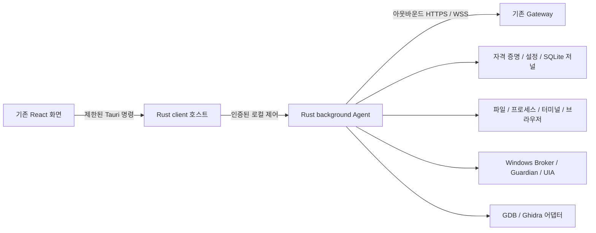

# Client와 Agent Rust 전환 설계안

> **Document ID**: `DOC-SPEC-CLIENT-RUST`\
> **Status**: Active · **Target Version**: v0.1.10 기준선 / 구현 배치 v0.1.11 예정\
> **Last Updated**: 2026-10-10 · **Classification**: Architecture Specification

## 개요

사용자 요청은 client app을 Rust로 전환하고 전환 후 기존 Python 코드를 유지하지 않는 것이다.
현재 client는 Electron/React UI와 Python Agent를 함께 배포한다. 따라서 UI 호스트만 교체하면
Python 제거 요구를 충족하지 못한다. client에 포함되는 Agent, Broker, Guardian, 플러그인
어댑터와 설치 유지보수 프로그램까지 Rust 구현으로 대체한다.

> [!NOTE]
> 2026-10-10 사용자 “진행해”로 Tauri/Rust 호스트·기존 React UI·내장 Agent Rust 전환
> 설계를 승인했다. Gateway·CLI는 별도 앱으로 유지한다.
> [구현 계획](client-rust-implementation-plan.md)의 검토 및 실행 방식 선택 단계이며,
> 코드 전환, Rust 빌드, 기존 코드 삭제는 아직 수행하지 않았다.

## 목차

- [1. 범위와 대안](#1-범위와-대안)
- [2. 목표 구성](#2-목표-구성)
- [3. 기존 기능 이식](#3-기존-기능-이식)
- [4. 계약과 데이터 호환성](#4-계약과-데이터-호환성)
- [5. 플랫폼과 패키징](#5-플랫폼과-패키징)
- [6. 구현 순서와 삭제 조건](#6-구현-순서와-삭제-조건)
- [7. 검증과 완료 기준](#7-검증과-완료-기준)
- [8. 관련 문서](#8-관련-문서)

## 1. 범위와 대안

| 대안 | 결과 | 비용 및 제약 |
| :--- | :--- | :--- |
| **Tauri/Rust + React 유지 (추천)** | UI 호스트와 Agent를 Rust로 교체하고 기존 화면 재사용 | 트레이, IPC, 로그인 시작, 설치 수명주기를 Tauri/Win32로 이식해야 함 |
| Electron/React + Rust Agent | 배포된 Python 제거, 기존 UI 호스트 유지 | Electron 및 Chromium UI 런타임은 계속 배포됨 |
| Rust 네이티브 UI + Rust Agent | 화면 구현까지 Rust로 교체 | 기존 React 화면 전체 재작성과 사용성 회귀 검증이 추가됨 |

추천안은 `apps/client`와 원격 PC에서 실행하는 `apps/agent` 전체를 대상으로 한다.
`apps/gateway`, `apps/cli`, `apps/console`의 기능과 외부 프로토콜은 유지한다.
`packages/*`의 Python 코드는 Gateway·CLI가 실제 사용하는 부분을 남긴다.
client 전용 Python 구현은 최종 트리와 배포물에서 제거하고 Python fallback은 두지 않는다.
개발 중 이전 구현을 비교 기준으로 쓰는 것은 전환 완료 후의 코드 유지와 구분한다.

## 2. 목표 구성

루트 Cargo workspace에 다음 역할을 분리한다. 경로는 생성할 위치를 뜻한다.

| 위치 | 책임 |
| :--- | :--- |
| `apps/client/src-tauri` | Tauri 2 앱, 트레이, 대화상자, 단일 인스턴스, 로그인 시작, 제한된 UI 명령 |
| `apps/agent-rust` | background Agent 실행 파일 및 서비스·Broker·Guardian·플러그인 어댑터 실행 모드 |
| `crates/racp-contract` | 메시지·operation 모델, 입력 검증, 오류 코드, 기존 JSON 계약 |
| `crates/racp-core` | 정책, 워크스페이스 경계, 자격 증명, 설정, SQLite 저널과 결과 보존 |
| `crates/racp-runtime` | HTTPS 등록, WSS 수명주기, dispatch, job, 취소, stream, provider 조합 |

비동기 실행은 Tokio, JSON은 Serde, HTTP/WSS는 인증서 검증을 지원하는 Rust 라이브러리,
저널은 SQLite를 사용한다. Windows 기능은 `windows` 계열 바인딩을 사용한다.
구체적인 버전은 구현 계획에서 검토·고정하고 Cargo.lock과 Rust toolchain을 체크인한다.

Agent는 UI와 분리된 프로세스로 실행한다. 창 닫기는 트레이로 숨기며 Agent를 유지한다.
완전 종료는 작업 취소와 자원 회수를 확인한 뒤 앱을 종료한다. 종료 확인 실패 시 기존처럼
창을 열고 오류를 표시한다. client 프로세스가 예기치 않게 종료되는 경우의 Agent 수명도
현재 background 실행 계약에 맞춘다.

## 3. 기존 기능 이식

| 기존 구현 | Rust 이식 시 보존할 동작 |
| :--- | :--- |
| `apps/client/main.cjs`, `preload.cjs`, `controller.cjs`, `login.cjs` | 기존 `racpClient` 화면 API, 등록/설정/현황, native 파일 선택, 트레이 상태, 3초 갱신, 중복 요청 차단, 로그인 시작 |
| `apps/agent/.../desktop_control.py`, `connect.py`, `connection_import.py` | 기존 11개 bridge action, `.racp` 파일 미리보기·SHA-256 재검증·만료 검증, HTTPS 등록, 안전한 진단 코드 |
| `settings.py`, `settings_edit.py`, `background.py`, `instance_lock.py` | revision 비교, 실행 중 설정 변경 제한, 디바이스별 잠금, 인증된 loopback 상태/종료 제어, PID·생성 시각·인스턴스 검증 |
| `runtime.py`, `outputs.py`, `terminal_streams.py` | Hello/Welcome, lease/epoch/reconnect, 정책 적용, 선행 저널, 결과 복구, job·취소·deadline, 출력 spool, credit/replay |
| `providers/*` | 파일·셸·프로세스·메모리·터미널·브라우저·화면·리버싱 operation과 한도 |
| `broker/*`, `service_host.py` | Windows 사용자 세션·Named Pipe 접근 제어, Job Object, UIA/화면 캡처, 물리 입력 감지, 입력 해제, 서비스 수명주기 |
| `plugins/*` | 플러그인 protocol과 supervisor, GDB/MI, Ghidra Headless 및 재시작·자원 정리 |
| `apps/client/build/maintenance.py` | 설치 전 실행 확인, Agent 종료 확인, 상태 백업과 해시 검증, 자신의 로그인 등록만 제거, 사용자 데이터 보존 |

브라우저 기능은 Python Playwright 호출을 제거하고 Rust에서 Chromium/CDP를 제어한다.
기존 격리 context/page, origin 정책, 다운로드/업로드, 이벤트, screenshot, timeout,
worker containment를 재현한다. 이 어댑터의 parity 검증 없이 Python 브라우저 구현을 삭제하지 않는다.
Ghidra의 Java 실행과 Chromium 자체는 기존 기능의 외부 런타임으로 계속 필요하다.

## 4. 계약과 데이터 호환성

`docs/protocol`의 스키마 경로와 RACP wire protocol을 변경하지 않는다. Rust의 Serde 모델은
단순 deserialization뿐 아니라 기존 모델의 길이·범위·관계 검증과 미지 필드 거부까지 수행한다.
각 operation은 지원하는 플랫폼과 검증된 구현에 맞춰 capability를 광고한다.

UI에는 자격 증명과 원시 예외를 노출하지 않는다. Tauri 명령을 로컬 main window에 한정하고
renderer에 임의 파일 읽기·프로세스 실행 권한을 주지 않는다. 연결 파일의 경로와 digest는
호스트에 보관하여 미리보기 이후 파일 변경을 거부한다. 기존 16 KiB bridge 입력 한도와
안전한 오류 코드 집합을 보존한다.

기존 `credential.bin`은 Windows 동일 사용자 DPAPI로 해독하고 기존 JSON 구조를 읽는다.
다른 사용자 데이터, 손상 데이터는 덮어쓰지 않는다. POSIX에서는 일반 파일과 0600 권한을
확인한다. 상태 경로는 현재 Electron userData 아래 Agent 경로와 호환되도록 명시적으로
매핑하며 Tauri 기본 경로로 바뀌어 재등록을 요구하지 않도록 한다.

SQLite 실행 저널과 spool은 백업 후 읽고, 미확정 실행은 UNKNOWN으로 보존한다.
기존 기록을 읽을 수 없으면 자동 재실행하거나 새 빈 저널로 교체하지 않는다.
워크스페이스의 절대 로컬 경로, link/reparse 차단, 다중 폴더 경계와 정책 profile을 보존한다.

## 5. 플랫폼과 패키징

Windows x64 설치 EXE, 포터블 EXE 및 ZIP을 기본 배포 대상으로 유지한다.
Tauri의 NSIS 설치만으로 기존 포터블 형식이 충족된다고 간주하지 않는다. 포터블 EXE는
별도 launcher로 구성하고 고정 WebView2 런타임·Agent·브라우저 자원을 함께 제공한다.
일반 EXE만 복사하여 설치된 WebView2에 의존하는 결과를 완전한 포터블로 표시하지 않는다.

설치/업그레이드/제거는 Python 대신 Rust maintenance 실행 모드를 호출한다.
빌드·staging·manifest 검증은 Node/Rust 기반으로 전환하고 CPython, wheel, Python
Playwright staging 및 Electron packaging 설정을 제거한다. 패키지 해시·target·architecture·
버전 검증과 기존 출력 보존 정책은 유지한다.

저장소 버전 도구에 Cargo/Tauri 버전 동기화를 추가하고 구현 배치에서 PATCH를 한 번 올린다.
Gateway/CLI용 Python 버전 관리 도구는 client 런타임의 Python 의존성과 구분한다.
Windows CI에 Rust 품질 검사와 실제 native 패키지 smoke를 추가한다.
macOS/Linux는 기존처럼 정의만 유지하고 명시 요청 전 native 빌드·컨테이너는 실행하지 않는다.

## 6. 구현 순서와 삭제 조건

1. 기존 JSON 계약·UI API·상태 fixture를 확정하고 Cargo workspace와 호환성 테스트를 구축한다.
2. 등록·연결 파일·자격 증명·설정·저널·background 제어를 Rust로 이식한다.
3. WSS 실행 수명주기와 파일·프로세스·셸·터미널 provider를 이식하고 Gateway 연동을 검증한다.
4. 브라우저, Windows Broker/Guardian/UIA/메모리, 리버싱·플러그인·서비스 기능을 이식한다.
5. React에 Tauri adapter를 연결하고 트레이·자동 시작·완전 종료와 설치 유지보수를 이식한다.
6. Windows 패키징과 smoke, 기존 상태 업그레이드를 검증한 뒤 client 전용 Python과 Electron 코드를 제거한다.

마지막 단계에서 `apps/agent`의 Python 구현, client maintenance, Python Agent staging,
기존 client 전용 테스트와 build helper를 삭제하거나 새 Rust/Node 절차로 대체한다.
root uv workspace, 버전 도구, contract tests의 `racp_agent` import와 CI도 함께 정리한다.
Gateway·CLI가 사용하는 공통 Python 패키지와 서버 테스트는 보존한다.
최종 삭제 목록은 사용 참조 검색과 parity 증거를 근거로 확정하며 stub·Python fallback으로
완료 기준을 충족했다고 표시하지 않는다.

## 7. 검증과 완료 기준

- 기존 schema와 Rust 모델 사이의 유효/무효 fixture, 식별자·한도·시간·미지 필드 검증이 일치한다.
- 기존 Python Gateway와 Rust Agent의 HTTPS/WSS 등록·재접속·epoch·lease·revoke가 동작한다.
- 동일 idempotency key 중복 호출은 side effect 1회이며 충돌·crash 복구·UNKNOWN 보존이 검증된다.
- 파일 경계, 다중 workspace, 대용량 전송 재개·해시, process tree 취소·timeout, 터미널 credit/replay를 검증한다.
- 브라우저와 Windows 화면·입력·메모리, Broker/Guardian, GDB/Ghidra의 기존 계약과 native 검증을 대체한다.
- 기존 등록 데이터로 시작하고 설정 revision·손상 설정 복구·활동 UI·트레이·로그인 시작·완전 종료가 동작한다.
- 설치형·포터블 EXE·ZIP은 Python/Node 사용자 설치 없이 실행하고 Python 실행 파일·모듈을 포함하지 않는다.
- Windows 설치/업그레이드/제거와 상태 백업 검증을 수행한다. 수행하지 못한 native 검증은 미완료로 기록한다.
- Rust fmt/clippy/test, 프론트엔드 type/build/test, 관련 Gateway/CLI 회귀 및 저장소 버전 검사를 통과한다.

> [!IMPORTANT]
> 이 작업 환경은 Linux이고 현재 PATH에 Cargo/Rust가 없다. 구현 시 도구 설치가 필요하며,
> Windows native 검증은 Windows runner/host에서 수행해야 한다. Linux 검사 통과를
> Windows 설치형·포터블·Win32 기능의 검증 증거로 대신하지 않는다.

진행 상태와 실제 실행 결과는 [구현 현황](../quality/implementation-status.md)에 기록한다.
이 설계 승인과 구현 계획 작성은 Rust 전환 완료를 의미하지 않는다.

## 8. 관련 문서

- [명세서 목록](README.md)
- [기술 문서 포털](../README.md)
- [RACP 종합 개발정의서](racp-specification-v1.1.md)
- [Windows 작업 및 테스트 계획서](windows-engineering-plan.md)
- [Desktop Client Guide](../guides/desktop-client-guide.md)
- [Windows 릴리스 게이트](../quality/windows-release-gates.md)
- [구현 현황](../quality/implementation-status.md)
- [기존 client 구조 결정 ADR-0023](../adr/ADR-0023-cross-platform-desktop-client.md)
