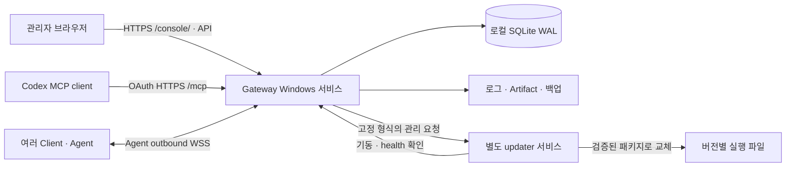
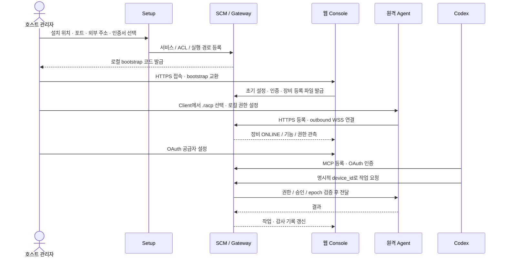
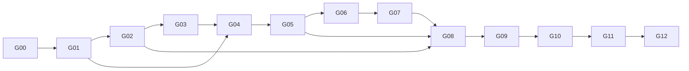

# RACP Gateway 웹 관리 서버 작업 계획서

> **Document ID**: `DOC-SPEC-GATEWAY-WEB-PLAN`\
> **Status**: Draft · **Target Version**: v0.1.15 기준선 / 후속 구현 버전은 배치별 지정\
> **Last Updated**: 2026-10-07 · **Classification**: Architecture Specification / Implementation & Operations Plan\
> **문서 개정**: 1.0 · **계획 대상**: Windows x64 단일 Gateway의 웹 기반 중앙 관리

**Goal:** Gateway를 상시 실행되는 서버로 설치하고, 브라우저에서 여러 Agent의 등록·상태·권한·작업·로그와 서버의 백업·업데이트를 관리한다.

**Architecture:** 기존 Python Gateway, React Console, SQLite WAL, Agent outbound WSS 및 MCP를 재사용한다. 웹 콘솔과 API는 하나의 HTTPS origin에서 제공하고, 서버 실행은 Windows 서비스가 담당한다. 서버 교체는 별도 updater가 수행하며 실행 파일과 운영 데이터를 분리한다.

**Tech Stack:** CPython 3.12.11 / FastAPI·Uvicorn / SQLite / React·TypeScript·Vite / 기존 pywin32 / PowerShell 5.1 이상 / Windows NSIS 설치 패키지.

**Spec:** [RACP 개발정의서](racp-specification-v1.1.md), [Windows 작업 계획서](windows-engineering-plan.md), 이 문서의 §1–§8 설계 기준.

> **실행자 안내**: 구현을 시작할 때 이 문서의 설계·인터페이스·시험을 함께 읽고 작업 단위로 수행한다. 같은 세션에서 직접 실행할 때는 `superpowers:executing-plans`를 적용한다. 서브에이전트 실행은 사용자가 그 방식을 선택한 경우에만 적용한다. 체크박스는 작업 추적용이며 이 문서 작성 자체가 구현 실행·서비스 설치·운영 서버 교체의 승인은 아니다.

> [!IMPORTANT]
> 현재 요청은 **계획서 작성**이다. 아래 신규 파일·API·서비스·설치형 패키지·수치는 후속 구현의 제안 계약이며 이미 구현되거나 검증된 것으로 취급하지 않는다. 현재 배포본은 v0.1.15 개발 ZIP이다. 실제 진행·시험 결과는 [구현 현황](../quality/implementation-status.md)에만 기록한다.

## 목차

- [1. 목적과 범위](#gwp-01)
- [2. 현재 기준선과 재사용 범위](#gwp-02)
- [3. 목표 아키텍처와 운영 흐름](#gwp-03)
- [4. 구성·저장 경로·서비스 계정](#gwp-04)
- [5. SQLite와 데이터 수명](#gwp-05)
- [6. 인증·역할·Agent 권한](#gwp-06)
- [7. 웹 콘솔과 API 계약](#gwp-07)
- [8. 설치·백업·업데이트 설계](#gwp-08)
- [9. 단계별 상세 작업](#gwp-09)
- [10. 시험 매트릭스와 인수 시나리오](#gwp-10)
- [11. 성능·신뢰성 목표](#gwp-11)
- [12. 실행 순서·일정·결정 사항](#gwp-12)
- [13. 증거 관리와 완료 판정](#gwp-13)
- [14. 관련 문서와 외부 근거](#gwp-14)

---

<a id="gwp-01"></a>

## 1. 목적과 범위

### 1.1 사용자가 원하는 운영 모델

1. 141 호스트에 Gateway를 설치하고 초기 설정을 완료한다.
2. 서버는 브라우저나 터미널을 닫아도 계속 실행되고 Windows 재부팅 후 기동한다.
3. 관리자는 웹 콘솔에 로그인해 여러 Agent를 등록하고 ONLINE/OFFLINE, 버전, 기능과 권한을 확인한다.
4. Codex는 Gateway의 MCP에 인증하고 선택한 장비에 작업을 요청한다.
5. 작업·승인·오류·접속·관리 변경 기록을 장비와 시간별로 조회한다.
6. 웹에서 백업·업데이트를 요청하고 진행 상태와 결과를 확인한다.

### 1.2 포함 범위

| 구분 | 이번 계획에 포함되는 산출물 |
|---|---|
| 중앙 관리 | 다중 Agent 목록·검색·그룹·태그·등록·폐기·credential 회전·진단 |
| 서버 운영 | 서비스 상태·readiness·실행 버전·디스크·DB·TLS·MCP 진단 |
| 웹 관리 | 최초 설정, 장비 상세, 작업·승인, 감사·운영 로그, 백업·업데이트 화면 |
| 데이터 | Gateway 전용 마이그레이션, SQLite WAL 관리, 보관 정책, 일관된 백업·복원 |
| 인증 | 기존 로컬 owner 모드 유지, 운영용 OIDC 로그인, 서버 역할과 장비별 접근 권한 |
| 배포 | Windows x64 Setup EXE, 자체 런타임 Portable ZIP, 업그레이드·제거·복구 |
| 업데이트 | 서명된 release manifest 검증, 작업 정리, 서비스 교체, health 확인, 제한된 rollback |
| 검증 | 계약·권한·장애·다중 Agent·실제 141→121·clean PC·8시간 soak |

### 1.3 초기 범위에서 제외

- macOS/Linux 서버 패키지, Linux container 실행 및 추가 CI runner.
- 여러 Gateway의 active-active 운영, 공용 네트워크 파일시스템에 SQLite 공유.
- 별도 Electron 관리 앱, 웹 터미널을 통한 임의 호스트 관리자 명령 실행.
- 자체 OAuth IdP 제품 구현, 외부 IdP를 동의 없이 설치·공개·운영하는 작업.
- Agent/Client 자동 배포·자동 업데이트. 이번 updater의 대상은 Gateway다.
- 웹에서 원격 PC의 OS 관리자 권한이나 로컬 허용 폴더를 강제로 확대하는 기능.

### 1.4 전역 제약

- Windows x64부터 구현·검증하고 다른 OS 빌드는 명시적 요청 전까지 보류한다.
- 운영 중인 141 서버와 121 Agent를 개발 fixture로 사용하거나 임의 종료하지 않는다.
- Agent protocol major 1, outbound WSS, device ID·boot ID·epoch, 승인과 멱등성 경계를 유지한다.
- `docs/protocol/`의 기존 계약 파일 경로를 유지하고 실제 API에서 계약과 client를 재생성한다.
- major/minor는 사용자 지정만 허용한다. 실제 코드·빌드 배치마다 PATCH를 한 번 증가하고 재시도에 재사용한다.
- Node 22.23.0·pnpm 11.19.0은 빌드 도구다. 사용자 호스트에서 Node/npm 설치를 요구하지 않는다.
- 설치 파일·manifest·로그에 owner token, enrollment token, cookie, JWT, private key를 포함하지 않는다.
- 브라우저 URL·인증서·조직 정책의 자동화 차단을 다른 경로로 우회하지 않는다.

---

<a id="gwp-02"></a>

## 2. 현재 기준선과 재사용 범위

작성 초기의 코드·Gateway ZIP 기준선은 **0.1.15**다. 작성 중 병행 작업이 SSOT를 **0.1.16**으로 증가했으며 그 변경은 보존했다. 아래는 계획을 수립할 때 코드와 기존 검증 기록을 읽어 확인한 기준선이다. 계획서 작성 중 운영 서비스의 상태나 v0.1.16 배포물을 새로 실증한 결과로 해석하지 않는다.

| 항목 | 기존 구현 | 재사용 / 추가 작업 |
|---|---|---|
| Gateway 서버 | [main.py](../../apps/gateway/src/racp_gateway/main.py), [app.py](../../apps/gateway/src/racp_gateway/app.py) | HTTPS·FastAPI·WSS·MCP 재사용. 설정 로더·서비스 진입점·관리 route 분리 추가 |
| 데이터 | [GatewayStore](../../apps/gateway/src/racp_gateway/store.py), [Journal](../../packages/sdk/src/racp_sdk/journal.py) | SQLite WAL·FULL sync, 장비·credential·작업·감사 기록 존재. Gateway 전용 migration과 운영 테이블 추가 |
| Console | [App.tsx](../../apps/console/src/App.tsx), [Resources.tsx](../../apps/console/src/Resources.tsx) | 대시보드·장비·작업·승인·세션·파일·감사·진단·설정 존재. 운영 화면과 사용자 흐름 확장 |
| 로그인 | [ConsoleAuth](../../apps/gateway/src/racp_gateway/console_auth.py) | 5분 one-use setup secret, cookie, 유휴 30분·절대 12시간. 일반 계정·역할 기능은 추가 필요 |
| 실시간 조회 | [EventFeed](../../apps/gateway/src/racp_gateway/events.py), [ConsoleLists](../../apps/gateway/src/racp_gateway/lists.py) | SSE·cursor·owner 범위 재사용. 10분/1만 event replay, owner당 16·전체 32 stream 제한 존재 |
| 작업 처리 | [ControlPlane](../../apps/gateway/src/racp_gateway/service.py), [Scheduler](../../apps/gateway/src/racp_gateway/scheduler.py) | 승인·journal·epoch·취소·UNKNOWN 유지. maintenance admission과 drain 추가 |
| 관측 | [log_event](../../packages/observability/src/racp_observability/logging.py) | 구조화 log 존재. 제한된 파일 sink·회전·검색·지원 bundle 추가 |
| MCP 인증 | [OAuth](../../apps/gateway/src/racp_gateway/oauth.py) | 고정 provider·scope·subject 검증 존재. 실제 운영 IdP/Codex 연결은 별도 gate |
| 배포 | [build_gateway.py](../../scripts/build_gateway.py), [host 스크립트](../../scripts/host/) | CPython·Console 포함 ZIP, PowerShell 원본 5개 존재. Setup·SCM·updater는 아직 없음 |
| 로컬 상태 | [gateway_host.py](../../scripts/gateway_host.py), [SecretStore](../../packages/sdk/src/racp_sdk/security.py) | 현재 사용자 DPAPI와 사용자 전용 폴더. 서비스 계정으로 복사만 해서 사용하는 것은 불가 |

현재 owner 모델은 `owner_local` 중심이다. 다중 Agent 지원과 다중 관리자/다중 조직 지원은 구분해야 한다. 본 계획의 첫 운영 버전은 **한 Gateway·한 관리 영역(realm)·여러 Agent**이며, 역할은 같은 realm 안에서 적용한다. 여러 조직의 tenant 제품으로 지원 범위를 확대하지 않는다.

기존 141→121 시험에는 Agent 후보 버전 차이, 실제 MCP 경로 미준비와 Windows 입력·장애 인수의 미완료 항목이 있다. [Windows 계획](windows-engineering-plan.md)과 [구현 현황](../quality/implementation-status.md)의 남은 결함을 신규 관리 화면의 성공으로 대체하지 않는다.

---

<a id="gwp-03"></a>

## 3. 목표 아키텍처와 운영 흐름

### 3.1 구성



- 일반 운영은 브라우저에서 수행한다. Console 정적 파일도 Gateway와 같은 origin에서 제공한다.
- 관리 route와 MCP는 같은 제어·권한·감사 계층을 호출한다. 웹 route에서 직접 Agent 명령을 우회 전송하지 않는다.
- Gateway는 네트워크·DB 처리용 단일 worker를 유지한다. 여러 프로세스가 같은 DB·socket session을 각자 관리하지 않는다.
- updater는 Gateway 종료 뒤에도 동작한다. arbitrary shell command를 받는 범용 원격 관리자 서비스로 만들지 않는다.
- Gateway 자체를 중지하면 웹 화면도 연결이 끊어진다. 영구 중지 뒤 재시작은 호스트의 SCM/PowerShell로 수행한다. updater가 관리하는 재시작·교체만 웹에서 시작할 수 있다.

### 3.2 최초 설치부터 첫 작업까지



Client 등록과 Codex 인증은 Gateway 준비 후 독립적으로 수행할 수 있다. 실제 원격 작업에는 인증된 client, ONLINE Agent, 사용 가능한 capability, 서버와 Agent의 허용 정책이 함께 필요하다.

### 3.3 운영 상태 모델

서버 lifecycle은 `STARTING → READY → DRAINING → STOPPING → STOPPED`, 장애는 `DEGRADED/FAILED`로 표시한다. update job은 §8의 별도 상태를 사용한다. healthz의 프로세스 생존과 readyz의 DB·초기 설정·maintenance 상태를 구분한다.

장비 목록은 기존 Agent 상태와 `last_seen_at`, 현재 socket 여부를 함께 사용한다. 웹 cache가 오래된 경우 **관측 지연**을 표시하며 이를 새로운 Agent protocol enum으로 만들지 않는다. Browser/SSE 단절 때 지난 ONLINE을 현재 상태로 표시하지 않는다.

---

<a id="gwp-04"></a>

## 4. 구성·저장 경로·서비스 계정

### 4.1 경로와 제품 경계

아래는 설치형의 제안 기본 경로다. Portable은 같은 논리 구조를 사용하되 사용자가 지정한 로컬 상태 폴더를 사용한다.

```text
%ProgramFiles%/RACP/Gateway/
  releases/<version>/           # Python, Gateway, Console, 운영 PS1
  updater/                     # 별도 updater 실행 파일
  active-release.json          # 활성 버전, 관리자/updater만 변경

%ProgramData%/RACP/Gateway/
  config/gateway.json           # 명시적 listener, origin, 경로, 운영 정책
  state/gateway.db              # Gateway·journal·관리 데이터
  secrets/                     # DPAPI 보호 비밀, 서버 private key
  logs/                        # 회전하는 서버 진단 log
  artifacts/                   # 작업 결과·첨부
  backups/                     # 검증된 backup set
  updates/staging/              # 검증 전/후 다운로드와 작업 receipt
```

실행 파일 폴더에는 운영 상태를 저장하지 않는다. 설치 위치·ProgramData·공백/한글 경로를 hardcode하지 않고 Windows known-folder 경로로 계산한다. 관리 데이터·키 폴더는 서비스 SID·필요한 updater SID·Administrators에만 권한을 부여한다. 일반 사용자에게 ProgramData 전체 쓰기 권한을 주지 않는다.

### 4.2 서비스 계정과 비밀

- Gateway 서비스 이름은 `RACP Gateway`, 실행 identity는 기본적으로 전용 virtual service account `NT SERVICE\RACP Gateway`로 설계한다. SCM의 실제 start/stop·파일·DPAPI 동작을 G02에서 검증한 후 지원을 확정한다.
- 서비스 adapter는 기존 pywin32를 사용한다. Uvicorn 프로세스를 `sc create`로 등록하는 것만으로 SCM 호환 구현이 완료됐다고 선언하지 않는다.
- bootstrap 비밀은 Gateway identity에서 생성한다. 로컬 관리 요청은 Windows named pipe의 SID/DACL과 caller identity를 검사한다. 일반 HTTP endpoint로 owner token을 내보내지 않는다.
- current-user DPAPI 파일은 다른 서비스 계정으로 그대로 이관되지 않는다. 기본 전략은 **서비스가 새 owner credential을 생성하고, 기존 계정은 인증된 export/import 작업으로 DB·장비 credential digest·realm identity를 보존**하는 것이다. owner digest 교체와 Agent credential 유지의 회귀를 검증한다.
- 서버 키는 제한된 ACL로 저장한다. 기계 범위 DPAPI를 사용할 필요가 생기면 별도 ADR과 ACL 검증을 거친다. machine DPAPI만으로 사용자별 접근 통제가 된다고 가정하지 않는다.
- Portable의 current-user 비밀은 같은 OS identity에 묶인다. 다른 PC로 ZIP과 owner.bin을 복사하는 것을 migration으로 취급하지 않는다.

### 4.3 설정 계약

신규 `GatewayConfig`는 versioned JSON이며 `schema_version=1`, `instance_id`, `mode`, `bind_address`, `port`, `public_origin`, `state_root`, `tls`, `auth`, `retention`, `update`, `revision`을 가진다. mode는 `service|portable`, initial revision은 1이다. 비밀 값 대신 로컬 secret reference를 저장한다. state root는 명시적 로컬 절대 경로로 정규화하고 UNC/reparse 경로를 거절한다. 기존 relative CLI 입력은 먼저 caller cwd 기준으로 절대 경로를 계산한 후 설정에 저장해 호환한다.

`public_origin`은 정확한 origin만 허용한다. 인증서/key 쌍, SAN, 만료, read 권한을 검증하고 외부 listener에는 TLS를 요구한다. 변경 요청은 `expected_revision`으로 경합을 검출한다. TLS·listener·auth 변경은 validate/stage/restart 단계로 처리하고 실패한 설정을 활성 파일에 덮어쓰지 않는다.

처음 설치의 기본 bind는 loopback이다. 관리자가 LAN 주소와 TLS를 명시한 후 외부 연결을 허용한다. 방화벽 규칙은 선택한 executable/port·Private/Domain profile 범위로 설치하고 제거할 때 제품 소유 규칙만 삭제한다. 사설 CA의 OS/browser 신뢰는 fingerprint와 목적을 표시하는 명시적 사용자 단계로 남긴다.

---

<a id="gwp-05"></a>

## 5. SQLite와 데이터 수명

### 5.1 DB 책임

| 데이터 | 위치 / 처리 원칙 |
|---|---|
| 장비·등록·credential digest·boot/epoch | 기존 GatewayStore 유지 |
| 작업·승인·멱등성·handles·Artifact catalog | 기존 journal/catalog 유지; 임의 재생성 금지 |
| realm·사용자·역할·장비 그룹·ACL | Gateway 전용 신규 테이블 |
| 설정 revision·업데이트·백업 job과 receipt | Gateway 전용 신규 테이블 |
| 감사 기록 | DB의 구조화된 기록, actor와 resource owner를 별도 필드로 보관 |
| 진단 log·긴 stdout/stderr·스크린샷 | 제한된 파일 저장소; DB에는 metadata·hash·참조만 저장 |

신규 테이블의 제안 이름은 `gateway_schema`, `gateway_settings`, `management_users`, `role_bindings`, `device_groups`, `device_group_members`, `maintenance_jobs`, `maintenance_receipts`, `backup_sets`, `update_jobs`이다. password store를 추가하지 않는다. OIDC 사용자 키는 `(issuer, subject)`이며 email을 영구 identity로 사용하지 않는다.

### 5.2 마이그레이션

`racp_sdk.journal.Journal`의 schema는 Agent도 사용한다. 공유 `PRAGMA user_version`을 관리 화면 기능 때문에 임의로 증가시키지 않는다. Gateway 전용 `gateway_schema(version, checksum, applied_at)`과 번호가 고정된 migrations를 추가한다. 이미 적용된 checksum 불일치·미지원 미래 버전·중복 실행·중간 실패를 검사한다.

각 migration은 사전 backup과 transaction을 사용한다. 기존 `owner_local`, device ID, credential digest, operation idempotency key, revoked 상태를 보존한다. schema 변경이 필요한 update는 이전 binary가 새 DB를 읽을 수 있는지를 manifest에 명시한다. 단순 파일 교체만으로 모든 rollback이 가능하다고 가정하지 않는다.

### 5.3 쓰기·검색·유지보수

- WAL·FULL sync·foreign key 검사를 유지한다. SQL transaction 안에서 네트워크 await나 긴 파일 작업을 수행하지 않는다.
- DB를 LAN 공유/NAS에 놓지 않는다. Agent는 API/WSS만 사용하고 SQLite를 직접 열지 않는다.
- 운영 log 수집은 최대 4,096건의 queue와 batch를 사용한다. 초기 값은 최대 256건 또는 200ms로 flush하며 queue 초과 시 drop count와 진단 경고를 남긴다. 한 진단 line은 최대 64KiB이며 초과분은 truncate 표시와 원래 길이를 남긴다. 감사 필수 기록은 조용히 버리지 않고 mutation을 실패시킨다.
- heartbeat protocol 기본 5초와 execution lease 60초는 변경하지 않는다. 상태 관측 저장 최적화가 필요하면 last-seen snapshot을 최대 30초 간격으로 합치되, 연결/폐기/권한 변경 감사 기록은 즉시 저장한다.
- page limit 기본 50·최대 200, 안정적인 keyset cursor를 사용한다. 검색 filter·realm·principal·sort·limit를 cursor에 묶어 변조/교차 재사용을 거절한다.
- 기본 보관 제안은 진단 log 30일/1GiB, 감사 180일, backup 14개다. 기존 operation outcome 최소 24시간과 idempotency tombstone의 보존 의미는 변경하지 않는다. 긴 결과의 보관은 Artifact 정책을 재사용한다.
- WAL checkpoint·정리·backup은 낮은 우선순위로 실행하고 DB busy/디스크 부족 때 API를 무한 대기시키지 않는다. 기본 DB busy 한도는 5초이며 retryable 오류로 반환한다.

SQLite는 단일 서버의 이 구조에 맞는 선택이다. 한 DB의 동시 writer가 하나인 제약은 부하 시험에 포함한다. 여러 Gateway worker/replica나 높은 지속 쓰기량이 필요해지면 DB 서버와 session routing을 함께 재설계한다. [SQLite 사용 기준](https://www.sqlite.org/whentouse.html), [WAL 설명](https://www.sqlite.org/wal.html).

---

<a id="gwp-06"></a>

## 6. 인증·역할·Agent 권한

### 6.1 두 인증 경로

| 경로 | 초기 운영 / 확장 정책 |
|---|---|
| 로컬 owner 관리 | 기존 일회용 setup secret→cookie 유지. IdP 없는 환경에서는 단일 owner 모드로 운영 |
| 다중 관리자 웹 로그인 | 운영자가 지정한 OIDC 공급자에 browser client 등록. Authorization Code/PKCE, state·nonce, 고정 callback·issuer 검증 후 Gateway session 발급 |
| Codex MCP | 기존 OAuth protected-resource 경로 유지. Console cookie·setup code·PC .racp를 MCP credential로 사용하지 않음 |
| Agent | 장비별 credential, revoke·rotation·boot/epoch, outbound WSS 유지 |

OIDC 공급자 설정이 없으면 다중 사용자 로그인 기능을 활성으로 표시하지 않는다. 외부 IdP 계정을 Gateway가 자동 생성하거나 허용 client ID를 자동 승인하지 않는다. role binding은 Gateway 관리자의 명시적 등록으로 생성한다. 처음 보는 OIDC subject를 자동 관리자/owner로 만들지 않는다.

### 6.2 역할 모델

| 동작 | owner | admin | operator | viewer |
|---|---|---|---|---|
| 상태·기능·일반 작업 metadata 조회 | 허용 | 허용 | 할당 장비 | 할당 장비 |
| 명령 출력·Artifact 조회 | 허용 | 허용 | 별도 read grant | 기본 거절 |
| 승인 대상 원격 작업 제출·취소 | 정책 적용 | 정책 적용 | 할당 장비와 작업 grant | 거절 |
| 다른 요청의 승인·거절 | 정책 적용 | 정책 적용 | 거절 | 거절 |
| 장비 등록·폐기·그룹·credential 회전 | 허용 | 허용 | 거절 | 거절 |
| 사용자·역할 변경 | 허용 | 거절 | 거절 | 거절 |
| TLS·OAuth·update trust key·복원 | 허용 | 거절 | 거절 | 거절 |
| 업데이트·backup 요청 | 허용 | 명시적 운영 grant | 거절 | 거절 |

`owner_id`는 자원 소유 영역, `actor_id`는 실제 작업자다. 역할을 추가하면서 기존 owner-scoped query를 actor ID로 치환하지 않는다. 내부 `ManagementPrincipal`을 통해 `realm_id`, `actor_id`, `role`, `device_grants`, `auth_revision`을 전달하고 각 route와 operation admission에서 검사한다.

최종 실행 권한은 **웹/MCP grant ∩ 서버 정책 ∩ Agent 로컬 profile/workspace/capability ∩ 필요한 승인**이다. 웹에서 화면 제어 허용이나 OS 권한을 강제로 켜지 않는다. 마지막 owner 비활성화/삭제와 자기 권한을 이용한 owner 승격을 거절한다.

operator에게 제출 권한이 있어도 승인 권한을 부여하지 않는다. 승인 정책은 원래 operation/key/digest·대상 장비·현재 identity를 검증하고, 권한 변경 뒤의 오래된 승인이나 다른 요청에 대한 승인 재사용을 거절한다.

### 6.3 세션과 변경

HttpOnly·Secure·SameSite cookie, 동일 Origin과 CSRF 검사, 기존 session TTL을 유지한다. 역할/장비 grant 변경 시 auth revision을 증가하고 다음 API·SSE·terminal WS admission에서 새 권한을 검사한다. 진행 중인 작업은 자동 재실행하지 않고 작업 정책에 따라 취소/조사한다. JWT logout과 즉시 revoke가 같은 의미라고 가정하지 않고 MCP token TTL·내부 사용자 비활성화 검사 범위를 문서화한다.

---

<a id="gwp-07"></a>

## 7. 웹 콘솔과 API 계약

### 7.1 화면

| 화면 | 필수 표시 / 동작 |
|---|---|
| 초기 설정 | 외부 주소·TLS, 저장 위치·디스크, owner bootstrap, 인증 방식·MCP 준비 단계 |
| 대시보드 | 서버 버전·mode·ready/degraded, Agent 상태 요약, 작업/승인 대기, 디스크·인증서 경고 |
| Agent 목록 | 검색·그룹·태그·상태·버전, 마지막 관측 시각, 현재 조회의 신선도 |
| Agent 상세 | stable ID, hostname, OS, 실행 identity, workspace/profile/capability, boot/epoch, 최근 작업·감사 |
| 등록 | 이름·그룹 입력, `.racp` 파일 다운로드, 10분·1회 안내, 사용 후 상태. 토큰은 대시보드에 반복 표시하지 않음 |
| 작업·승인·세션 | 기존 기능 재사용, 대상 장비·행위자·원래 요청·취소 접수/완료/UNKNOWN 구분 |
| 로그 | 감사·운영 log·작업 출력 분리, 기간·장비·level·event·request ID filter, page/export |
| 사용자·권한 | 계정 binding·역할·장비 grant, local-owner/OIDC 모드와 활성 여부 |
| 서버 설정 | revision, 재시작 필요 항목, TLS·OAuth·보관 정책 validation과 audit |
| 유지보수 | backup/restore/update 진행, maintenance 상태, 실패 이유·복구 receipt |

일반 사용 화면에 SQLite SQL, Python 패키지 경로, owner token, raw JSON 설정을 필수 입력으로 노출하지 않는다. 개발 진단은 별도 펼침 영역으로 제공한다. UI의 숨김/disabled는 안내이며 권한 보안은 서버가 검증한다.

### 7.2 신규 API 제안

`/api/v1/management/` 아래에 신규 관리 API를 둔다. 기존 `/devices`, `/audit`, `/jobs`, `/approvals` 경로는 계약을 보존하며 filter/권한을 확장한다. 구현 파일은 거대한 app.py에 계속 추가하지 않고 management router로 분리한다.

| API | 입력 / 결과 | 권한·행동 |
|---|---|---|
| `GET /status` | `GatewayStatusView` | 비밀 없는 운영 상태; 인증 필요 |
| `GET/PUT /settings` | `SettingsView` / `SettingsPatch(expected_revision, changes)` | validation·경합 409·비밀 mask·변경 감사 |
| `GET/POST/PATCH /users` | `ManagementUserView`, subject binding, role revision | 지정 issuer/subject만, 마지막 owner 보호 |
| `GET/POST/PATCH /groups` | 그룹 metadata와 device IDs | realm·device 소유 범위 검사 |
| `GET /logs` | UTC range·device·level·event·cursor | metadata 검색; 본문 길이·page 제한 |
| `POST /log-exports` | filter·format, idempotency key | 제한된 비동기 export job; 인증 다운로드 |
| `POST/GET /backups` | `BackupRequest` / job 또는 backup metadata | 비동기, owner/admin grant, secret archive 직접 노출 금지 |
| `POST /restores` | backup ID·expected instance/revision·확인 | owner만, maintenance, 기존 상태 보존 후 실행 |
| `GET /updates` | 설치 버전·후보·channel·지원 범위 | 신뢰된 feed 조회 결과만 |
| `POST /updates/check` | idempotency key | 제한된 원격 조회, concurrent 요청 합치기 |
| `POST /updates/apply` | release ID·expected version·idempotency key | staging·drain·독립 updater; 접수 202 |
| `GET /maintenance-jobs/{id}` | `MaintenanceJobView` | actor·realm scope, progress·terminal receipt |

상대 경로는 표의 prefix 기준이다. client가 임의 파일 경로·다운로드 URL·service 이름·명령행을 update/restore API에 제출하지 못하도록 한다. 백업·업데이트 상태 변경 요청은 auth+CSRF+Origin+idempotency+revision을 모두 검사한다. 민감한 입력을 URL query에 넣지 않는다.

신규 response 모델은 `packages/protocol/src/racp_protocol/management.py`, 신규 router는 `apps/gateway/src/racp_gateway/management/`에 둔다. OpenAPI SSOT는 기존 파일 경로를 유지하고 `scripts/console_contract.py`에서 재생성한다. TS client와 Zod decoder의 drift를 함께 검사한다.

### 7.3 공통 타입과 오류

G00에서 아래 필드를 고정하고 후속 작업에서 같은 타입을 사용한다. `GatewayStatusView`는 actor grant에 따라 private metadata를 필터링한다.

| 타입 | 필수 필드 / 규칙 |
|---|---|
| `GatewayPaths` | `release_root`, `config_file`, `state_root`, `database`, `secrets`, `logs`, `artifacts`, `backups`, `update_staging`: 정규화한 로컬 Path |
| `ManagementPrincipal` | `actor_id`, `realm_id`, `role`, `device_grants`, `auth_revision`; browser 제공 owner/role 값을 신뢰하지 않음 |
| `GatewayStatusView` | `instance_id`, `version`, `mode`, `lifecycle`, `ready`, `observed_at`, `schema_version`, `agent_counts`, `storage`, `tls`, `mcp`, `maintenance`; 비밀 제외 |
| `MaintenanceJobView` | `id`, `kind`, `state`, `actor_id`, `realm_id`, `created_at`, `updated_at`, `progress`, `error`, `receipt_id`; progress는 실제 알려진 값만 제공 |
| `DrainReport` | `can_stop`, `active_operation_ids`, `active_handle_ids`, `unresolved_operation_ids`, `observed_at`; CLOSED와 확정 정리 완료는 blocker에서 제외 |
| `VerifiedRelease` | §8.3의 검증된 필드와 signature/trust 결과; raw JSON을 이 타입처럼 전달하지 않음 |
| `UpdateReceipt` | `job_id`, `from_version`, `to_version`, `state`, `schema_before/after`, `backup_id`, `active_release`, `health_result`, `error`, `observed_at` |

인증 실패 401, 권한 거절 403, revision·중복 상태 충돌 409, 크기 초과 413, 자원/요청 제한 429, readiness/maintenance 불가 503을 명확하게 반환한다. 기존 RACP error envelope·retry-after·execution-state 의미를 유지한다. 예상하지 못한 내부 오류는 비밀 없는 error ID로 표시하고 상세 stack은 제한된 진단 log에만 남긴다.

---

<a id="gwp-08"></a>

## 8. 설치·백업·업데이트 설계

### 8.1 설치형과 Portable

Setup은 `RACP-Gateway-<version>-win-x64-setup.exe`, Portable은 `RACP-Gateway-<version>-win-x64.zip`으로 제공한다. Gateway 설치형은 기존 Client NSIS 패키지와 **별도 제품 ID·서비스·data root·제거 규칙**을 사용한다. Client의 per-user 설치 설정을 그대로 서비스 설치에 적용하지 않는다.

Setup은 elevation으로 서비스·ProgramFiles·제품 소유 방화벽 규칙을 설치하고 서비스 SID ACL을 적용한다. 외부 trust store·IdP·공개 ingress는 자동 구성하지 않는다. 설치 실패는 해당 설치가 만든 service/rule/staging만 회수한다. 제거 기본값은 서비스·실행 파일 제거와 운영 데이터 보존이며, 데이터 삭제는 별도 명시적 선택·backup 안내·범위 확인을 요구한다.

Portable은 서비스·방화벽을 등록하지 않는다. PowerShell 실행과 사용자 계정 상태를 유지한다. 초기 릴리스에서 Portable 자동 self-update는 제공하지 않고 검증된 새 ZIP을 별도 버전 폴더에 해제해 기존 state root로 실행한다.

NSIS 실행 도구는 기존 electron-builder 26.15.3의 고정된 배포 도구 취득 경로를 재사용하고 실제 compiler archive version·SHA-256을 packaging SSOT에 기록한다. Gateway에 Electron/Chromium을 넣지 않는다. 사용자 Node/npm·Python 설치를 요구하지 않는다.

### 8.2 백업과 복원

- online backup은 별도 DB connection의 SQLite backup API를 사용한다. 실행 중인 `gateway.db` 하나만 일반 파일 복사해 backup 성공으로 보고하지 않는다.
- DB·설정·TLS public/private material·필수 Artifact index와 파일을 backup set manifest로 묶고 각각 hash와 schema/instance/version을 기록한다. 임시 토큰과 browser session은 이관 후 무효화한다.
- 백업 세트는 처음부터 private ACL의 로컬 폴더에 생성한다. 웹의 일반 다운로드는 비밀 없는 진단 export만 허용한다. 다른 PC로 옮기는 encrypted export는 호스트에서 명시적으로 수행하며 암호를 command-line·log에 남기지 않는다.
- DB snapshot 시점의 Artifact 목록을 기준으로 보존 lease를 잡아 파일 GC와 경합하지 않게 한다. 누락 파일이 있으면 incomplete로 기록하고 restore 가능 backup으로 표시하지 않는다.
- restore는 candidate 상태 폴더에서 manifest/hash/SQLite integrity/schema를 검사한다. 현재 Gateway를 drain·정상 종료하고 pre-restore backup 뒤에 상태를 교체한다. 새 origin/서비스 계정/DPAPI 이관을 검사한다.
- 복원으로 예전 revoked credential이 다시 살아날 수 있다. 같은 host rollback은 최신 revocation receipt를 재적용하고, 다른 host 이관은 Agent credential 회전/재등록 계획을 포함한다. 복원된 admission/UNKNOWN 작업은 자동으로 재실행하지 않는다.

SQLite backup API의 목적과 snapshot 절차는 [공식 설명](https://www.sqlite.org/backup.html)을 따른다. application의 Artifact·설정·키 일관성은 SQLite backup만으로 충족되지 않으므로 별도 manifest와 lease 검증이 필요하다.

### 8.3 업데이트

업데이트 상태는 `CHECKING → AVAILABLE → DOWNLOADING → VERIFIED → DRAINING → STOPPING → INSTALLING → MIGRATING → STARTING → HEALTH_CHECK → SUCCEEDED`다. 중단은 `DEFERRED/FAILED/ROLLED_BACK`이며 단계별 receipt를 Gateway DB 외부의 private 파일에도 남긴다.

1. 서버에 설정된 HTTPS feed에서 서명된 manifest를 가져온다. configured origin 밖 redirect, 서명 불일치, 과도한 응답을 거절한다.
2. manifest의 `release_id`, `version`, `platform=win-x64`, `protocol_major=1`, `schema_min/max`, `min_updater_version`, `size_bytes`, `sha256`, `package_url`, `key_id`, `expires_at`, detached signature를 검증한다.
3. update manifest 서명은 기존 cryptography의 **Ed25519 detached signature**를 사용한다. signature는 수신한 UTF-8 manifest 원문 bytes에 대해 검증하고 duplicate JSON key·64KiB 초과 manifest를 거절한다. trust key는 배포본에 public key만 포함한다. SHA-256은 무결성 확인이며 publisher 인증을 대신하지 않는다. release signing key는 build/운영 비밀 저장소 밖으로 배포하지 않는다.
4. 다운로드는 fixed staging 내부 exclusive 파일을 사용하고 크기·공간·압축 traversal/reparse point·hash를 검증한다. API가 지정한 arbitrary path에 쓰지 않는다.
5. 새 Agent 등록과 원격 실행 admission을 닫고 maintenance 이유·기존 active 작업을 표시한다. heartbeat·결과 수신·조회는 계속 허용한다.
6. 기본 drain 예산은 120초다. active operation과 `ACTIVE/CREATING/CLOSING` handle이 남으면 **DEFERRED**로 종료하고 설치하지 않는다. `UNKNOWN/RECONCILING`이면서 실제 정리 완료 증거가 없는 작업도 blocker로 남긴다. CLOSED 기록을 활성 handle로 세지 않는다. 별도 명시적 취소 요청이 확인된 경우에만 기존 취소 경로를 사용한다.
7. updater의 Windows named pipe는 고정 message schema·caller SID·nonce·expiry·instance/release ID를 검증한다. 기본 updater는 별도 demand-start 서비스로 운영하고 설치 교체에 필요한 최소 권한만 부여한다.
8. Gateway를 정상 중지하고 pre-update backup을 검증한다. updater가 old service PID/생성 시각/실행 경로를 확인한다. 임의 port 기반 kill과 관련 없는 process 종료를 금지한다.
9. 버전별 폴더에 신규 파일을 stage하고 활성 release reference를 전환한다. migration 후 서비스를 시작해 60초 안에 version·instance·schema·readyz를 확인한다.
10. schema 호환이면 이전 binary로 rollback한다. 비호환이면 이 update의 검증된 pre-update DB/config snapshot까지 복원한다. 신규 admission은 health 완료 전까지 닫는다. 복구 실패 시 FAILED와 호스트 조치를 표시하고 반복 설치 loop를 멈춘다.

일반 자동 동작은 **새 버전 확인·알림**까지다. 기본 정책은 관리자 apply다. 업데이트 서버 공개·제품 코드 서명·signing key 취득은 실제 release 단계에서 명시적으로 처리한다. unsigned 개발 패키지의 test feed 성공을 운영 trust 검증으로 대체하지 않는다.

---

<a id="gwp-09"></a>

## 9. 단계별 상세 작업

### 9.1 공통 작업 절차와 리뷰 대상

각 작업은 자신의 regression test와 인터페이스를 포함하는 독립 검토 단위다. 전체 product code를 한 번에 바꾸지 않는다. 아래 `생성` 경로는 아직 존재하지 않는 계획 대상이다. 제안 타입 이름은 G00에서 확정한 후 후속 작업이 동일한 이름을 사용한다.

공통 체크 순서:

- [ ] 지정 test의 기대 assertion을 먼저 작성한다.
- [ ] 구현 전 test를 실행해 기능 누락/계약 불일치로 실패하는 것을 확인한다.
- [ ] 지정 파일·signature·기본값으로 최소 구현한다.
- [ ] 지정 회귀와 계약 검사를 실행해 failure/error가 없음을 확인한다.
- [ ] 소스·계약·운영 문서·증거를 함께 검토한다. 커밋은 해당 작업의 변경만 선택해 수행하고 다른 채팅의 변경을 포함하지 않는다.

모든 단계에서 집중 검토할 다섯 조건은 **다른 realm/장비 접근**, **서비스 계정·DPAPI 변경**, **진행 중인 작업/UNKNOWN**, **전원/디스크/DB 장애**, **오래된 브라우저·SSE cache·중복 관리 요청**이다. 이를 담당하는 작업과 시험을 아래에 연결한다.

### G00. 설정 계약과 경로 기반 확정

**선행:** 계획 검토, 현재 checkout와 병행 작업 범위 확인.

**파일:** 생성 `apps/gateway/src/racp_gateway/config.py`, `packages/protocol/src/racp_protocol/management.py`, `apps/gateway/build/deployment.json`; 수정 `main.py`, `scripts/gateway_host.py`, `scripts/build_gateway.py`; 시험 `tests/unit/test_gateway_config.py`.

**인터페이스:** `load_gateway_config(path: Path) -> GatewayConfig`, `resolve_gateway_paths(config: GatewayConfig) -> GatewayPaths`, `validate_gateway_config(config: GatewayConfig) -> ConfigCheck`. §4의 필드·revision·secret reference·service/portable mode를 고정한다.

- [ ] `test_config_rejects_unknown_fields_and_conflicting_tls`, `test_paths_are_independent_of_cwd`, `test_existing_state_is_never_reinitialized`를 작성한다. 공백·한글 경로/port 충돌/인증서 만료/상대·UNC state를 포함한다.
- [ ] `uv run pytest tests/unit/test_gateway_config.py -v`에서 의도한 RED를 확인한다.
- [ ] mode별 root 계산과 validate/stage/read 함수를 구현한다. 기존 CLI를 삭제하지 않고 새 설정 옵션과 호환 경로를 추가한다.
- [ ] config test와 기존 `test_gateway_host.py`, `test_host_powershell.py`를 실행한다.

**합격:** 기존 .racp를 덮어쓰지 않고 source/portable 동작이 유지된다. 이 단계에서 서비스 지원을 선언하지 않는다.

### G01. Gateway 전용 마이그레이션과 관리 metadata

**선행:** G00.

**파일:** 생성 `apps/gateway/src/racp_gateway/migrations.py`, `apps/gateway/src/racp_gateway/management/store.py`; 수정 `store.py`, 신규 management models; 시험 `tests/integration/test_gateway_migrations.py`.

**인터페이스:** `migrate_gateway(db: sqlite3.Connection, target: int) -> MigrationReport`, `ManagementStore.get_revision() -> int`, `ManagementStore.compare_and_set(expected_revision: int, patch: SettingsPatch) -> SettingsView`. maintenance receipt의 enum/ID와 actor/owner 구분도 고정한다.

- [ ] 기존 owner·장비·revoked·operation/approval·Artifact fixture를 만들고 `test_upgrade_preserves_identity_and_deduplication`을 작성한다.
- [ ] 중간 migration 실패·checksum 불일치·future schema·반복 적용·revision 경합을 RED로 확인한다.
- [ ] 기존 데이터 보존 migration과 §5의 table/index를 추가한다. shared Journal의 Agent schema를 변경하지 않는다.
- [ ] migration과 기존 lifecycle·console list·authenticated execution 회귀를 실행한다.

**합격:** identity/credential digest/operation key 보존, transaction 실패 시 원복, 미지원 schema에서 기동 거절.

### G02. Windows 서비스와 로컬 bootstrap

**선행:** G00–G01.

**파일:** 생성 `apps/gateway/src/racp_gateway/windows_service.py`, `apps/gateway/src/racp_gateway/local_admin.py`, `scripts/host/Install-GatewayService.ps1`, `scripts/host/Remove-GatewayService.ps1`; 수정 `main.py`, host 발급 helper; 시험 `tests/integration/test_gateway_service.py`, `tests/integration/test_gateway_service_secrets.py`.

**인터페이스:** `run_gateway(config: GatewayConfig, stop_event: threading.Event) -> int`, `LocalAdminBroker.issue_bootstrap(caller: WindowsPrincipal) -> BootstrapReceipt`. SCM adapter는 START_PENDING/RUNNING/STOP_PENDING/STOPPED와 checkpoint를 보고한다.

- [ ] `test_scm_start_stop_reports_state`, `test_non_admin_pipe_caller_denied`, `test_service_identity_can_decrypt_its_secret`, `test_original_user_secret_cannot_be_silently_reused`를 작성한다.
- [ ] 격리 Windows fixture 서비스 이름/data root로 RED를 확인한다. 제품 서비스나 live 8765를 fixture로 쓰지 않는다.
- [ ] virtual service account, service SID ACL, 단일 instance lock, SCM stop의 async graceful shutdown을 구현한다.
- [ ] 3회 start/stop과 reboot 후 기동을 실제 관리자 test host에서 검증한다. pipe 응답에는 short-lived code만 허용한다.

**합격:** 브라우저·로그인 사용자 종료와 독립 실행, 정상 stop, 일반 사용자 IPC 거절, 비밀 미출력. 관리자 환경이 없으면 이 gate는 BLOCKED_ENV다.

### G03. 최초 웹 설정과 TLS 운영 흐름

**선행:** G00–G02.

**파일:** 생성 `apps/gateway/src/racp_gateway/management/setup.py`, `apps/console/src/management/Setup.tsx`; 수정 `App.tsx`, `api.ts`, `network.py`; 시험 `tests/integration/test_gateway_setup.py`, `apps/console/tests/gateway-setup.spec.ts`.

**인터페이스:** `SetupService.preview(input: SetupRequest) -> ConfigCheck`, `SetupService.commit(input: SetupRequest, expected_revision: int, principal: ManagementPrincipal) -> SettingsView`.

- [ ] bootstrap 5분/1회, 미로그인 설정 거절, public origin/TLS 불일치, duplicate submit 1회 commit을 검사한다.
- [ ] loopback 초기화→외부 HTTPS 설정→재시작 뒤 readiness 흐름을 RED로 확인한다.
- [ ] runtime path/토큰을 사용자 입력으로 요구하지 않는 wizard와 validation·revision·audit를 구현한다.
- [ ] 실제 cert로 hostname/IP SAN·만료·신뢰 오류를 검증한다. browser 차단이면 자동화 결과를 BLOCKED_ENV로 남기고 우회하지 않는다.

**합격:** owner token은 browser storage에 없고 잘못된 설정이 현재 listener를 끊지 않는다. setup 완료와 MCP OAuth 준비 상태가 구분된다.

### G04. 여러 Agent 등록·분류·관측

**선행:** G01·G03.

**파일:** 생성 `apps/gateway/src/racp_gateway/management/devices.py`, `apps/console/src/management/Devices.tsx`, `AgentDetail.tsx`; 수정 `store.py`, `lists.py`, `EnrollPC.tsx`, `events.py`; 시험 `tests/integration/test_multi_agent_management.py`, `apps/console/tests/agents.spec.ts`.

**인터페이스:** `DeviceManagement.list(principal: ManagementPrincipal, query: DeviceQuery) -> DevicePage`, `set_groups(device_id: str, group_ids: list[str], expected_revision: int) -> DeviceMetadataView`. 기존 enrollment·revoke·rotate endpoint를 재사용한다.

- [ ] `test_twenty_agents_have_independent_ids_epochs_and_groups`, `test_offline_agent_does_not_block_other_agents`, `test_revoked_agent_cannot_reconnect`를 작성한다.
- [ ] pagination/search cursor와 realm/device mismatch를 RED로 확인한다.
- [ ] 목록·상세·그룹·태그·버전·last-seen·관측 지연을 구현한다. protocol 상태와 UI freshness를 분리한다.
- [ ] 20 fixture Agent를 연결해 1개 disconnect/reconnect/rotation/revoke 시 다른 장비의 조회·작업을 검증한다.

**합격:** 대상 ID/identity 표시, `.racp` one-use, 장비 혼선 없음, 잘못된 cache ONLINE 오표시 없음.

### G05. 관리 사용자·역할과 OIDC 연결

**선행:** G01·G03·G04.

**파일:** 생성 `apps/gateway/src/racp_gateway/management/auth.py`, `authorization.py`, `users.py`, `apps/console/src/management/Users.tsx`; 수정 `console_auth.py`, `app.py` dependency, `service.py` admission, `oauth.py`의 principal mapping; 시험 `tests/integration/test_management_rbac.py`, `test_management_oidc.py`.

**인터페이스:** `resolve_management_principal(session: str) -> ManagementPrincipal`, `authorize_management(principal: ManagementPrincipal, action: ManagementAction, device_id: str | None) -> None`, `OidcLogin.complete(code: str, state: str) -> SessionReceipt`.

- [ ] viewer mutation 거절, operator 장비 범위, Artifact 추가 grant, last-owner 삭제 거절을 작성한다.
- [ ] 잘못된 issuer/state/nonce/callback·미등록 subject·권한 변경 후 API/SSE/terminal 재검사·actor/owner 혼동을 RED로 확인한다.
- [ ] §6 matrix를 서버에서 검사하고 cookie를 발급한다. default mapping은 deny, role 변경은 auth revision으로 반영한다.
- [ ] local owner 모드·기존 OAuth resource·console auth/event 회귀와 browser logout을 함께 검증한다.

**합격:** UI를 우회한 API도 동일하게 거절, 서버 grant가 Agent local capability를 확장하지 않음. 실제 운영 IdP는 issuer/client/callback 정보가 준비된 경우에만 실증한다.

### G06. 감사·운영 로그 검색과 보관

**선행:** G01·G04·G05.

**파일:** 생성 `apps/gateway/src/racp_gateway/management/logs.py`, `log_exports.py`, `apps/console/src/management/Logs.tsx`; 수정 observability `logging.py`, `Journal.audit`의 backward-compatible 확장, `Resources.tsx`; 시험 `tests/integration/test_management_logs.py`, `tests/unit/test_log_redaction.py`, `apps/console/tests/logs.spec.ts`.

**인터페이스:** `LogStore.append(entry: SafeLogEntry) -> None`, `search(principal: ManagementPrincipal, query: LogQuery) -> LogPage`, `ExportService.submit(query: LogQuery, key: str) -> MaintenanceJobView`.

- [ ] raw token/cookie/authorization/key·HTML/ESC·64KiB 이상 log line·잘못된 UTC range·cursor 재사용을 검사한다.
- [ ] `test_retention_never_deletes_idempotency_tombstones`, `test_audit_failure_blocks_mutation`, `test_bounded_log_queue_reports_drop_count`를 RED로 확인한다.
- [ ] allowlist structured field·file rotation·indexed metadata·page/export 제한을 구현한다. stdout을 일반 SSE에 넣지 않는다.
- [ ] 감사·진단·operation output을 같은 검색 화면에서 구분하고 device/request/actor로 추적되는지 확인한다.

**합격:** secret 미출력, realm scope 보존, 출력 파일은 인증 후 조회, backlog/디스크 부족을 정상 성공으로 표시하지 않음.

### G07. 운영 대시보드·설정·실시간 일관성

**선행:** G03–G06.

**파일:** 생성 `apps/gateway/src/racp_gateway/management/router.py`, `status.py`, `settings.py`, `apps/console/src/management/Overview.tsx`, `Settings.tsx`; 수정 `app.py`, `App.tsx`, generated client, 기존 OpenAPI; 시험 `tests/integration/test_management_status_settings.py`, `apps/console/tests/management.spec.ts`.

**인터페이스:** `GatewayStatusService.snapshot(principal: ManagementPrincipal) -> GatewayStatusView`, `SettingsService.stage(patch: SettingsPatch) -> ConfigCheck`. G00/G01의 models·revision을 그대로 사용한다.

- [ ] 디스크 부족·TLS 만료·DB busy·MCP 미설정·source/package version 차이와 stale SSE cache를 검사한다.
- [ ] ETag/revision 경합·logout 후 cached private data 잔존·설정 secret echo를 RED로 확인한다.
- [ ] §7 화면과 route를 구현하고 최초 설정·single-owner/OIDC mode·version을 명확히 표시한다. 필요 시 FastAPI version의 기존 고정값도 SSOT로 정리한다.
- [ ] OpenAPI·TS·Zod drift, 실시간 replay gap→snapshot refresh, WS/SSE slot 회수를 검증한다.

**합격:** health와 readiness가 다르고, UI·API·SSE가 같은 권한·scope·revision을 따른다.

### G08. maintenance·backup·restore

**선행:** G01·G02·G05·G07.

**파일:** 생성 `apps/gateway/src/racp_gateway/maintenance.py`, `backup.py`, `restore.py`, `apps/gateway/src/racp_gateway/management/backups.py`, `apps/console/src/management/Backups.tsx`; 수정 `scheduler.py`, `service.py`, Artifact GC; 시험 `tests/integration/test_gateway_backup_restore.py`, `test_gateway_maintenance.py`.

**인터페이스:** `MaintenanceCoordinator.begin(kind: MaintenanceKind, key: str) -> MaintenanceJobView`, `drain(timeout_seconds: int = 120) -> DrainReport`, `BackupManager.create(job_id: str) -> BackupSet`, `RestoreManager.validate(backup_id: str) -> RestorePreview`.

- [ ] maintenance 중 신규 admission 거절·결과 수신 유지·active handle와 CLOSED 구분·중복 backup 한 번 실행을 검사한다.
- [ ] online WAL 쓰기·Artifact GC 경합·backup corruption·디스크 부족·예전 revoked DB 복원·UNKNOWN 재실행 금지를 RED로 확인한다.
- [ ] backup API·file lease·private manifest·staged restore·pre-restore snapshot을 구현한다. 서비스를 유지보수 밖에서 임의 종료하지 않는다.
- [ ] isolated fixture에서 DB integrity·장비 identity·operation key·로그·설정 복원과 credential 회전/비활성화를 확인한다.

**합격:** backup을 실제로 복원할 수 있고 작업·폐기 보안 경계가 유지된다. incomplete 세트는 restore 목록에서 사용 불가다.

### G09. 서명 검증·독립 updater·웹 update 화면

**선행:** G02·G05·G07·G08.

**파일:** 생성 `apps/gateway/src/racp_gateway/update_manifest.py`, `updater.py`, `updater_service.py`, `apps/gateway/src/racp_gateway/management/updates.py`, `apps/console/src/management/Updates.tsx`; 시험 `tests/unit/test_update_manifest.py`, `tests/integration/test_gateway_updater.py`, `apps/console/tests/update.spec.ts`.

**인터페이스:** `verify_release_manifest(raw: bytes, trust: UpdateTrust) -> VerifiedRelease`, `Updater.stage(release: VerifiedRelease) -> StagedRelease`, `Updater.apply(job: UpdateJob, staged: StagedRelease) -> UpdateReceipt`. download URL은 VerifiedRelease에서만 소비한다.

- [ ] signature/key/expiry/platform/size/hash/schema 오류, unknown redirect, traversal/reparse extraction, downgrade를 검사한다.
- [ ] 동시 apply·120초 drain defer·각 단계 전원 단절·60초 health 실패·schema 호환/비호환 rollback·신규 admission 금지를 RED로 확인한다.
- [ ] §8 상태 machine·fixed IPC·staging·receipt·active release switch를 구현한다. 강제 자기 덮어쓰기나 silent 작업 취소를 하지 않는다.
- [ ] test public key와 isolated feed로 N→N+1→rollback을 실행하고 복구 실패까지 UI/receipt가 일치하는지 확인한다.

**합격:** 중복 apply side-effect=1, 검증 안 된 패키지는 서비스 중지 전에 거절, updater crash 후 receipt 기반 복구, 실패한 schema를 구 binary로 열지 않음.

### G10. Setup·Portable·설치 제거와 release manifest

**선행:** G02·G03·G08·G09.

**파일:** 생성 `apps/gateway/build/installer.nsi`, `scripts/gateway_install_smoke.py`, `scripts/host/Update-Gateway.ps1`; 수정 `deployment.json`, `build_gateway.py`, `gateway_smoke.py`, 운영 guide; 시험 `tests/unit/test_gateway_packaging.py`, 실제 isolated clean-PC installation fixture.

**인터페이스:** 확장 build CLI는 `scripts/build_gateway.py --platform win --arch x64 --targets setup,portable --node <pinned-node> --dry-run`을 정의한다. 내부 `package_gateway(config: PackagingConfig) -> BuildManifest`가 파일·runtime·Console·service/updater·trust public key의 manifest를 만든다.

- [ ] target/arch mismatch·기존 output 덮어쓰기·private state 포함·없는 service binary·다른 제품 data 삭제를 검사한다.
- [ ] clean PC 설치·취소된 설치·재부팅·upgrade·uninstall 기본 data 보존·명시적 data 삭제·rollback을 RED로 확인한다.
- [ ] 자체 CPython/wheels/Console을 Setup·ZIP으로 package한다. pin된 compiler/hash를 검사하고 `--publish never` 정책으로 local 산출물만 만든다.
- [ ] Python/Node 미설치 Windows 10/11 x64에서 설치와 재기동을 확인한다. 실제 code-signing은 release credential이 준비됐을 때 별도 gate로 검증한다.

**합격:** 설치 EXE 존재만으로 통과하지 않고 SCM·identity·재부팅·제거/보존·업데이트 receipt가 함께 통과한다. Portable은 서비스 미등록을 확인한다.

### G11. 통합·부하·실제 141→121 인수

**선행:** G04–G10, 기존 Windows 핵심 기능 결함 분류.

**파일:** 생성 `scripts/gateway_management_acceptance.py`, `tests/integration/test_gateway_management_e2e.py`; 확장 Console E2E와 별도 부하 fixture; 갱신 compatibility·release gates·구현 현황.

**인터페이스:** `scripts/gateway_management_acceptance.py --scenario multi-agent|upgrade|restore|soak --gateway <origin> --evidence-dir <new-dir>`을 정의한다. secret은 command-line이 아니라 보호된 로컬 credential reference를 사용한다. 증거에 candidate hashes·test topology·clock·cleanup receipt를 포함한다.

- [ ] §10–§11 시험 항목을 실행 가능한 케이스로 만들고 안전한 fixture ownership·scope 검사를 먼저 검증한다.
- [ ] 50 synthetic Agent + 10 browser session의 기능/격리 시험과 8시간 soak를 수행한다. 물리 50대 검증으로 보고하지 않는다.
- [ ] 새 Gateway 후보와 정확히 확인한 121 Agent 후보로 웹 등록·작업·로그·권한·폐기와 실제 Codex 호출을 수행한다.
- [ ] 설치·upgrade·restore·네트워크 단절·restart·디스크 부족·SQLite busy·SSE reconnect·UNKNOWN 처리와 정리 결과를 기록한다.

**합격:** 데이터 오염·중복 side effect·secret leak·scope 누출·미정리 fixture 0건. actual MCP 미준비/브라우저 차단/부하 host 부족은 해당 항목 BLOCKED_ENV이며 자동 PASS하지 않는다.

### G12. 운영 문서·지원 bundle·출시 판정

**선행:** G11의 필수 gate와 release 의존 정보.

**파일:** 수정 `gateway-deployment-guide.md`, `remote-mcp-oauth-setup.md`, `pc-connect-guide.md`, `docs/quality/windows-release-gates.md`, `implementation-status.md`; 생성 비밀 제거 support-bundle 기능과 관련 시험.

**인터페이스:** `create_support_bundle(request: SupportBundleRequest) -> SupportBundleReceipt`; DB 원문·private key·전체 command output은 기본 포함하지 않고 manifest·버전·설정 mask·제한 log만 포함한다.

- [ ] support bundle의 token·cookie·key·사용자 경로 노출과 파일 크기 한도를 검사한다.
- [ ] setup→첫 등록→권한→MCP→로그→backup→update→restore→uninstall의 사용자 안내를 실제 후보로 검증한다.
- [ ] signed setup/hash/release metadata·호환 matrix·잔여 이슈·중단/복원 방법을 한 후보에 연결한다.
- [ ] §13의 구현/인수/운영 release 수준을 별도로 판정하고 사용자에게 결과를 제출한다. 공개 업로드는 요청된 release 절차에서만 수행한다.

**합격:** 운영자가 저장소·개발 venv·원문 token을 몰라도 설치와 웹 관리를 수행한다. 미통과 gate는 출시 제한에 명시한다.

### 9.2 작업별 검증 명령

아래 신규 test 경로는 해당 작업에서 만든 뒤 실행한다. RED에서는 해당 기능 부재를 확인하고, 구현 후에는 모든 지정 케이스의 failure/error 0을 기대한다. native service·OIDC·clean PC fixture를 사용할 수 없으면 해당 환경 인수는 BLOCKED_ENV로 남기며 skip만 있는 exit 0을 PASS로 집계하지 않는다. Console browser test는 격리된 test Gateway를 사용한다.

| 작업 | Python 검증 명령 | 추가 필수 검증 |
|---|---|---|
| G00 | `uv run pytest tests/unit/test_gateway_config.py tests/unit/test_gateway_host.py tests/unit/test_host_powershell.py -v` | 기존 CLI·Portable 경로 호환 |
| G01 | `uv run pytest tests/integration/test_gateway_migrations.py tests/integration/test_lifecycle.py tests/integration/test_console_lists.py tests/integration/test_authenticated_execution.py -v` | 기존 DB snapshot의 identity·credential/key 비교 |
| G02 | `uv run pytest tests/integration/test_gateway_service.py tests/integration/test_gateway_service_secrets.py -v` | 관리자 fixture의 3회 start/stop·실제 reboot |
| G03 | `uv run pytest tests/integration/test_gateway_setup.py -v` | `pnpm --dir apps/console test -- gateway-setup.spec.ts` |
| G04 | `uv run pytest tests/integration/test_multi_agent_management.py tests/integration/test_console_lists.py -v` | `pnpm --dir apps/console test -- agents.spec.ts` |
| G05 | `uv run pytest tests/integration/test_management_rbac.py tests/integration/test_management_oidc.py tests/unit/test_oauth_resource.py tests/integration/test_console_auth_events.py -v` | 실제 issuer/client/callback는 별도 운영 gate |
| G06 | `uv run pytest tests/integration/test_management_logs.py tests/unit/test_log_redaction.py tests/unit/test_retention.py -v` | `pnpm --dir apps/console test -- logs.spec.ts` |
| G07 | `uv run pytest tests/integration/test_management_status_settings.py tests/contract/test_console_drift.py -v` | `pnpm --dir apps/console test -- management.spec.ts`, formatter/type/client drift |
| G08 | `uv run pytest tests/integration/test_gateway_backup_restore.py tests/integration/test_gateway_maintenance.py tests/integration/test_retention_resolution.py -v` | 실제 backup set 복원·scope/UNKNOWN 확인 |
| G09 | `uv run pytest tests/unit/test_update_manifest.py tests/integration/test_gateway_updater.py -v` | `pnpm --dir apps/console test -- update.spec.ts`, 모든 crash 지점 receipt |
| G10 | `uv run pytest tests/unit/test_gateway_packaging.py tests/unit/test_version.py -v` | 새 build CLI dry-run→Setup/ZIP→clean PC install smoke |
| G11 | `uv run pytest tests/integration/test_gateway_management_e2e.py -v` | 신규 acceptance CLI의 multi-agent/upgrade/restore/soak, actual MCP |
| G12 | `uv run pytest tests/unit/test_support_bundle.py -v` | 가이드 실제 수행·문서 link/anchor·release checksum |

G12는 `tests/unit/test_support_bundle.py`도 생성한다. `pnpm` 검증은 pinned Node 22.23.0·pnpm 11.19.0의 Corepack 실행 경로를 사용한다. Windows 임시 폴더 권한 문제가 있으면 실행별 새 evidence root 아래의 `--basetemp`를 명시하며, 이미 결과가 있는 base를 재사용해 삭제하지 않는다.

---

<a id="gwp-10"></a>

## 10. 시험 매트릭스와 인수 시나리오

### 10.1 필수 시험군

각 번호는 구현 시 실제 test 함수·fixture·증거 경로로 연결한다. 아래 합격 기준은 앞으로 수행할 시험 기준이다.

| 시험 | 절차 요약 | 합격 기준 | 담당 |
|---|---|---|---|
| GT01 설정·경로 | 공백/한글·cwd 변경·포트 충돌·cert 오류 | 기존 state 보존, 잘못된 설정 거절 | G00 |
| GT02 migration | 기존 DB→신규·checksum/future/중간 실패 | identity·key 보존, partial schema 없음 | G01 |
| GT03 서비스 | 3회 기동/종료·logout·reboot | SCM 상태 정확, headless 유지, 정상 stop | G02 |
| GT04 로컬 bootstrap | 일반 SID·잘못된 pipe·만료·재사용 | 권한 없는 caller 거절, 5분/1회 | G02–G03 |
| GT05 TLS/외부 주소 | SAN·만료·CA·Origin·Host 오류 | HTTPS 검증 유지, 실패 안내 | G03 |
| GT06 enrollment | 여러 이름/그룹·동시 재사용·만료 | device ID 독립, token side-effect=1 | G04 |
| GT07 장비 관측 | 20개 연결·1개 단절·reconnect·revoke | 오대상 작업 없음, 다른 장비 유지 | G04 |
| GT08 RBAC | matrix의 모든 허용/거절 API 직접 호출 | realm/device/output 범위 누출 0 | G05 |
| GT09 OIDC/세션 | issuer/state/nonce 오류·logout·role 변경 | 인증 fail-closed, API/SSE/WS 재검사 | G05 |
| GT10 Agent 로컬 권한 | 웹 grant 확대·read-only·화면 미허용 | 로컬 허용 범위 강제 확장 없음 | G05 |
| GT11 audit·log | secret·HTML/ESC·거대 line·queue 초과 | redaction, text rendering, bound·drop 표시 | G06 |
| GT12 log filter/export | 범위·cursor·기간·download grant | 검색 정확, page 제한, 인증 다운로드 | G06 |
| GT13 dashboard freshness | offline·SSE gap·브라우저 back·logout | 지난 ONLINE/권한을 현재로 표시 안 함 | G07 |
| GT14 settings 경합 | 동일 revision 동시 commit·bad TLS | 하나만 성공, 다른 요청 409 | G07 |
| GT15 maintenance | active job·ACTIVE/CLOSED handle·신규 작업 | drain defer 정확, 결과 수신 유지 | G08 |
| GT16 backup | WAL 쓰기 중 snapshot·Artifact GC·공간 부족 | verified 완전 세트만 복원 가능 | G08 |
| GT17 restore | corrupt·old revoke·다른 account/host | credential/owner 이관 명시, 재실행 없음 | G08 |
| GT18 update trust | 위조/잘린 manifest·wrong key/hash·redirect | 서비스 중지 전에 거절 | G09 |
| GT19 update 경합 | 같은 key·동시 apply·active 작업 | side-effect=1, 강제 취소 없음 | G09 |
| GT20 update 장애 | 각 단계 updater crash·health 실패 | receipt 복구 또는 명확한 FAILED | G09 |
| GT21 rollback | schema 호환/비호환·DB restore 실패 | 정확한 binary/DB pair, admission 닫힘 | G09 |
| GT22 설치 | runtime 없는 clean PC·reboot·중간 취소 | 자체 실행, 제품 범위만 cleanup | G10 |
| GT23 제거 | 기본 uninstall·명시적 data 삭제 | 다른 제품/기존 데이터 임의 삭제 없음 | G10 |
| GT24 Portable | 별도 해제·기존 state root·다른 계정 | 무설치, 같은 계정 한계 명시 | G10 |
| GT25 부하·SQLite busy | 50 synthetic Agent·10 브라우저·writer 경합 | §11 목표 또는 제한 기록 | G11 |
| GT26 8시간 soak | 연결·작업·SSE·GC·backup 반복 | leak/오염/미종료 process 0, 지표 기록 | G11 |
| GT27 실제 A→B 웹 | 141 console→121 등록·작업·로그·폐기 | 현재 후보·실제 device ID로 결과 확인 | G11 |
| GT28 실제 MCP | Codex OAuth→device_list→121 허용 작업 | OAuth·Agent·독립 결과 확인 | G11 |
| GT29 지원 bundle | 제한된 log·mask config·ZIP 검사 | secret/원문 DB/private key 미포함 | G12 |

### 10.2 묶음 인수

**GA01 — 최초 설치·웹 관리:** clean Windows 설치 → 서비스 기동 → bootstrap → TLS/외부 origin 설정 → `.racp` 발급 → 121에서 로컬 권한 선택·등록 → ONLINE 확인 → 허용된 작업 → 결과/감사 검색 → 브라우저 종료 → 서비스 유지 확인.

**GA02 — 상시 운영·다중 장비:** synthetic 50개 연결 + 실제 121 후보 → operator/viewer grant 검사 → Agent 하나 단절/rotation/revoke → 다른 장비 작업 지속 → SSE reconnect → 로그 검색·export → backup → 8시간 soak → fixture cleanup.

**GA03 — 업데이트·실패 복구:** release N의 실제 DB/장비/로그와 idempotency fixture 준비 → 작업 중 apply DEFERRED 확인 → idle apply N+1 → drain/정상 stop → DB backup·migration → health → 같은 key side-effect 없음 → health 실패·비호환 schema rollback → 복원 후 revoked·UNKNOWN 처리 확인.

셋 모두 candidate source/lock/package hash를 고정한다. 실제 121의 old Client 결과를 새 배포 후보의 PASS로 사용하지 않는다. GUI/원격 입력의 독립 결과 검증은 기존 Windows 계획의 기준을 따른다.

---

<a id="gwp-11"></a>

## 11. 성능·신뢰성 목표

아래 값은 **계획용 초기 인수 목표**이며 현재 측정값·지원 보증이 아니다. G00에서 시험 host CPU/RAM/디스크/Windows build와 데이터 크기를 고정하고 G11에서 측정해 지원 범위를 확정한다.

| 항목 | 초기 시험 조건 / 목표 |
|---|---|
| 장비 | 50 synthetic Agent, 5초 heartbeat, boot/epoch 독립; 실제 물리 인수는 141→121 |
| 브라우저 | 10 동시 session, 현재 SSE 전체 32/owner 16 제한 안에서 검증 |
| metadata 조회 | 1만 device metadata·100만 audit row fixture, page 50, warm 상태 p95 ≤ 1초 |
| 상태 표시 | 정상 LAN에서 관측 event 후 웹 갱신 p95 ≤ 2초; 연결 불명 상태는 stale 표시 |
| 운영 log | 초당 100건·평균 1KiB·30분, queue bounded; 필수 감사 drop 0 |
| 작업 | 10개 서로 다른 장비의 병렬 read fixture, 승인/등록/취소가 무한 대기하지 않음 |
| 재기동 | 일반 상태의 서비스 start 후 60초 이내 readiness; Agent 재연결 p95 30초 이내 목표 |
| drain | 기본 120초, 미정리 작업이면 DEFERRED. 임의 강제 종료를 성능 통과 방법으로 쓰지 않음 |
| 업데이트 | health 확인 60초; 실패 복구가 5분을 넘으면 자동 반복 없이 운영 조치 표시 |
| backup/restore | 초기 1GiB DB + 1GiB Artifact 세트에서 RPO 6시간·RTO 15분 목표, 직접 복원 시험 필수 |
| 8시간 soak | warm-up 30분 뒤 마지막 2시간의 private working set 증가 ≤ 15%, handle/task/SSE slot의 지속 증가 없음 |

Windows Selector loop의 socket 수 제한, TLS handshake, disk·DB writer 경합, 긴 transaction과 export memory를 별도로 측정한다. 50개 시험을 통과해도 500/1,000개 장비나 active-active 지원을 선언하지 않는다. 목표 미달이면 원인과 측정 조건을 남기고, 근거 없이 숫자를 완화해 PASS로 바꾸지 않는다.

---

<a id="gwp-12"></a>

## 12. 실행 순서·일정·결정 사항

### 12.1 의존성과 배치



| 배치 | 작업 | 독립 검토 산출물 | 계획 공수 |
|---|---|---|---|
| B1 기반 | G00–G02 | config/migration/service bootstrap와 정상 lifecycle | 5–8 인일 |
| B2 웹 장비 관리 | G03–G05 | 최초 설정·다중 Agent·역할·OIDC 계약 | 7–11 인일 |
| B3 관측·운영 | G06–G08 | 검색/대시보드/backup/restore/maintenance | 7–10 인일 |
| B4 배포·교체 | G09–G10 | 서명 검증 updater, Setup/Portable, rollback | 7–11 인일 |
| B5 인수·인계 | G11–G12 | clean PC·actual MCP·부하·soak·운영 문서 | 5–8 인일 |

합계 **31–48 인일의 초기 추정**이다. 달력 일정·완료 보장이 아니며 실제 Windows 서비스 identity, OIDC, 코드 서명, 121 후보 설치, 기존 핵심 결함에 따라 재산정한다. 기존 기능을 모두 새로 작성하는 공수가 아니다. 병렬 실행 여부와 agent 수는 구현 시작 시 사용자가 선택한 방식에 따른다.

### 12.2 결정 / 외부 의존

| 항목 | 계획의 기본값 | 확정 시점 / 정보 |
|---|---|---|
| 운영 host | Windows x64 한 대, 141은 현재 시험 host | G00 실제 서비스 시험 host와 administrator 권한 확인 |
| DB | local SQLite, 단일 realm·단일 Gateway worker | G00–G01; replica 요구 시 별도 설계 |
| 관리 UI | React Web Console, 별도 Electron UI 추가 없음 | 이 계획의 기본 방향 |
| 설치형 | NSIS Setup + 자체 런타임 ZIP | G10 compiler pin/hash와 clean PC 지원 matrix |
| account | 전용 virtual service account | G02 DPAPI/ACL/SCM 실제 검증으로 확정 |
| TLS | 운영자 제공 cert 우선, 개발용 private CA는 별도 신뢰 절차 | G03 실제 hostname/origin·인증서 발급/갱신 책임 |
| 관리자 인증 | local-owner 유지, OIDC 설정 시 다중 사용자 모드 | G05 issuer·client ID·callback·관리자 subject |
| MCP | 기존 외부 OAuth protected resource | G11 실제 Codex client/callback·TLS 신뢰·scope |
| update feed | HTTPS origin allowlist + 서명 manifest, 기본 수동 apply | G09 운영 feed 주소·trust public key·release signing 책임 |
| 백업 이관 | 같은 host 자동 backup, 외부 encrypted export는 명시적 host 작업 | G08 비밀 보관·다른 PC restore 절차 |
| release 번호 | baseline 0.1.15, 후속 배치 PATCH; minor/major는 사용자 지정 | 실제 변경/빌드 시작 시 SSOT 도구로 한 번 증가 |

외부 정보가 없어도 local-owner·test provider/key·격리 fixture로 해당 개발을 진행할 수 있다. 실제 운영 OAuth·서명 공개 배포 gate는 필요한 정보 없이 통과로 처리하지 않는다. 이 표는 앞으로 구현자가 확인할 결정 목록이며 계획서 작성 완료의 장애 조건이 아니다.

---

<a id="gwp-13"></a>

## 13. 증거 관리와 완료 판정

### 13.1 검증 실행

다음 명령은 현재 존재하는 기본 검사다. G00–G12의 신규 test와 build 옵션은 구현한 뒤 실행한다. 새 test를 만들지 않은 상태에서 계획의 명령을 그대로 실행하지 않는다.

```powershell
uv run ruff check scripts/version.py tests/unit/test_version.py packages/ apps/
uv run mypy
uv run pytest tests/unit/test_version.py tests/contract/test_console_drift.py -v
uv run python scripts/console_build.py --node .tools/node-v22.23.0-win-x64/node.exe
uv run python scripts/build_gateway.py --node .tools/node-v22.23.0-win-x64/node.exe --dry-run
```

API 변경 때 `scripts/console_contract.py`로 기존 OpenAPI 파일을 갱신하고 TS client/Zod 검사와 affected Console E2E를 수행한다. Windows native test는 isolated temporary root와 service/process identity를 기록한다. 개발 host의 기존 Client/Gateway·다른 채팅 test root를 cleanup하지 않는다.

실행별 evidence 폴더는 `dist/acceptance/RUN-<date>-gateway-management/<task-or-scenario>/`에 생성한다. 기존 evidence 폴더를 덮어쓰지 않는다. 최소 항목은 source/lock/package hash, version·candidate matrix, test XML, API/operation ID, 안전하게 정제한 log, 화면 증거, service PID/생성 시각, DB backup manifest, update receipt, fixture 정리 결과다.

### 13.2 판정

| 수준 | 선언 조건 |
|---|---|
| 계획 작성 완료 | 설계·파일·인터페이스·의존성·시험·완료 기준과 문서 링크 검증 |
| 구현 완료 | 해당 G 작업 코드·계약·fixture 검사 PASS, 미구현 경로가 지원 상태로 표시되지 않음 |
| 웹 관리 인수 완료 | GA01/GA02와 권한·로그·backup/restore가 실제 후보에서 PASS |
| Windows 배포 완료 | 서비스·clean install·reboot·upgrade·rollback·uninstall와 GA03 PASS |
| 운영 release 가능 | 실제 TLS·관리자/MCP 인증·서명/update feed·backup 복원·지원 matrix·잔여 위험 확인 |

상태는 `PASS`, `FAIL`, `BLOCKED_ENV`, `NOT_RUN`, `DEFERRED`로 기록한다. manifest hash 통과, startup, API 200, synthetic 부하, actual Codex 성공은 각각 별도 증거다. 서버·관리 기능 완료가 기존 Windows 화면 입력 인수 완료를 대신하지 않는다.

진행 수치·결함·검증 로그는 [구현 현황](../quality/implementation-status.md)에 누적한다. 이 계획서에는 요구사항·시험 기준·개정 이력만 유지하고 `phase-*-result.md` 같은 일회성 결과 문서를 만들지 않는다.

### 13.3 구현 시작 점검

- [ ] 사용자가 계획의 범위·기본값을 검토하고 실제 구현 시작과 실행 방식을 정했다.
- [ ] SSOT·HEAD·workspace 수정과 병행 작업 범위를 다시 확인했다.
- [ ] 현재 141 서비스·121 Agent를 보존할 격리 fixture·포트를 마련했다.
- [ ] G00의 필드/type·packaging SSOT와 모호한 결정 사항을 확정했다.
- [ ] 해당 코드/빌드 배치 PATCH 증가·lock sync·필수 검사 계획을 마련했다.
- [ ] 실제 설치·OIDC·signing/공개 업로드에 필요한 환경을 준비했거나 해당 gate의 차단 조건을 명시했다.

---

<a id="gwp-14"></a>

## 14. 관련 문서와 외부 근거

### 저장소 문서

- [명세서 목록](README.md) · [문서 포털](../README.md)
- [RACP 개발정의서](racp-specification-v1.1.md)
- [Windows 작업 및 테스트 계획서](windows-engineering-plan.md)
- [Gateway 배포 및 운영 가이드](../guides/gateway-deployment-guide.md)
- [2-PC 운영 가이드](../guides/two-pc-lab-guide.md)
- [외부 MCP OAuth 설정](../guides/remote-mcp-oauth-setup.md)
- [ADR-0008 Console 인증·실시간 관측](../adr/ADR-0008-console-session-and-event-feed.md)
- [ADR-0018 외부 OAuth MCP](../adr/ADR-0018-external-oauth-mcp-resource-server.md)
- [Windows 릴리스 게이트](../quality/windows-release-gates.md) · [구현 현황](../quality/implementation-status.md)

### 공식 외부 자료

- [SQLite 사용 기준](https://www.sqlite.org/whentouse.html): 단일 application server 뒤의 embedded DB와 동시 writer 한계를 검토한 근거.
- [SQLite WAL](https://www.sqlite.org/wal.html): 같은 host의 WAL·reader/writer·checkpoint 운용 참고.
- [SQLite Backup API](https://www.sqlite.org/backup.html): online DB backup 참고. 파일·credential까지의 일관성은 본 계획이 추가로 정의한다.
- [Windows 서비스 개요](https://learn.microsoft.com/en-us/windows/win32/services/about-services): SCM lifecycle과 상시 server service의 근거.
- [Windows 서비스 계정](https://learn.microsoft.com/en-us/windows/win32/services/service-user-accounts): identity·접근 권한 설계 참고.
- [DPAPI CryptProtectData](https://learn.microsoft.com/en-us/windows/win32/api/dpapi/nf-dpapi-cryptprotectdata): 현재 사용자/기계 범위와 이관 제약 참고.
- [Codex MCP 명령](https://learn.chatgpt.com/docs/developer-commands#codex-mcp): 실제 client 등록·OAuth login의 확인 자료. 일반적인 등록 예제가 운영 인증 설정을 완료해 주는 것은 아니다.

| 개정 | 날짜 | 내용 |
|---|---|---|
| 1.0 | 2026-10-07 | 웹 중앙 관리, single-Gateway SQLite, service/Setup/updater, 13개 작업 G00–G12, 29개 시험군 GT01–GT29와 3개 묶음 인수 정의 |
