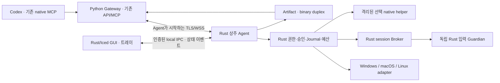

# RACP Client 영역 전체 Rust 전환 작업 계획서

> **Document ID**: `DOC-PLAN-RUST-CLIENT`\
> **Status**: Active · **Target Version**: v0.1.20 기준선 / 전환 릴리스 버전 미정\
> **Last Updated**: 2026-10-10 · **Classification**: Architecture & Implementation Plan

## 개요

이 계획의 목표 범위는 **Client 영역 전체를 Rust로 전환하고 레거시를 유지하지 않는 것**이다. GUI만 교체하는 작업이 아니라 GUI·트레이·등록·설정·상주 Agent·Desktop Broker/Guardian·OS Provider·전송·분석 helper 관리·Client 빌드 도구까지 재구성한다. Gateway와 서버 측 Python 코드는 유지한다.

완료된 제품의 기본 Client는 Python·Electron·Node.js·React·Playwright Python을 실행하거나 동봉하지 않는다. 기본 GUI는 **Rust + Iced**로 재작성한다. 기존 React 화면 재사용을 전제로 한 Tauri+React 제안은 이번 전체 전환 기준에서 사용하지 않는다. 외부 분석 엔진이나 브라우저처럼 기능에 필요한 제3자 도구는 기본 Client와 분리된 선택 runtime으로 관리한다.

기존 Python 구현의 추가 기능 확장과 전수 인수는 전환 준비에서 종료하고, 현재 계약과 증거를 추출한 뒤 Rust 기능별 검증으로 이동한다. 최종 소스·배포·CI에는 기존 Client 실행 경로, Python fallback, 구버전 설정 이전 코드 또는 이중 Client 운영을 남기지 않는다.

> [!IMPORTANT]
> 이 문서는 **작업 계획**이다. Rust 코드 작성·컴파일·기존 설치 제거·재등록·제품 패키징을 수행했다는 뜻이 아니다. 과거 source/VM 성공을 Rust 구현 성공으로 이전하지 않는다. 실행 결과와 미완료 항목은 [구현 현황](../quality/implementation-status.md)에만 누적한다.

## 목차

- [1. 범위와 완료 조건](#section-01)
- [2. 현재 기준선과 전환 원칙](#section-02)
- [3. 기술 선택](#section-03)
- [4. 목표 구조와 실행 경계](#section-04)
- [5. Rust workspace와 코드 배치](#section-05)
- [6. 계약·상태·권한 설계](#section-06)
- [7. 기능 전체의 전환·확장 범위](#section-07)
- [8. 플랫폼별 구현](#section-08)
- [9. 작업 분해와 실행 순서](#section-09)
- [10. 검사와 실제 원격 인수](#section-10)
- [11. 성능 목표와 측정](#section-11)
- [12. 빌드·패키징·버전 관리](#section-12)
- [13. 레거시 제거와 설치 전환](#section-13)
- [14. 위험·의존성과 진짜 한계](#section-14)
- [15. 종료 감사와 관련 문서](#section-15)

<a id="section-01"></a>

## 1. 범위와 완료 조건

### 1.1 포함·유지·제외

| 영역 | 처리 | 최종 상태 |
|---|---|---|
| `apps/client` Electron/React/TypeScript/IPC | 전체 교체 | Rust native GUI·트레이·local IPC |
| `apps/agent` Python runtime 및 Client 실행 진입점 | 전체 교체 | Rust 상주 Agent·CLI·OS별 서비스/로그인 시작 |
| Python Desktop Broker/Guardian | 전체 교체 | Rust session별 Broker·독립 입력 Guardian |
| Client 전용 Python SDK/Provider/plugin wrapper | 전체 교체 | Rust 구현; 원본 외부 MCP는 변경하지 않음 |
| Client build/staging/smoke 도구 | 교체 | Rust `xtask`·native 패키징·새 인수 도구 |
| Node·CPython·Python wheels·Electron bundle | 기본 배포에서 제거 | 기본 Client 실행에 필요 없음 |
| React 화면·renderer assets·preload bridge | 제거 | UI 코드는 Rust; 새 아이콘·폰트 등 정적 assets는 허용 |
| Gateway·서버 관리·서버 측 MCP/API·Console | 유지 | Python Gateway 및 현재 별도 웹 Console |
| 서버가 사용하는 Python domain/protocol/policy/SDK | 유지 가능 | Client runtime dependency로 사용하지 않음 |
| RACP protocol/schema/catalog | 공통 계약으로 유지·정비 | Rust/서버 간 한 계약; 구 Client 지원 목적의 shim은 제외 |
| 기존 Codex 리버싱 MCP·분석 DB | 유지 | host 도구와 원본 native protocol을 그대로 활용 |
| 기존 등록·설정 파일 | 자동 이전 제외 | 새 Rust 설정 형식으로 새 등록; 기존 자료는 임의 삭제하지 않음 |
| 향후 Gateway→Client 조직 정책 | 설계 경계만 유지 | 실제 policy push/pull·Enterprise 배포는 이번에 구현하지 않음 |

### 1.2 전체 전환의 합격 기준

1. 기본 Client의 모든 프로젝트 소유 실행 코드가 Rust이며 기존 Python/JS Client를 호출하지 않는다.
2. GUI만 작동하는 시제품을 완료로 선언하지 않는다. 상주 Agent·권한·OS 기능·분석 전송·정리까지 구현한다.
3. 기준선의 등록 operation마다 Rust 구현과 검사 또는 실제 OS/runtime 조건을 추적한다. 기능을 누락해 크기/성능 목표를 맞추지 않는다.
4. 18개 카테고리/143개 권한 후보 전체를 구현·필요 조건·플랫폼 한계로 판정한다. 단순 `planned` 표시는 최종 판정이 아니다.
5. 지원 OS의 기능·배포·권한·UI·성능을 해당 OS에서 확인한다. Windows 결과를 macOS/Linux 결과로 바꾸지 않는다.
6. 레거시 제거 목록과 최종 배포 manifest 검사를 통과한다. 구 Client 전용 runtime/test/CI 경로가 남지 않는다.

### 1.3 이전·확장·플랫폼 완료의 구분

전체 범위는 유지하되 서로 다른 산출물을 같은 완료율로 합산하지 않는다.

| 판정 단위 | 대상 | 완료 의미 |
|---|---|---|
| 기준 기능 이전 | 기준선 100개 operation 및 연결된 81개 권한 | 계약·거부·정리 의미와 선언한 Windows 기능의 Rust 인수; 기존 미검증 경로도 별도 추적 |
| 기능 확장 | 62개 planned 권한 및 신규 operation | R11의 개별 구현·검증 또는 근거 있는 플랫폼 한계 판정; 이전 완료가 확장 완료를 뜻하지 않음 |
| Windows 제품 전환 | Windows의 이전·확장·배포·레거시 제거 | R13-W/R14 통과; macOS/Linux를 지원 제품으로 광고하지 않음 |
| 전체 플랫폼 전환 | Windows 및 요청된 macOS/Linux native 인수 | R12-N/R13-N까지 통과해야 3-OS 완료로 표시 |

operation과 permission은 다대다 관계다. 100과 143을 합산해 기능 수나 완료율로 사용하지 않는다. 개발 중 `not_implemented`, `unverified`, `deferred`를 숨기지 않으며 이 상태는 최종 `supported` 판정을 대신할 수 없다.

<a id="section-02"></a>

## 2. 현재 기준선과 전환 원칙

계획 작성 시 SSOT 버전은 **0.1.20**이며 Registry는 **100개 operation**, catalog는 **81 RPC-backed / 62 planned = 143개 권한**이다. operation 등록·권한 연결은 모든 backend의 실제 성공 증거와 다르다. §27의 [구현 현황](../quality/implementation-status.md#agent-permissions-v020)을 기준으로 기능별 증거를 가져온다.

현재 핵심 증거는 파일/프로세스/터미널/화면 제어, packet→기존 Wireshark MCP, dump→기존 WinDbg MCP, W11 native live debugger 및 원본 proxy MCP의 HTTP 수집·인터셉트·재전송이다. 서비스/소프트웨어 inventory와 text search/patch는 host/source 검증이 있고 W11 신규 인수는 미완료다. Browser의 별도 source 실패도 해결됐다고 간주하지 않는다.

성능 측정에서 같은 0.1.13 번들의 빈 설정 status/activity 호출 중앙값 합은 약 4.26초였다. 매 요청 fresh Python 실행·무거운 import·serial polling이 확인된 지연 후보다. Rust에서는 **상주 상태·local IPC·변경 이벤트**로 이 경로를 교체한다. 측정값과 조건은 [구현 현황 §27.14](../quality/implementation-status.md)에 보존하며 예상 성능을 실측처럼 기록하지 않는다.

전환 준비는 다음으로 제한한다.

- 필요한 요구사항·schema·operation·권한·실패/정리 의미를 추출한다.
- 현재 확인된 요청/응답·binary framing·hash·실제 MCP 시나리오를 언어 중립 fixture로 만든다.
- 이미 통과한 Python 경로를 다시 장기간 시험하지 않는다.
- 미확인 기능은 Rust backlog로 가져온다. 오래된 결과와 새 Rust 결과를 분리한다.
- 개발 중 기존 소스가 참고용으로 잠시 존재해도 릴리스와 지원 경로는 새 Rust 하나로 정한다. Git history와 증거는 코드 fallback이 아니다.

### 2.1 기준선과 추적 산출물

R00은 버전 문자열뿐 아니라 기준 commit, dirty diff 유무, Registry/catalog/schema의 SHA-256을 고정한다. 같은 0.1.20 안의 변경도 구분한다. 기준 입력은 [Registry](../../packages/protocol/src/racp_protocol/registry.py), [공개 Registry JSON](../protocol/registry-v1.json), [권한 catalog](../../packages/protocol/src/racp_protocol/permission_catalog.json)이다. 각 입력 간 불일치는 이전 전에 해소한다.

추적표는 제안 경로 `native/tests/fixtures/migration-inventory.json`에 기계 판독 형식으로 두고 결과·증거는 [구현 현황](../quality/implementation-status.md)에 연결한다. 이 문서 개정 시점에는 해당 산출물이 아직 없다. 필수 필드는 다음과 같다.

- `operation_id`, `permission_ids`, `category`, `baseline_kind`(기존/확장), `source_path`, `contract_digest`.
- `platform`, `backend`, `owner_task`, `implementation_state`, `availability_reason`, `required_runtime`.
- `test_ids`, `evidence_ref`, `evidence_commit`, `cleanup_assertions`, `blocking_dependency`.

R00 검사는 ID 중복·누락, 존재하지 않는 operation 참조, 권한 연결 누락을 실패로 처리한다. 다중 권한의 AND/OR 의미와 출력 권한도 보존한다. 이후 신규 ID는 기준선을 조용히 바꾸지 않고 delta로 추가한다. 카테고리 off·grant deny·승인 필요·OS/runtime 부재·출력 권한 회수는 공통 정책 검사와 기능별 대표 인수로 연결한다.

<a id="section-03"></a>

## 3. 기술 선택

### 3.1 기준 stack

| 역할 | 선택 | 원칙 |
|---|---|---|
| GUI | Iced + Rust | 기존 화면 재작성, native window, 한글/IME·DPI·키보드·접근성 검증 |
| UI renderer | wgpu 및 software 경로 | GPU 없는 Hyper-V/원격 세션에서도 사용 가능해야 함 |
| 비동기 Agent | Tokio 기반 Rust | UI thread에서 network·disk·OS query를 수행하지 않음 |
| wire/모델 | Serde 및 명시한 validator | unknown field·overflow·bool/int 혼동·예산 초과 거부 |
| HTTPS/WSS | Rust TLS/HTTP/WebSocket 라이브러리 | 인증서 검증·사설 CA·proxy 조건·재연결을 실제 검증 |
| Journal | SQLite Rust 접근 계층 | mutation 접수/실행/결과·replay·retention·UNKNOWN 의미 유지 |
| 암호/secret | 검증된 라이브러리 + OS 보호 저장소 | 자체 암호 구현·평문 fallback 제외 |
| Windows OS API | `windows`/`windows-sys` 계열 | Win32/COM/UIA·Job Object·DPAPI·SCM native 연동 |
| macOS/Linux OS API | Rust platform adapter | OS framework/IPC/FFI를 작은 경계에 한정 |
| 의존성·버전 | `rust-toolchain.toml`, `Cargo.lock` | R00에서 실제 호환 버전을 pin; 실행마다 latest를 가져오지 않음 |

Iced는 [공식 Rust GUI](https://book.iced.rs/)이며 [upstream](https://github.com/iced-rs/iced)은 여러 플랫폼과 wgpu/tiny-skia renderer를 제공한다. upstream은 현재 experimental임을 명시한다. 따라서 R01에서 트레이·IME·접근성·software renderer의 제품 요구 충족을 확인한다. 요구를 충족하지 못하면 기능을 축소하거나 React/Python으로 fallback하지 않고 **Rust native GUI 선택을 재검토**한다.

> [!NOTE]
> “전체 Rust”는 OS의 시스템 DLL·프레임워크나 제3자 브라우저/디버거까지 재작성한다는 뜻이 아니다. 프로젝트 소유 Client 실행 코드·wrapper·상주 제어 계층을 Rust로 작성한다. 기본 패키지에 Python/Node/Electron/JRE/전체 분석 IDE를 필수로 넣지 않는다.

### 3.2 선택 runtime

브라우저·CDB/GDB·packet driver·분석 엔진은 capability별 선택 runtime이다. manifest/version/platform/arch/hash·신뢰 출처·실행 recipe를 검증한다. Client caller가 임의 executable/DLL 경로를 runtime으로 지정하지 못한다. 필요한 runtime이 없으면 이유와 설치 조건을 표시한다. 일반 PC의 기본 연결/파일/프로세스 기능은 분석 IDE 설치 없이 동작한다.

Client의 기존 Python GDB/Ghidra wrapper와 프로젝트 소유 Java bridge도 그대로 남기지 않는다. Rust에서 native CLI/API/JNI 등을 직접 사용하는 isolated helper 또는 host 분석 경로로 재설계한다. vendor API가 특정 언어 plugin을 요구할 경우 Client 밖의 선택 host 분석 연동으로 구분하고, 그 조건을 숨긴 채 Client 전체 Rust 완료를 선언하지 않는다.

### 3.3 초기 기술 검증과 결정 시점

Iced는 초기 선택이며 R01의 제품 적합성 검증 후 확정한다. R00은 Rust MSRV/toolchain, Iced/wgpu/tiny-skia, Tokio, TLS, SQLite, Windows bindings, tray 의존성의 버전·feature·license·지원 OS 최소 버전을 기록한다. 후보 조합을 먼저 고정한 뒤 다음 gate를 통과시킨다.

| 시점 | 검증 항목 | 실패 시 조치 |
|---|---|---|
| R01 | 한글 조합/후보창·붙여넣기·Tab/단축키·Narrator의 이름/역할/상태·100/150/200% DPI·다중 모니터 이동 | Rust toolkit 또는 접근성 연동을 재검토하고 결정 기록; 핵심 조작 접근성 미충족 상태에서 화면 전면 재작성 확대 금지 |
| R01 | GPU 비활성 VM에서 software renderer 선택·트레이·single instance·닫기/종료·Agent 단절 표시 | 실제 선택된 renderer와 장애 복구 확인; 컴파일 성공을 UX 합격으로 처리하지 않음 |
| R02–R03 | 사설 CA·hostname/만료 오류·HTTP CONNECT proxy·재연결·secret store 잠금/부재 | 지원 조건 명시; TLS 검증 해제나 평문 secret 저장으로 우회하지 않음 |
| R07 이후, R10 본 구현 전 | Rust CDP로 격리 profile·frame/selector·upload/download 최소 실험 | 필요한 Chromium/CDP 조합과 미지원 동작을 조기에 확정 |

최종 선택 근거는 관련 ADR에 남기고 실행 증거는 현황 SSOT에 기록한다. upstream의 renderer 제공 사실만으로 tray·접근성·IME 통합이 자동 충족된다고 보지 않는다.

<a id="section-04"></a>

## 4. 목표 구조와 실행 경계



- UI는 credential·실행 권한의 authority가 아니다. Agent가 모든 동작과 출력 권한을 검사한다.
- GUI/상주 Agent/세션 Broker/Guardian/native helper는 목적별 process 경계를 둔다. 기본 설치의 모든 executable은 Rust로 작성한다.
- GUI 종료·트레이 숨김·Agent 중지·앱 완전 종료를 분리하고 cleanup 결과를 표시한다.
- local IPC는 Windows named pipe, macOS/Linux Unix-domain socket을 기본으로 한다. 넓은 TCP listen을 열지 않는다.
- IPC peer의 사용자/session/PID·생성 시각 또는 OS peer credential을 검증하고 메시지 크기·동시 호출·deadline·권한을 제한한다. privileged Agent가 임의 UI 프로세스의 명령을 수용하지 않는다.
- snapshot 요청 + 변경 이벤트 + reconnect 후 resync를 사용한다. 이벤트 sequence 누락을 감지하고 동일 데이터를 지속적으로 다시 렌더링하지 않는다.
- blocking OS API는 bounded worker로 분리한다. 취소·deadline·lease가 끝난 worker가 늦게 결과를 publish하지 못한다.

### 4.1 실행 주체·격리·종료 책임

기본 Agent는 로그인 사용자 권한으로 실행하고, 시스템 서비스·승격 helper는 필요한 capability에 한정한다. 서비스의 Session 0에서 사용자 화면을 조작하지 않는다. Broker는 지정한 로그인 session에서만 시작하며 잠금·로그오프·사용자 전환 시 기존 observation/approval/input lease를 폐기한다. GUI와 Agent의 소유 사용자·session이 달라지면 새 인증/권한 판단을 거친다.

local IPC는 OS ACL/peer identity 외에 연결별 handshake·프로토콜 버전·challenge와 요청 scope를 검사한다. 실행 파일 이름이나 PID만으로 신뢰하지 않으며, 같은 사용자 권한을 이미 장악한 악성 코드까지 별도 보안 경계로 차단한다고 주장하지 않는다. 승인 응답은 Agent가 발급한 대기 요청에만 결합한다. privileged helper는 허용된 typed 명령만 수용한다.

`spawn_blocking` 작업은 시작 후 `abort`로 중단되지 않는다는 [Tokio 계약](https://docs.rs/tokio/latest/tokio/task/fn.spawn_blocking.html)을 설계에 반영한다. 짧은 OS query는 bounded pool·동시성 한도로 제어하고 COM apartment/thread-affinity를 지킨다. 중단 불가능하거나 무기한 block 가능한 API는 종료 가능한 소유 helper process로 분리한다. deadline은 결과 폐기만이 아니라 실제 작업·handle·입력 회수까지 검증한다.

R04는 queue/channel별 용량·worker 수·shutdown budget을 정하고 control/heartbeat/cancel이 대용량 stream에 막히지 않게 한다. 종료 순서는 신규 접수 차단→lease/입력 해제→소유 작업 취소→Journal/출력 정리→bounded 종료다. 강제 종료에도 Guardian이 key/button release를 수행하며 실패한 cleanup은 별도 상태로 남긴다.

<a id="section-05"></a>

## 5. Rust workspace와 코드 배치

다음 경로는 **신규 구조 제안**이며 현재 존재하는 산출물이라고 간주하지 않는다.

```text
native/
  Cargo.toml                 # workspace와 package version
  Cargo.lock
  rust-toolchain.toml
  apps/
    client/                  # Iced UI·트레이·single instance
    agent/                   # outbound Agent·CLI·서비스 lifecycle
    broker/                  # 로그인 session의 화면·입력·clipboard
    guardian/                # lease 만료/죽은 Broker의 입력 회수
  crates/
    wire/                    # 공통 메시지·operation·framing·validator
    policy/                  # local grants·constraints·approval·revision
    engine/                  # dispatcher·Journal·deadline·취소·resources
    ipc/                     # local authenticated transport·events
    artifacts/               # chunk/hash/retry·native duplex
    providers/               # typed 기능·managed helper recipes
    platform/                # win/mac/linux OS별 작은 FFI 경계
    storage/                 # 설정·OS secret store·원자적 저장
    ui-model/                # 설정/등록 UI의 공통 상태·검증
  xtask/                     # contract·검사·측정·패키징 orchestration
  tests/
    fixtures/                # 언어 중립의 정상/거부/실패 vector
    acceptance/              # 실제 OS·VM·native MCP 검증 도구
```

`unsafe`는 검토 가능한 OS/FFI 경계에 한정하고 safe wrapper가 handle ownership·길이·수명·반환 code를 검사한다. cross-platform core에서 platform별 handle을 임의 integer로 교환하지 않는다. Agent의 child process 및 borrowed 대상은 서로 다른 resource type으로 관리한다.

<a id="section-06"></a>

## 6. 계약·상태·권한 설계

### 6.1 Gateway와 공통 계약

Gateway를 Rust로 바꾸지 않는다. 서버가 사용하는 [protocol 계약](../protocol/README.md)의 파일 경로와 기준은 유지하고 필요한 변경을 명시한다. Client 구버전 호환 shim이나 Python 실행 fallback은 만들지 않는다.

- Registry의 operation·input/output·capability·side-effect·idempotency·예산을 Rust와 서버가 같은 계약으로 검증한다.
- JSON types, canonical digest/HMAC, Unicode/path, 숫자·float 직렬화, 기본값/null, timestamp, base64, checksum의 cross-language vector를 확인한다.
- unknown field/ID·손상 settings·중복 request·위조 approval·overflow는 거절한다. Serde의 일반적인 deserialize 성공만으로 계약 검증을 대체하지 않는다.
- descriptor/code/schema 변경은 원자적 변경 배치로 관리하고 CI drift 검사를 둔다.
- Python server의 모델/도구는 server 범위에 유지할 수 있지만 Cargo 빌드·Client 실행에서 Python을 호출하지 않는다. Rust가 소비하는 schema/catalog/fixture는 저장소에서 고정된 입력이다.

JSON Schema에 표현되지 않는 Pydantic custom validator·권한 조합·정규화·실패 code도 입력/출력 vector로 추출한다. R02는 schema 일치와 실행 의미 일치를 별도 판정한다. Python/Rust 비교 harness는 개발/CI 도구이며 배포 Client의 runtime dependency가 아니다. 실제 통신 fixture는 token·개인 경로·파일 내용 등을 제거하고 재현 가능한 소유 fixture로 치환한다.

### 6.2 상태·수명주기

Device/boot/connection epoch/principal/workspace/session/permission revision을 접수·실행·stream·출력·renew·replay 시점에 검사한다. PID는 생성 시각/OS handle과 함께 확인한다. clock은 deadline/lease에 monotonic 기준을 사용하며 wall-clock timestamp를 authority로 쓰지 않는다.

mutation은 Journal 접수 이후 실행한다. 동일 idempotency key의 재전송으로 작업을 다시 실행하지 않는다. 재연결·프로세스 죽음·부분 쓰기·정리 실패를 성공으로 바꾸지 않고 원인에 따라 UNKNOWN/partial/failed/expired를 반환한다. 취소 후 자신의 helper·socket·job·임시 파일·눌린 입력만 정리하고 borrowed process를 임의 종료하지 않는다.

### 6.3 설정·권한·승인

공통 catalog에서 등록/설정 UI와 Agent validator를 생성한다. 카테고리 off는 세부 선택을 보존하고 전체를 차단한다. 실행 profile·grant·constraint·OS/runtime availability는 다른 값으로 표시한다.

- 새 설정 형식만 지원한다. 구 v1/v2 자동 이전·구 identity 자동 import·구 Client 동시 실행 지원은 제외한다.
- OS secret과 편집 가능한 local policy를 분리한다. 기본 저장 권한/암호 보호·revision·원자적 commit·실패 복구를 검증한다.
- UI의 로컬 승인 요청은 operation/target/owner/device/boot/epoch/workspace/revision/TTL/nonce에 결합한다. 한 번의 승인으로 다른 요청이나 변경된 target을 실행하지 못한다.
- 로컬 승인과 Gateway owner 승인/profile을 각각 검사한다. 승인 UI가 없거나 종료됐으면 실행을 차단한다.
- hot policy는 Agent IPC의 validation→새 immutable snapshot→commit→관련 resource retirement→receipt 순서로 적용한다. credentials/gateway/승격처럼 restart가 필요한 항목은 분명히 구분한다.
- future `ManagedPolicySource`는 검증된 별도 constraint를 공급하는 인터페이스만 둔다. 현재는 local source이며 실제 Server→Client policy 전달은 구현하지 않는다.
- 광역 shell/argv/native debugger·proxy가 실행 프로그램의 모든 OS 행위를 checkbox만으로 격리한다고 설명하지 않는다.

### 6.4 충돌·복구·호환 계약

| 경계 | 설계·검증 조건 |
|---|---|
| wire 버전 | 제품 SemVer와 wire/schema 버전을 구분. Hello의 버전·capability로 미지원 조합을 작업 접수 전에 거부하고 supported Gateway 범위를 명시 |
| canonical/validator | 중복 JSON key, absent/null/default, 정수 범위·float 표현·Unicode 정규화·path case를 fixture로 고정. 기존 digest를 다른 canonical 표준으로 임의 교체하지 않음 |
| mutation Journal | durable accept→실행 시작→side effect→결과 commit 경계별 crash 주입. 외부 OS 변경과 DB를 하나의 transaction으로 볼 수 없으므로 exactly-once 성공을 보장한다고 쓰지 않음 |
| 재전송·보존 | 동일 scope/key+다른 payload는 conflict. 결과 만료 후에도 mutation key tombstone을 보존하고 자동 재실행 금지. outcome 불명은 UNKNOWN으로 조회/명시적 resolution |
| 재부팅·시간 | boot가 바뀌면 이전 monotonic lease/approval을 재사용하지 않음. suspend/resume 후 현재 authority를 재검하고 오래된 input lease를 폐기 |
| DB/디스크 | Journal schema version·WAL/durability·backup/checkpoint·disk-full/corruption 처리 명시. durable 기록 불가 시 mutation 접수 차단; 메모리 전용 성공 응답 금지 |
| hot policy | expected revision CAS, 원자적 snapshot 교체 후 신규 접수 차단·진행 중 출력 재검. commit 성공과 retirement 완료를 receipt에서 구분하고 실패 자원은 격리/재정리 |
| 이벤트·Artifact | snapshot+sequence 연결의 경합, gap/resync, 중복·역순 ACK, 재연결 scope, bytes/hash/MIME·최대 크기, disk spool quota·만료·중간 취소를 검사 |
| 관측·로그 | operation/request/trace ID와 boot/epoch/revision을 연결. token·cookie·clipboard·원문 payload를 기본 로그에서 제외; 로그/덤프 retention과 크기 제한 |

기존 [Journal](../../packages/sdk/src/racp_sdk/journal.py)의 deduplication/UNKNOWN/tombstone 의미를 계약 fixture로 추출한다. 새 Rust state 형식 도입과 향후 **Rust→Rust 설정/DB 업그레이드**는 별도 문제다. 구 Python 설정 자동 이전을 제외하더라도 새 제품의 schema upgrade·중단 복구·지원하지 않는 downgrade 거부는 R03 및 R13-W/R13-N에서 설계·검증한다.

<a id="section-07"></a>

## 7. 기능 전체의 전환·확장 범위

기능/권한 ID의 원본은 [Agent 권한 아키텍처](agent-permissions-and-capabilities.md)다. R00에서 100개 operation과 143개 ID를 inventory로 고정하고, 이후 각 ID에 OS별 backend·조건·검사·실제 증거를 결합한다. 아래는 전환 작업의 묶음이며 일부 기능만 남기는 축소 목록이 아니다.

| 카테고리 | 전환·추가 작업 | 필수 경계 |
|---|---|---|
| 시스템 관측 | identity/resources/locale/safe environment/session | provenance·민감 정보 분리·관측 budget |
| 파일 보기 | list/name/content search/text/binary/image/stat/hash | anchored 경로·링크 거부·encoding·bytes·Artifact |
| 파일 변경 | create/edit/exact batch patch/copy/move/delete/trash/ACL | 해시/revision·파일별 원자성·partial 결과·삭제 범위 |
| 디스크·볼륨 | volumes/usage/health/mount/raw/partition/format | 장치 identity·offset·admin·보호 장치·복구/현지 확인 |
| 프로세스 | list/inspect/tree/spawn/wait/stop | PID/생성 시각·owned/borrowed·arguments 권한 |
| 명령·작업 | argv/shell/recipe/script/elevated/jobs observe/cancel | executable ceiling·승격 분리·deadline·Journal |
| 터미널 | PTY/ConPTY 입출력·resize·keepalive/close | cursor/credit·PID scope·해제·late output 거부 |
| 앱 실행 | inventory/launch/close | 대상 identity·사용자/session·비소유 앱 분리 |
| 화면 보기 | monitors/windows/UIA·스크린샷 | 실제 session/foreground·DPI·layout revision |
| 화면 입력 | mouse/key/text/UIA·drag/scroll | opt-in·observation·lease·입력 Guardian·keyup 회수 |
| clipboard | text/formats/image/file 목록/쓰기 | session·sequence 충돌·크기·민감 데이터 출력 |
| browser | pages/DOM/frame/capture/input/evaluate/files/console/network/cookies/storage | Rust CDP 중심·관측 폐기·scope·opaque 실행 grant |
| network | interfaces/connections/probe/capture IPv4/IPv6/L2/HTTP/proxy/tunnel/config/firewall | 장치/process/filter·driver·lease·raw packet/CA 조건 |
| memory | regions/read/write/allocate/protection/dump | pinned target·주소 overflow·보호 process·Artifact |
| analysis/debug | static/dump/trace/live debug·register/memory write | 원본 MCP·관리 runtime·실제 attach/step/detach·borrowed 보존 |
| OS configuration | services/registry/tasks/software/settings | protected 대상·expected value·backup·권한 상승 분리 |
| accounts/session/power | 계정 관측/변경·lock/logoff/reboot/shutdown/sleep | login authority·현지 확인·Agent 연결 영향·복구 |
| diagnostics/backup/artifacts | events/trace/performance/support bundle/backup/restore/전송 | credential 제외·출력 승인·hash·예산·취소 |

최종 support matrix는 `supported`, `needs_permission`, `needs_runtime`, `unsupported_os`, `unsupported_protected_target`처럼 실제 이유를 제공한다. OS의 보호 대상처럼 정상 권한으로 기술적으로 불가능한 항목은 근거·대안과 함께 개별 판정한다. 구현하지 않은 항목을 기술적 불가로 바꾸지 않는다.

browser는 기본적으로 설치된 지원 Chromium 계열 또는 선택 managed runtime을 Rust CDP로 제어한다. 기존 Playwright 동작의 selector/frame/upload/download/관측 의미를 재구현하고 Python/Node driver로 우회하지 않는다. 다른 browser engine은 실제 지원 조건을 별도로 판정한다.

### 7.1 Browser 이전의 별도 계약

기본 제어 대상은 **Agent가 소유한 격리 browser process와 전용 profile**이다. 사용자의 기본 profile·cookie DB·열린 개인 탭을 자동 연결/복사하지 않는다. Chrome 136 이후 기본 데이터 디렉터리에 대한 remote-debugging switch가 제한된다는 [Chrome 공식 안내](https://developer.chrome.com/blog/remote-debugging-port)를 반영한다. 지원 browser binary/CDP 버전 조합, profile 수명, 실행 권한, debug endpoint 접근 경계를 manifest에 고정한다.

CDP 연결 성공만으로 Playwright 기능 동등성을 인정하지 않는다. auto-wait/actionability·strict selector·navigation timeout·OOPIF/frame·dialog·popup·download 완료·upload 경로·browser crash를 별도 vector로 옮긴다. arbitrary evaluate/cookies/storage는 광역 실행·민감 출력 권한을 따로 검사한다. 종료 시 소유 process/profile만 정리하며 browser endpoint를 외부 네트워크에 노출하지 않는다.

<a id="section-08"></a>

## 8. 플랫폼별 구현

| 영역 | Windows | macOS | Linux |
|---|---|---|---|
| 기본 target | x64; ARM64 별도 gate | arm64 및 x64 | x64 및 arm64 |
| native 연동 | Win32/COM/UIA, Job Object, DPAPI | Cocoa/CoreGraphics/AX/TCC, Keychain | procfs/ptrace/netlink, D-Bus/AT-SPI/portal, secret backend |
| 실행/터미널 | process handles·ConPTY | process group·PTY | pidfd 지원 확인·process group/cgroup 조건·PTY |
| lifecycle | user login·SCM 서비스 분리 | LaunchAgent/선택 LaunchDaemon | systemd user/선택 system 서비스 |
| 화면/입력 | desktop/session·DPI·UIA·SendInput·Guardian | 화면 녹화/접근성 OS permission·좌표 변환 | X11·Wayland 경로 분리; portal/PipeWire·compositor 조건 |
| capture/debug | native driver/OS API·CDB/DbgHelp | OS capture·debug permission·native engine | capture capability·ptrace 정책·native engine |
| local IPC | named pipe ACL·peer PID/session | Unix socket·peer credentials | Unix socket·peer credentials |
| 설치 | setup EXE·portable EXE/ZIP | DMG·APP/ZIP | deb·AppImage |

[Rust target 지원](https://doc.rust-lang.org/rustc/platform-support.html)과 [Windows Rust bindings](https://github.com/microsoft/windows-rs)을 참고한다. 언어가 Rust라고 secure desktop/PPL/TCC/Wayland 제한을 해제하지 않는다. 실제 OS 승격·사용자 동의·driver·하드웨어·라이선스는 여전히 필요하다.

Windows를 첫 구현/인수 대상으로 삼는다. macOS/Linux adapter와 패키징 정의는 처음부터 분리해 작성하되 **native 빌드/인수는 해당 OS와 명시한 실행 요청이 준비될 때 수행**한다. 현재 사용자 조건에 따라 macOS/Linux runner/container를 임의 실행하지 않는다. 미실행 OS는 deferred로 남기고 전체 3-OS 완료를 선언하지 않는다.

<a id="section-09"></a>

## 9. 작업 분해와 실행 순서

작업은 선행 항목의 산출물을 기준으로 진행한다. task 성공은 아래 gate와 [현황 기록](../quality/implementation-status.md)이 있어야 한다. 코드를 먼저 구현하고 영향을 받는 최소 검사로 확인하며 전체 회귀는 기능을 모아 최종 gate에서 실행한다.

| ID | 선행 | 작업·산출물 | 완료 gate |
|---|---|---|---|
| R00 | 없음 | commit/hash 기준선·operation/권한 inventory·언어 중립 fixture·레거시 소비자 목록·toolchain/license 후보 pin | §2.1 추적표·100개 operation·143개 ID·수명주기/배포 진입점에 누락 없음 |
| R01 | R00 | Cargo workspace·Iced UI 골격·theme/fonts/IME/DPI·트레이·single instance·GPU/software path | §3.3 접근성/입력/VM gate, toolkit 확정. Python/JS 실행 없이 동작 |
| R02 | R00 | wire/validator/canonical digest/TLS/WSS·Artifact 계약·서버 drift checker | 정상/거부 cross-language vector와 실제 Python Gateway handshake |
| R03 | R02 | 설정·OS secret store·one-use 연결 파일·등록·local authenticated IPC·상태 이벤트 | 새 등록→저장→재시작·위조/다른-user IPC 거부·구 설정 자동 import 없음 |
| R04 | R02,R03 | dispatcher/Journal/queue/lease/deadline/취소/reconnect/replay/resource registry | §6.4 crash 경계별 재실행 방지·UNKNOWN/partial·bounded cleanup·late output 거부 |
| R05 | R03,R04 | catalog/profile/constraints·공통 UI·local approval·hot retirement·future policy 경계 | 최초 등록/편집 동일 의미·off direct RPC 거부·승인 재사용 불가·revocation 회수 |
| R06 | R04,R05 | files/system/storage observation·search/image/patch·hash·Artifact | 허용 workspace·link/race/bytes/encoding·파일별 원자성·scope/hash 대응 |
| R07 | R04,R05 | spawn/stop/jobs/PTY/ConPTY·app lifecycle·recipe/script/elevation | owned containment·borrowed 보존·stdout/backpressure·취소·깨끗한 종료 |
| R08 | R01,R04,R05 | Windows Broker/Guardian·화면/UIA/input/clipboard·user login | 실제 OS 화면/입력·session/DPI/foreground fence·lease/drop/keyup·clipboard CAS |
| R-PKG | R01,R03,R07,R08 | Windows 패키징 recipe·manifest·서비스/트레이 등록·상태 root·Rust updater 설계 | 개발 staging으로 경로/의존성 검증. 제품 패키징 요청 후 깨끗한 VM의 설치/portable/제거 조기 인수 |
| R09 | R06,R07 | network/capture/memory/dump/native debugger/proxy·관리 runtime | 원본 Codex MCP의 static/packet/dump/live/HTTP 경로·target/hash·완전한 cleanup |
| R10 | R05,R06,R07 및 R07 이후 CDP 실험 | browser Rust CDP·관측/입력/파일·console/network/storage | §7.1 동등성·격리 profile·외부 앱/credential 범위 거부; R09 분석 기능과 독립 진행 가능 |
| R11 | R05–R10 | 62 후속 권한을 포함한 config/accounts/power/diagnostics/backup/restore/storage 확장 | 각 ID의 구현/필요 조건/기술 한계 판정·고위험 작업의 소유 VM fixture 인수 |
| R12-D | R00부터, R06–R11과 함께 갱신 | macOS/Linux adapter 인터페이스·OS 제한·배포 정의 | Windows 공통 core에 타 OS handle/경로 가정 없음; native 인수는 미완료로 명시 |
| R12-N | R12-D, 관련 기능 및 해당 OS 실행 요청/runner | macOS/Linux native UI/Agent·OS 권한·배포 인수 | OS/arch별 실제 증거; 미실행 target은 deferred |
| R13-W | R01–R11,R-PKG,R12-D | Windows 최적화·전체 회귀·실제 MCP·soak/fault·설치·성능 인수 | Windows 기능/성능/정리/제품 배포 gate 충족; 패키징 요청 전 배포 gate는 대기 |
| R13-N | R12-N 및 해당 target 패키징 | macOS/Linux 전체 회귀·실제 원격·배포·성능 인수 | 실행한 target별 판정; R13-W를 타 OS 증거로 전용하지 않음 |
| R14 | R13-W, 서버 의존성 분리 | 기존 Client 소스/의존성/CI 제거·가이드/AGENTS/skills 갱신·지원 종료 | 삭제 후 서버/Console 회귀·최종 tree/manifest/CI·새 등록 재검증. 3-OS 완료는 R13-N도 필요 |

Windows 흐름은 `R00 → R01/R02 → R03 → R04 → R05 → R06–R11 → R13-W → R14`다. R-PKG는 R08 이후 조기에 진행하고 R12-D는 기능별 adapter와 함께 작성한다. `R12-N → R13-N`은 명시한 OS 실행 요청 이후의 별도 경로다. R12-N이 deferred여도 Windows 작업을 계속할 수 있지만 3-OS 완료를 선언할 수 없다. R01/R02의 독립 작업은 같은 전환 배치에서 진행할 수 있지만 현재 사용자 요청 없이 별도 agent/thread를 만들지 않는다. UI layout 다듬기 때문에 engine/권한/cleanup 구현을 뒤로 미루지 않는다.

R00/R02 fixture는 기존 검사 전부를 그대로 복제하지 않는다. 계약이 달라지기 쉬운 경계와 실제 성공 사례를 가져온다. R09의 native MCP 인수가 성공해도 R11의 나머지 후보 또는 R12-N의 다른 OS 완료를 대신하지 않는다.

첫 통합 checkpoint는 R06의 최소 read-only 경로로 **새 등록→Gateway handshake→권한 허용/거부→파일 조회/hash→상태 UI→종료**를 완주하는 것이다. 이후 R07의 소유 process 하나에 mutation/Journal/crash 복구를 연결한다. 모든 Provider를 만든 뒤 최초 end-to-end 연결을 시험하는 순서를 피한다.

각 task는 시작 시 담당 범위·입력 fixture·선행 gate·막힌 외부 조건을 확정하고 종료 시 commit·실행 command·환경·증거 경로·미완료를 현황 SSOT에 남긴다. 일정은 R01/R02/CDP 실험과 R-PKG 결과 이후 산정한다. toolkit 부적합·wire digest 불일치·중단 불가능한 helper·설치 실패는 해당 의존 경로의 확대를 중지시키는 gate이며 독립 작업은 계속한다.

<a id="section-10"></a>

## 10. 검사와 실제 원격 인수

### 10.1 검사 계층

| 검사 ID | 범위 | 요구 증거 |
|---|---|---|
| RT-CONTRACT | strict schema/canonical bytes/숫자·Unicode/unknown field/framing | Rust + Python Gateway의 같은 vector 결과 |
| RT-LOCAL | registration/secret/IPC/공통 UI/local approval | 임시 state·사용자/session·실제 거부/저장/재시작 |
| RT-LIFECYCLE | idempotency/epoch/queue/cancel/crash/lease/replay | Journal state·1회 실행·소유 resource 부재·late output 거부 |
| RT-OS | file/process/PTY/desktop/config/memory/network | 실제 native API·정확한 target·hash·각 OS 조건 |
| RT-MCP | 기존 host tool의 static/PCAP/dump/live/proxy/replay | 원본 MCP 명령/결과 + Rust Agent/Device/boot/epoch + cleanup |
| RT-PERF | cold/warm UI·IPC·CPU/RAM·streaming | 같은 reference 환경의 P50/P95·표본·원시 수치 |
| RT-DIST | install/portable/restart/upgrade/uninstall·runtime separation | 실제 설치·실행·manifest·상태/credential 포함 없음 |
| RT-REMOVAL | 소스/dependency/build/CI의 레거시 제거 | 제거 목록·코드 검색·lock/manifest 검사 |
| RT-SERVER | Python Gateway/SDK/CLI·웹 Console 유지 | Python Agent 없이 서버 설치/import·API/MCP/schema·Console 검사 통과 |

Rust 자동 검사 예시는 다음과 같다. 실제 gate는 workspace가 생성된 뒤 정확한 command/feature를 확정한다.

```text
# repository root에서 native workspace로 이동한 뒤 실행하는 제안 명령
cd native
cargo fmt --all -- --check
cargo clippy --workspace --all-targets --locked -- -D warnings
cargo test --workspace --locked
cargo run --locked -p xtask -- contract-check
cargo run --locked -p xtask -- acceptance --platform win --scenario core
```

Rust 검사는 개발 컴파일을 수반한다. GPU/software·default/minimal·플랫폼 feature 조합을 명시한 CI matrix로 검사하며 상호 배타적 feature를 무조건 `--all-features`로 합치지 않는다. 제품 installer/portable/DMG/deb/AppImage 생성·배포와 구분하고, 제품 패키징은 별도 실행 요청 때 수행한다. R-PKG에서 recipe·개발 staging 검사를 먼저 준비하고 실제 installer 검증이 미실행이면 RT-DIST를 대기로 남긴다. 계획서 작성만으로 위 명령을 실행하지 않는다.

### 10.2 W11의 최소 실제 시나리오

1. 새 Rust Client를 별도 임시 state로 설치/실행하고 새 연결 파일로 등록한다. 기존 Device credential을 자동 가져오지 않는다.
2. 권한 off의 direct RPC 거부→명시한 on/승인→기능 성공→hot off 뒤 input/output/session retirement를 확인한다.
3. 한글 파일 search/patch/image/hash, process/terminal, 실제 mouse/key/UIA/clipboard를 소유 fixture에서 확인한다.
4. 자신의 binary/packet/dump를 회수하고 기존 Codex 리버싱 MCP로 실제 분석한다. live debug의 break/step/resume/detach 및 proxy interception/replay까지 확인한다.
5. Gateway 연결 손실·Agent/helper 죽음·UI 종료·취소·lease 만료에서 실행 횟수와 소유 resource cleanup을 확인한다.
6. 실행 후 기존 사용자 앱/clipboard/OS 설정을 보존했는지 확인하고 소유 fixture·시험 Device만 정리한다.

원격 Agent 연결이 없으면 해당 인수만 대기하고 independent Rust 구현을 진행한다. helper·GUI 존재/ONLINE·mock 결과만으로 실제 동작 PASS를 기록하지 않는다. 악성/미확인 대상, 실제 disk format/reboot 등은 일반 시험에 섞지 않고 지정된 격리 VM·소유 가상 디스크·복구 조건에서 수행한다.

### 10.3 장애 주입과 장시간 인수

RT-LIFECYCLE은 실행 전/side effect 후/결과 commit 전의 crash, 연결 flap·중복 요청·epoch 변경·권한 hot off, disk full·DB 손상, OS suspend/resume·session switch, helper hang·Agent/GUI 강제 종료를 다룬다. 기대 결과는 중복 mutation 없음·UNKNOWN/partial의 정확한 노출·입력 해제·소유 자원 회수·borrowed 보존이다. parser/framing/길이·주소 연산 경계는 property/fuzz 검사 후보로 두고 발견된 실패 입력을 고정 회귀 fixture로 남긴다.

초기 soak gate는 reference Windows에서 8시간 연결/idle 및 제한된 stream 반복, 100회 연결 단절/복구다. task/handle/process/queue/spool이 설정된 상한을 지키고 drain 뒤 활성 소유 자원이 기준치로 돌아와야 한다. 메모리 추세와 실패 횟수는 원시 시계열로 남긴다. 이 시간/횟수는 계획 목표이며 실행한 결과가 아니다.

<a id="section-11"></a>

## 11. 성능 목표와 측정

다음은 초기 **제품 목표**이며 달성 수치가 아니다. reference OS/build·CPU/RAM·디스크·전원 모드·GPU/VM·도구/Agent 버전·enabled capabilities를 기록한다. 목표 변경은 원인과 결정 기록 없이 낮추지 않는다.

| 항목 | 초기 gate | 측정 기준 |
|---|---|---|
| GUI cold 시작 | P95 ≤ 2초 | process 시작→사용자 입력 가능한 첫 화면, 실제 cold 조건 명시 |
| GUI warm 시작 | P95 ≤ 1초 | 동일 reference에서 별도 반복 표본 |
| local status 반영 | P95 ≤ 100 ms | Agent 상태 변경→local IPC→화면 반영; Gateway RTT 제외 |
| UI 입력 반응 | P95 ≤ 100 ms | 권한 toggle/스크롤/키 입력, UI thread 장시간 block 없음 |
| Agent idle memory | ≤ 50 MiB | GUI/native helper/browser 제외, private/PSS 측정 정의 명시 |
| GUI + Agent idle memory | ≤ 180 MiB | 지정된 기본 기능, GPU/shared memory 별도 기록 |
| Agent idle CPU | 평균 ≤ 0.5%의 한 core | 5분 관측, UI/tray 상태 polling용 child process 생성 0회 |
| binary streaming | 제한한 byte/queue/window 안에서 지속 전달 | peak memory·throughput·backpressure·cancel/lease cleanup을 함께 기록 |

표본은 개발 탐색에서 cold 10회/warm 20회 이상, R13 인수에서는 각 100회 이상을 기준으로 원시값/P50/P95/max와 nearest-rank 계산법을 기록한다. 작은 표본의 P95를 안정적인 제품 보증으로 해석하지 않는다. cold는 프로세스 재시작과 OS/file cache 초기화 조건을 구분한다. release profile·로그 수준·동일 workload를 사용하며 기존 status/activity 4.26초와 새 event-to-render 100ms는 서로 다른 측정이므로 직접 배속 비교하지 않는다. Native helper와 managed browser는 별도 scenario로 측정한다. 기능을 끄거나 resource 검사를 제거해 목표를 맞추지 않는다. VM software renderer·low-end 환경은 별도 support tier를 선언하고 실제 UX를 확인한다.

최적화 우선순위는 fresh subprocess 제거→이벤트/상태 cache→불필요한 OS query 제거→bounded 작업/IO→UI 가상화·부분 갱신→buffer/직렬화/FFI 복사 비용이다. 언어 전환만으로 속도 개선을 확정하지 않는다.

<a id="section-12"></a>

## 12. 빌드·패키징·버전 관리

- `native/xtask`가 검사·계약·staging·패키징의 Client 진입점이 된다. Client build에서 pnpm/Electron/Python wheel 단계를 제거한다.
- 각 target은 해당 OS/arch SDK·native dependency와 함께 빌드한다. Windows EXE를 macOS/Linux에 복사하거나 개발용 cross compile만으로 native 인수를 대체하지 않는다.
- Windows setup/portable/ZIP, macOS DMG/APP ZIP, Linux deb/AppImage의 기존 제품 형식은 native 구현으로 제공한다.
- staging/output 경로는 새 Rust manifest로 식별한다. 예: `dist/client-native/<version>/<target>/`와 기존 `dist/client-desktop/<version>/<target>/`. 이름/실행 파일/서비스명/state root를 혼용하지 않도록 R00에서 확정한다.
- 기본 manifest는 executable·library·asset·hash·size·OS/arch·compiler·Cargo.lock digest·features·license/SBOM·capability/runtime 구성을 포함한다. credential/token/gateway-specific state는 포함하지 않는다.
- 선택 runtime은 기본 패키지와 분리하고 hash·배포 권리·OS/arch·dependencies를 확인한다. 임의 remote path/URL을 받아 실행하는 installer를 만들지 않는다.
- 제품 version SSOT는 repository 규칙을 따른다. `scripts/version.py`를 Cargo workspace/version 표시·manifest까지 동기화하도록 정비하고 Rust는 `CARGO_PKG_VERSION`을 사용한다. 독립적인 두 version 체계를 만들지 않는다.
- 전환이 breaking일 수 있어도 MAJOR/MINOR를 임의 지정하지 않는다. 사용자 정의 전까지 전환 릴리스 버전은 미정이다. PATCH는 변경/빌드 배치마다 한 번만 적용하고 retry에 재사용한다.
- 제품 패키징은 사용자 요청 때 수행한다. macOS/Linux native build/CI 실행은 별도 명시 요청이 필요하며 signing/notarization/publishing은 독립 release 작업이다.
- 현재 [desktop-build skill](../../.agents/skills/desktop-build/SKILL.md)·[Desktop Client Guide](../guides/desktop-client-guide.md)의 Electron 전제와 Rust 제안 절차는 R-PKG에서 명확히 구분하고 R14에서 운영 정의를 전환한다. 기존 운영 정의를 새 제품의 인수 증거로 사용하지 않는다.

빌드 orchestration과 제품 runtime의 Rust 전환은 compiler/linker/SDK/NSIS 등 외부 build tool까지 Rust로 다시 작성한다는 뜻이 아니다. build-only dependency와 배포 dependency를 분리하고, Cargo에서 Python/Node를 은밀히 실행하는 build script가 없는지 감사한다. `Cargo.lock`·target·features·toolchain·native SDK를 고정하고 RustSec advisory/license 점검 결과와 예외 근거를 남긴다. dependency에 C/assembly가 포함될 수 있으므로 자체 실행 코드의 Rust 전환을 전체 공급망의 Rust-only 보증으로 표현하지 않는다.

R-PKG는 per-user/per-machine 설치·portable state root·실행 파일/서비스명·다중 instance 충돌을 확정한다. clean VM에서 개발 PC의 DLL/runtime/PATH 없이 시작해야 한다. native updater 또는 수동 교체 경로는 서명/신뢰 키·version/OS/arch/hash·크기 검증→drain/stop→원자적 교체→health check를 설계한다. downgrade/rollback은 **Rust 릴리스끼리** state schema 호환성이 확인된 경우만 허용하며 실패 시 진단 가능한 정지 상태를 유지한다. legacy Client fallback은 만들지 않는다. 제품 signing/publishing은 별도 release gate다.

<a id="section-13"></a>

## 13. 레거시 제거와 설치 전환

### 13.1 제거 대상

R14에서 사용처를 조사하고 다음 Client 전용 항목을 제거한다.

- `apps/client`의 Electron main/preload/backend/controller/login, React/TypeScript/Vite, Electron builder·pack hook·renderer·Node smoke/E2E.
- `apps/agent`의 Python main/background/desktop_control/service/Broker/Guardian/Provider/plugin 실행 경로와 package script.
- Client 전용 CPython/wheels/Playwright Python/Node staging·bootstrap·빌드/테스트 job과 docs의 구 실행 명령.
- Python Client fallback·구 state 자동 변환·구 IPC compatibility·이중 Client launcher·구버전 지원 feature flag.

서버/Console가 사용하는 pnpm/Python dependency, Gateway 관리 작업, host MCP 도구·DB, 계약 fixtures 및 기존 증거를 함께 지우지 않는다. workspace references·lockfiles·version tool·AGENTS/skills/가이드·CI를 같이 정리한다. 공유 dirty worktree의 다른 작업을 전환 삭제 대상으로 간주하지 않는다.

현재 [schema drift 검사](../../tests/contract/test_schema_drift.py)는 `racp_agent.settings/service_config/plugins.config`를 직접 import하며 [버전 검사](../../tests/unit/test_version.py)도 `racp_agent`를 import한다. [root workspace](../../pyproject.toml)는 `racp-agent`를 dependency로 갖고, [quality CI](../../.github/workflows/quality.yml)는 전체 Python workspace 및 Playwright를 설치한다. 따라서 디렉터리 삭제만으로 R14를 끝낼 수 없다.

R00/R02에서 소비자를 분류하고 R14 삭제 **전에** 서버가 필요한 공통 모델/계약은 서버 공통 패키지로 분리한다. Client 설정 계약은 새 Rust 계약으로 관리하되 기존 `docs/protocol/` 경로를 임의 삭제/이동하지 않는다. 과거 계약의 보존/대체 관계를 문서화하고 더 이상 삭제된 모델을 import하지 않도록 drift 검사를 재구성한다. Client 전용 검사만 Rust 검사로 이전하며 Gateway/Console/공유 계약 회귀는 유지한다. CI의 Linux 서버/Console job은 Client native Linux build와 구분한다.

R14는 삭제 후 새 checkout에서 Python Agent 없는 Gateway/SDK/CLI 설치·import·기존 API/MCP·Console 검사와 Rust clean build를 실행한다. `scripts/version.py`의 Agent/Client 이전 경로, uv/pnpm workspace·lock, schema 생성기·CI path filter도 함께 정비한다. 제거 audit은 파일명 검색 외에 실제 dependency graph·패키지 manifest·실행 child process를 확인한다.

### 13.2 사용자 설치 전환

새 Rust Client는 새 state schema와 등록 절차를 사용한다. 구 설치/credential/workspace를 몰래 import하거나 기존 Device ID로 가장하지 않는다. 교체 시 자신의 구 Agent를 정상 중지하고 cleanup을 확인한 뒤 새 Client를 등록한다. 구 Device revoke는 명시한 교체 절차에서 owner 권한으로 수행한다. 현재 실행 중인 설치/Device/VM을 계획 작성 단계에서 중단하지 않는다.

전환 runbook은 새 installer/등록 수단·로컬 복구 접근 준비→구 Agent의 신규 작업 차단/drain→입력/helper/자동 시작 회수→새 state 등록→Gateway/기능/cleanup 확인→owner의 구 Device revoke 순서를 명시한다. 새 등록 실패 시 중복 Agent를 자동 시작하지 않고 로컬 진단/재등록 단계에서 멈춘다. 기존 자료 보존과 활성 credential 폐기를 구분하며 uninstall의 state 보존/삭제 정책을 사용자에게 표시한다.

기존 `dist/` 배포물과 acceptance 증거는 역사 자료이며 지원되는 fallback이 아니다. repository 규칙대로 보존하고 레거시 제거를 이유로 unrelated output/사용자 파일을 일괄 삭제하지 않는다.

<a id="section-14"></a>

## 14. 위험·의존성과 진짜 한계

| 위험/조건 | 대응과 판정 |
|---|---|
| Iced 제품 적합성·renderer/트레이/접근성 | R01 gate에서 실제 확인; Rust 범위는 유지하고 toolkit을 조정 |
| Rust/Python canonical/validation 차이 | R02 언어 중립 vector와 서버 drift 검사; 양쪽 계약을 명시적으로 정비 |
| UI 프로세스가 privileged Agent를 제어 | peer identity·폐쇄된 IPC API·Agent 권한/승인 검사·사용자/session 분리 |
| OS query/FFI가 block하거나 cleanup 실패 | bounded worker/격리 process·deadline·scope 폐기·UNKNOWN/partial 명시 |
| COM/Win32/ptrace/TCC/Wayland·driver 조건 | platform adapter와 capability reason; 실패를 다른 대상으로 fallback하지 않음 |
| native engine/license·브라우저 크기 | 선택 runtime·검증된 manifest·기본 패키지 분리·필요 조건 표시 |
| 기존 GUI/데이터 이전 기능을 남기는 scope 확장 | 새 등록 기준; 구 Client 보존·동시 운영·자동 migration 제외 |
| 62 planned 후보를 누락 | R11 ID별 구현/조건/기술 한계 표와 종료 감사 |
| 실제 macOS/Linux 장비·runner 없음 | 정의/코드 검사는 진행, native 인수 deferred; 3-OS 완료 선언 금지 |
| 테스트가 구현을 대체 | 변경 범위 검사·기능 묶음 인수·최종 전체 gate로 제한 |

<a id="section-15"></a>

## 15. 종료 감사와 관련 문서

전체 전환 완료 전 다음 항목을 **실제 산출물**로 확인한다.

- [ ] R00–R14 및 R-PKG의 각 gate·artifact·누락/제약 판정이 현황 SSOT에 기록돼 있다. Windows는 R13-W, 타 OS는 R12-N/R13-N으로 구분한다.
- [ ] 100개 기준 operation과 143개 권한 후보의 traceability에 미분류·누락이 없다.
- [ ] Client/UI/Agent/Broker/Guardian/wrapper/build 코드가 Rust이며 Client 실행에 Python/JS fallback이 없다.
- [ ] Gateway 유지·현재 MCP/계약·권한/승인/Journal/cleanup 조건을 실제 Rust 경로로 확인했다.
- [ ] 등록/설정/전체 기능 UI가 실제 상태와 지원 조건을 표현하며 미구현을 지원으로 표시하지 않는다.
- [ ] 지원 OS마다 실제 GUI·native API·상주 lifecycle·원격 분석·설치·성능 결과가 있다.
- [ ] 모든 mutation/partial/cancel/crash/lease/retirement 시험에서 자신의 자원과 borrowed 대상을 구분했다.
- [ ] manifest/SBOM/lock·코드/CI 검색으로 구 Client dependency와 실행 진입점 제거를 확인했다.
- [ ] 삭제 후 clean checkout에서 Python Agent 없는 서버/Console 회귀와 Rust build가 통과했다.
- [ ] crash 경계·tombstone·hot policy CAS·blocking API 종료·Rust state upgrade/rollback 조건을 실제 검증했다.
- [ ] 제품 build/signing/deferred OS 등 남은 gate를 완료로 바꾸지 않았다.

이 계획서는 [기존 Agent 구현 계획](agent-permissions-implementation-plan.md)의 **Python/Electron 실행 계획을 대체**한다. 기능 요구사항과 과거 결과는 [권한 아키텍처](agent-permissions-and-capabilities.md), [Windows 계획](windows-engineering-plan.md), [종합 개발정의서](racp-specification-v1.1.md), [구현 현황](../quality/implementation-status.md)에서 이어받는다. [명세서 목록](README.md)·[문서 포털](../README.md)에서 이 문서를 전환 실행 기준으로 찾을 수 있게 한다.
