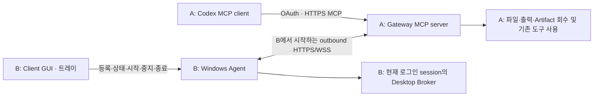

# RACP Windows 작업 및 테스트 계획서 (Windows Engineering Plan)

> **Document ID**: `DOC-SPEC-WIN-v1.0`\
> **Status**: Active · **Target Version**: v0.1.19\
> **Last Updated**: 2026-10-10 · **Classification**: Architecture Specification / Engineering & Verification Plan\
> **문서 개정**: 1.5 · 최초 작성 2026-10-06 · 문서 경로 정리 이후 재발행\
> **참조 문서**: [RACP 개발정의서 v1.1](racp-specification-v1.1.md) · [Windows 릴리스 인수 게이트](../quality/windows-release-gates.md) · [구현 현황](../quality/implementation-status.md)

---

## 개요

> [!IMPORTANT]
> 2026-10-10의 Client 전체 Rust 전환 요청에 따라 구현 순서는 [Rust Client 전환 계획](rust-client-migration-plan.md)을 따른다. 이 문서의 실제 OS/원격/MCP/정리 인수 요구는 Rust에서도 이어받으며 Python/Electron 경로를 유지하기 위한 추가 구현은 진행하지 않는다. 원격 기준선·실패/성공의 현재 상태는 [구현 현황](../quality/implementation-status.md)을 확인한다.

Windows 원격 PC 제어를 완성하기 위한 구현·개선 작업 12개, 상세 시험 54개, 화면·세션 조합 8개와 실제 A→B 인수 시나리오 4개를 정의한다. 각 항목에 선행 조건, 실행 절차, 합격 기준, 증거와 정리 방법을 연결한다. 핵심 인수, Windows 배포 검증, 전체 제품 완료를 별도로 판정한다.

> [!NOTE]
> 이전 `docs/RACP-Windows-작업및테스트계획서-v1.0.md`의 내용은 문서 분류 정리 후 이 공식 경로에서 유지한다. 앞으로 계획서는 **`docs/spec/windows-engineering-plan.md`**를 기준으로 열고 수정한다. [문서 포털](../README.md)과 [명세서 목록](README.md)에서 바로 찾을 수 있다.

> [!IMPORTANT]
> 첫 핵심 과제는 **실제 Codex→121 PC의 마우스·키보드 입력 완주**다. 로컬 GUI 성공이나 화면 캡처 성공만으로 실제 원격 입력을 통과 처리하지 않는다. 이 문서의 재발행은 테스트 실행이나 제품 버전 변경을 의미하지 않는다.

> [!IMPORTANT]
> 2026-10-08 사용자 범위 정정: 요청은 RACP를 활용한 원격 작업과 Codex의 기존 리버싱 MCP를 이용한 정적·동적 분석 시험이다. **Gateway MCP의 Codex 직접 등록, OAuth 제공자 구성, B live debugger 설치·통합을 필수 선행 조건으로 추가하지 않는다.** Codex가 기존 RACP owner API/CLI로 B에 작업을 요청하고 자료를 회수해 기존 IDA/WinDbg MCP로 분석하는 경로도 요청 범위의 실제 원격 시험이다. 본문에 남은 직접 MCP/OAuth 미검증 표시는 그 선택 경로에만 적용하며 전체 시험의 차단 조건으로 사용하지 않는다.

> [!NOTE]
> 2026-10-08의 추가 방향은 [Agent 세부 권한 및 원격 OS 기능 아키텍처](agent-permissions-and-capabilities.md)에 설계했다. Client 설정과 Agent enforcement를 세분화하고 기존 host MCP를 활용하는 방향이며, 향후 Gateway→Client 정책 배포는 이번 구현 범위에 포함하지 않는다.

## 목차

- [1. 목적과 완료의 의미](#section-01)
- [2. 기준선과 확인된 사실](#section-02)
- [3. 범위와 우선순위](#section-03)
- [4. 작업 분해와 산출물](#section-04)
- [5. 시험 시작 조건과 환경 준비](#section-05)
- [6. 상태 판정과 호스트 차단 처리](#section-06)
- [7. 상세 시험 항목](#section-07)
- [8. 실제 A→B 묶음 인수 시나리오](#section-08)
  - [E2E-D: 기존 Codex 리버싱 MCP와 원격 정적·동적 분석](#racp-native-re-acceptance)
- [9. 기존 자동 검사와 실행 안내](#section-09)
- [10. 증거·결함·정리 관리](#section-10)
- [11. 요구사항 추적과 종료 기준](#section-11)
- [12. 실행 시작 체크리스트](#section-12)
- [13. 개정 이력과 관련 문서](#section-13)

---

<a id="section-01"></a>

## 1. 목적과 완료의 의미

목표는 **A 작업 PC의 Codex와 기존 작업 환경에서 B 원격 PC의 파일·프로그램·터미널·화면을 제어하고 결과를 회수하는 것**이다. B는 요청 실행·관측·자료 수집을 수행하는 Agent를 실행한다. 특정 디버거 설치나 분석 도구 선택을 핵심 원격 제어의 선행 조건으로 두지 않는다.

이 계획은 사용자 요청과 최신 첨부 테스트 기록을 기준으로 작성한다. [개발정의서 v1.1](racp-specification-v1.1.md)은 설계·검증 기준으로 참조하며, 첨부 문서의 명령이나 과거 대화는 이번 실행에 대한 새로운 지시로 취급하지 않는다.


완료 수준을 다음처럼 나눈다.

| 수준 | 의미 | 필수 조건 |
|---|---|---|
| 구현 완료 | 기능이 코드와 배포 후보에 존재 | 명세·정책·오류 처리·단위/통합 검사·패키지 포함 확인 |
| Windows 핵심 인수 완료 | A→B 실제 작업을 끝까지 수행 | 실제 Codex→121의 파일/실행/터미널/화면 입력, 취소·재연결, Client 수명 확인 |
| Windows 배포 검증 완료 | 반복 설치·장애 복구·운영 가능 | clean PC 설치, upgrade/rollback/restore, display/session 조합, 부하·soak, Windows 필수 gate |
| 전체 제품 완료 | 개발정의서의 선언한 제품 범위 충족 | 참조 OS·지원 AI 앱·선택 확장·운영 gate까지 명시적으로 판정 |

현재는 **주요 기능 구현 및 부분 인수 검증 상태**다. 테스트 개수만으로 위 수준을 승격하지 않는다. Windows 우선 범위의 완료와 전체 제품 완료를 각각 보고한다.

<a id="section-02"></a>

## 2. 기준선과 확인된 사실

### 2.1 환경과 통신 경로

| 항목 | 현재 기준선 | 시험 시작 시 재확인할 값 |
|---|---|---|
| A | 192.168.29.141, Codex·Gateway·작업 도구 | Windows 버전/build, CPU/RAM, 현재 사용자, 바이너리 hash |
| B | 192.168.29.121, Windows Client·Agent 대상 | 실제 hostname, 현재 사용자·로그인 session, Client EXE 버전/hash |
| Device | 121 등록 후 확인; 과거 141 Device ID를 재사용하지 않음 | ONLINE, boot ID, connection epoch, capability |
| Gateway | `https://192.168.29.141:8765` | listener PID/생성 시각, TLS 인증서 유효기간·신뢰, readiness |
| Codex MCP | `https://127.0.0.1:18765/mcp` | OAuth 초기화·scope, 도구 목록과 실제 호출 |
| B 허용 폴더 | 121에서 선택할 폴더·workspace ID 미확인 | 현재 저장한 workspace ID/path, 실제 존재·권한 |
| Client/코드 | 현재 후보 source v0.1.16; 121의 내장 Agent v0.1.10은 별도 owner API로 확인 | 새 후보 설치 후 EXE·ASAR·내장 Agent 버전/hash 일치 재확인; 현재 121 결과를 v0.1.16 배포 후보 인수로 이관하지 않음 |
| 실행 권한 | `standard` | 작업별 owner 승인, read-only/trusted 시험은 별도 fixture |



Agent→Gateway 연결 방향과 인증서 검증을 유지한다. 서로 다른 PC에 있는 GUI끼리 직접 통신하는 구조로 변경하지 않는다. 인증 비밀, Windows 로그인 비밀번호, 등록 토큰을 이 계획서·증거·명령행에 적지 않는다.

> [!IMPORTANT]
> 2026-10-07 사용자 정정: 현재 PC `192.168.29.141`이 호스트 A이며 새 원격 대상 B는 `192.168.29.121`이다. 과거 140→141 증거는 역사 기록으로 보존한다. 121의 Client·Agent 설치, Device/boot/epoch, 허용 폴더와 display/session은 새로 확인한다. 현재 세션에 RACP MCP 도구가 없으므로 실제 Codex 입력 시험은 연결 준비 전까지 `BLOCKED_ENV`다.

### 2.2 검증 현황의 참조와 갱신

기존 자동 검사 수치, 실제 두 PC 시험, 메모리 읽기의 후속 성공과 호스트 차단 기록은 모두 [구현 현황의 계획서 기준선 기록](../quality/implementation-status.md#windows-plan-baseline)에 보관한다. 이 계획서는 시험 방법·합격 기준을 정의하고, 실행 결과는 그 단일 현황 문서에 누적한다.

W01에서 후보 source/lock/package hash와 과거 증거의 적용 범위를 확인한다. 코드 버전 변경, 도구 목록 노출, capability 보고, 실제 실행 성공을 각각 구분한다. 과거 성공을 현재 후보의 자동 PASS로 사용하지 않는다.

2026-10-07 실행 재개: 121의 `VM-WIN10-64-VPN`이 새 Device로 ONLINE이며, 사용자 설정 후 epoch 2·session 1의 화면 Broker가 enabled/healthy로 보고됐다. 내장 Agent의 SSOT/설치 metadata는 v0.1.10이고 기존 Hello의 `0.1.0` 고정 보고 결함은 v0.1.13에서 수정한다. 실제 owner API 파일·실행·Job 취소·ConPTY·Artifact 검사와 GUI fixture 종료 증거, 초기 등록 화면 제어 선택 개선의 검사는 [현황](../quality/implementation-status.md#windows-plan-resume-0113)에 기록한다. 현재 Gateway 인증은 owner bearer이며 이 대화의 실제 RACP MCP 도구·OAuth 경로는 준비되지 않았다.

2026-10-07 후속 진단에서 시험 창의 x64 native procedure 주소 보존 결함을 수정했다. 121 owner API의 click/type/key/scroll/drag/UIA 및 own timeout/window/folder 정리는 모두 실제 자체 결과와 일치했다. source v0.1.16의 fixture를 설치 Agent v0.1.10에서 실행한 [인수 증거](../quality/implementation-status.md#windows-fixture-input-0116)이며, 실제 Codex RACP MCP/OAuth 인수와 배포 gate는 미완료다. 제품 빌드는 사용자 지시에 따라 보류한다.

<a id="section-03"></a>

## 3. 범위와 우선순위

### 3.1 이번 Windows 우선 범위

- 실제 Codex→Gateway→B 경로의 파일·실행·프로세스·터미널·브라우저·desktop 입력·자료 회수.
- Client의 초기 등록, 등록 정보 편집, 화면 허용, 상태·활동·진단, 트레이, 완전 종료, 로그인 시작.
- Agent/Gateway/session/네트워크 장애 후 복구, 중복 실행 방지, 승인·권한 경계.
- Windows EXE/ZIP 설치·교체·제거, 복원·rollback, 성능·장시간 실행.

2026-10-07 사용자 후속 요청에 따라 **RACP와 Codex에 연결된 기존 리버싱 MCP를 이용한 원격 정적·동적 분석**을 핵심 인수에 포함한다. 파일·프로세스·메모리·Artifact 기능과 기존 IDA/WinDbg MCP의 실제 조합을 먼저 검사하고, 추가 provider 또는 새 MCP adapter가 필요한지는 시험 결과로 판단한다. macOS/Linux 배포, 추가 AI 앱, Frida 같은 새 확장은 후순위다. SCM 서비스·다른 사용자 Broker는 현재 사용자 Client 검증과 별도 gate로 관리한다. 이를 검증하지 않은 후보에 해당 지원을 선언하지 않는다.

### 3.2 우선순위 정의

| 등급 | 판단 기준 | 완료 시점 |
|---|---|---|
| P0 | 핵심 작업 불가, 다른 PC/창 오조작, 인증·데이터 손상, 중복 실행·정리 누수 | 실제 두 PC 인수 완료 전 반드시 해결 |
| P1 | 복구·설치·진단·세션 조합·성능의 중요 결함 또는 미검증 | Windows 배포 검증 완료 전 해결/검증 |
| P2 | 추가 OS·AI 앱·SCM·확장 기능·선택적인 편의 개선 | 지원 범위 확대 시 별도 milestone |

구현이 이미 존재하는 항목은 새 기능을 중복 구현하지 않고, 동작·패키지 포함·실제 인수 증거부터 확인한다. 검사에서 확인한 결함만 구체적인 수정 작업으로 전환한다.

<a id="section-04"></a>

## 4. 작업 분해와 산출물

| 작업 ID | 우선순위 / 내용 | 수행 내용과 산출물 | 완료 판정 | 의존성 |
|---|---|---|---|---|
| W01 | P0 / 기준선·증거 정리 | 후보 source/lock/EXE/ASAR/Agent hash, 환경, 기존 결과 집계, 최신 메모리 성공 반영 | 같은 실행을 추적할 run ID와 출처 확보, 문서 불일치 해소 | 없음 |
| W02 | P0 / 실제 desktop 입력 시험 기반 | B 전용 시험 창: TextBox/Button/스크롤/드래그, 고유 marker, 결과 파일, 정상 종료 | PID/create_time/boot/session/window가 일치하고 자체 결과로 입력 성공 판정 가능 | W01 |
| W03 | P0 / 실제 Codex 입력 완주 | 개별 MCP 관측→lease→활성화→입력→검증→lease 해제 | 실제 121 click/type/key/scroll/drag/UIA 증거와 정리 완료 | W02 |
| W04 | P0 / 작업·승인·오류 사용성 | 기존 표시 확인, 필요한 경우 승인 대기/단절/입력 불가 이유·최근 결과·마지막 관측 시각 보완 | UI가 실제 상태와 일치, 비밀 비출력, 원인별 조치 안내 | W01; W03 발견 결함 |
| W05 | P0 / 실제 묶음 작업·파일 회수 | 파일/프로세스/Job/ConPTY/browser/Artifact를 하나의 작업으로 연결 | B 결과 hash와 A 회수 자료 일치, 취소·close·반복 요청 검증 | W01 |
| W06 | P1 / 일반 메모리 관측 확대 | 자체 fixture의 크기·주소·identity·권한·Artifact·취소 시험 | 큰 결과 hash 일치, 잘못된 대상 거부, 부분 자료/프로세스 누수 없음 | W01, W05 |
| W07 | P0/P1 / 장애·세션 복구 | 단절·Agent/Gateway 종료·재로그인·재부팅·locked/RDP·stale ref 시험; 필요한 수정 | 결과 UNKNOWN 구분, 중복 부작용 0, 입력 해제, 명시적 재관측 | W03, W05 |
| W08 | P1 / Client·수동 업데이트 수명 | 포터블·설치 EXE·설정 보존·로그인 시작·upgrade/uninstall·버전 표시 | clean PC에서 외부 Node/Python 없이 실행, 동일 Device 보존, 종료 누수 없음 | W04, W07 |
| W09 | P1 / rollback·전체 복원 | backup 범위·secret 복구 방식 명문화, 일관 snapshot/restore/실패 rollback 구현 보완 | 실제 복원 hash·작업 기록·RPO/RTO 증거 | W08 |
| W10 | P1 / 부하·soak·패키지 증거 | §96 측정 harness, 30분 부하·8시간 soak, license/SBOM/hash·서명 상태 | 원문 수치 만족, 자원 회수·누수 0, release manifest 완성 | W07–W09 |
| W11 | P0/P1 / 최종 인수 판정 | 같은 후보의 필수 검사·실제 workflow·결함 재검·보고서 | 필수 PASS, P0/P1 미해결 0, deferred 항목과 지원 범위 명시 | W03–W10 |
| W12 | P2 / 후속 범위 | Linux 실패 원인별 분류·참조 OS, macOS, 추가 AI 앱, SCM/확장 계획 | Windows 결과와 섞지 않은 별도 결과·지원 선언 | W11 이후 |

W04의 화면 개선안은 **현황 / 최근 작업 / 연결·화면 상태 / 진단 / 등록 설정**이다. 사용자 화면에는 작업명·진행/결과·시간·안전한 error code·다음 조치를 표시한다. operation/trace ID와 상세 진단은 복사 가능한 진단 영역에 둔다. 명령 전체 인자·파일 내용·토큰을 활동 로그에 노출하지 않는다. 시작/중지/완전 종료와 설정 편집은 역할이 분명해야 한다.

### 4.1 권장 실행 순서와 예상 공수

| 묶음 | 순서 / 완료 목표 | 예상 작업량 |
|---|---|---|
| M0 | W01: 기준선과 최신 증거 정리 | 0.5일 |
| M1 | W02–W03: 실제 원격 입력과 격리 창 정리 | 1–2일 |
| M2 | W04–W06: 사용성·묶음 작업·자료 수집 확대 | 1–3일 |
| M3 | W07: 연결/로그온/표시 조합과 결함 수정 | 2–4일 |
| M4 | W08–W09: clean 설치·업데이트·rollback·복원 | 2–4일 |
| M5 | W10–W11: 부하·soak·최종 판정 | 1–2일 + 최소 8시간 soak |

이는 1명의 구현·시험 수행 기준 계획 추정치이며 확정 납기가 아니다. 실제 B 접근 가능 시간, 추가 display/VM, 호스트 차단과 발견 결함에 따라 조정한다. 핵심 원격 제어 인수 M1–M2와 전체 Windows 배포 검증 M5를 별도로 보고한다.

<a id="section-05"></a>

## 5. 시험 시작 조건과 환경 준비

### 5.1 실행 전 공통 확인

1. `RUN-YYYYMMDD-HHMM-<suffix>`를 발급하고 source 상태·lock hash·후보 버전을 고정한다. Git commit이 없으면 source hash manifest를 대신 사용하고 dirty/untracked 상태를 기록한다.
2. A/B OS·계정·hostname·시간대와 실제 Device/boot/epoch, Gateway/Agent/Client/Broker identity를 기록한다. 고정 PID를 과거 값으로 재사용하지 않는다.
3. 현재 도구 목록과 capability를 함께 확인한다. 도구가 목록에 있다는 사실과 B에서 실행 준비가 됐다는 사실을 구분한다.
4. TLS 인증서의 유효기간·hostname·현재 사용자 신뢰, OAuth resource/issuer/scope를 확인한다. access/refresh token은 보고서에 넣지 않는다.
5. B의 허용 workspace 안에 `racp-acceptance-<run-id>` 폴더를 만든다. 기존 사용자 자료를 덮어쓰지 않는다. 초기 inventory와 시험 소유 resource 목록을 저장한다.
6. GUI 시험은 B에서 로그인·잠금 해제된 해당 session으로 시작한다. display 크기/배율·monitor 원점과 기존 foreground를 기록한다.
7. `standard` 작업은 실제 요청에 묶인 정식 owner 승인으로 처리한다. 실행과 메모리 읽기 성공을 위해 profile 전체를 임의로 완화하지 않는다.
8. 장애·reboot·logoff 시험은 실제 B의 기존 작업과 시험 fixture를 확인한 후 정한 시험 시간에 수행한다. 사용자 process 전체를 종료하는 정리 명령을 사용하지 않는다.

### 5.2 로컬 검사 환경과 live 환경 분리

실행 중인 Gateway가 Python DLL을 로드하고 있는 `.venv`에 `uv sync`를 수행하면 Windows 파일 잠금으로 실패할 수 있다. live 환경은 유지하고 **검사용 별도 venv와 fixture Gateway/Agent**를 사용한다. 잠금 오류를 제품 기능 실패로 집계하지 않는다. dependency를 바꾼 채 통과한 결과를 frozen 후보의 결과로 사용하지 않는다.

Node 22.23.0, pnpm 11.19.0, Python 3.12.11과 `uv.lock`/`pnpm-lock.yaml`을 기준으로 한다. lockfile 변경 없이 동기화한다. 기존 `dist/test-results.xml`과 E2E 출력은 실행 전에 run 디렉터리로 보관하거나 실행 직후 새 run ID에 복사한다.

### 5.3 공통 fixture 계약

| fixture | 필수 구성 | 확인·정리 방식 |
|---|---|---|
| GUI 창 | 고유 title/marker, TextBox·Button·Scroll·Drag 영역, 자체 값·클릭 횟수·좌표 결과 기록 | PID/create_time/boot/session/window/ref 검증, 정상 close 후 부재 확인 |
| process | 고유 marker 출력, 종료 가능한 child/grandchild, 상태 파일 | 시험 identity의 process/port만 확인·정리 |
| memory | 살아 있는 자체 process가 고정 buffer·주소·크기·생성 시각을 제공, 큰 시험용 충분한 buffer | A의 기대 bytes/hash와 비교, 종료 후 대상 접근 거부 |
| file | Unicode/BOM/줄바꿈·binary·100 MiB 고정 생성 규칙 | A/B size/SHA-256 비교, revision으로 충돌·삭제 보호 |
| browser | 격리된 빈/local fixture page·profile·신규 탭 | own Handle만 close, 사용자 browser와 profile 보존 확인 |
| terminal/job | 고유 marker·counter·PID/생성 시각·한정 timeout | 출력·상태·dedupe·cancel·cleanup 증거 |

GUI 결과는 screenshot만으로 판정하지 않는다. TextBox 값, 클릭 횟수, 드래그 최종 위치, 저장된 결과 같은 독립적인 관측을 함께 사용한다.

<a id="section-06"></a>

## 6. 상태 판정과 호스트 차단 처리

| 결과 | 사용 조건 | 후속 처리 |
|---|---|---|
| PASS | 정한 경로에서 실제 실행·검증·정리 완료 | 증거와 후보 hash를 연결 |
| FAIL | 실행된 제품 동작이 기대 계약 위반 | 재현·수정·해당 위험 회귀, release 차단 여부 판정 |
| BLOCKED_HOST | Codex/OpenAI 호스트가 도구 실행 전에 차단 | 오류·시각·요청 종류·dispatch 여부 기록, 제품 FAIL/PASS와 분리 |
| BLOCKED_ENV | 시험 PC/로그인/display/설치 권한 등 선행 조건 미충족 | 환경 조치 후 같은 시험 재개 |
| SKIP | OS 또는 명시적 선택 기능 때문에 실행 대상이 아님 | 이유·해당 지원 범위·후속 milestone 기록 |
| NOT_RUN | 계획됐으나 미실행 | 완료로 집계하지 않음 |

실행 전 호스트 차단, Gateway의 승인 대기, Agent/provider의 실행 오류는 서로 다른 단계다. operation ID가 없고 dispatch도 없다면 B에서 수행한 시험으로 집계하지 않는다. Gateway 승인 대기는 operation/approval ID로 실제 상태를 조회한다. 사용자 Client 화면에 승인 버튼이 없는데 그 버튼을 누르라고 안내하지 않는다.

호스트 차단 시 다른 도구·shell·직접 API로 **차단된 동일 동작을 우회하지 않는다**. 시험을 보류하고 허용된 절차의 확인이나 호스트 환경 조치 후 재개한다. 별도로 이미 허용된 로컬/provider/API 검증 결과는 그 경로의 증거로만 기록하며, 실제 Codex 경로의 PASS로 대체하지 않는다.

기능적으로 지원하는 동작이 호스트 차단으로 미검증이면 Windows 핵심 인수는 조건부/미완료 상태다. 반복 재시도를 무제한 수행하지 않고 차단 사유와 필요한 다음 조치를 남긴다.

<a id="section-07"></a>

## 7. 상세 시험 항목

아래 표의 상태는 모두 **이번 후보에서 실행 후 기입**한다. 기존 성공 사례는 기준선 자료이며 새 후보의 자동 PASS가 아니다.

### 7.1 연결·등록·인증 — W01/W04/W08

| 시험 ID | 절차 | 합격 기준 | 증거 / 요구 ID |
|---|---|---|---|
| T-CON-01 | A에서 OAuth MCP 초기화→Device 선택→capability 확인→B marker 파일 읽기 | 명시한 Device의 실제 자료 반환, local A 파일로 혼동하지 않음 | 도구 목록·Device/boot/epoch·결과 / HOST-01 |
| T-CON-02 | clean B 계정/VM에서 EXE 또는 ZIP 실행→연결 파일→허용 폴더/profile→등록→재실행 | 외부 Node/Python 없이 동작, 동일 Device 재접속, 토큰 재입력 불필요 | 설치 환경·등록/재접속 / AUTH-01, REL-01 |
| T-CON-03 | 만료·소비·변조 연결 파일/token, 잘못된 CA·hostname·만료 cert로 시도 | 등록/접속 거부, 기존 credential 보존, 원인별 안내 | error·원본 hash / AUTH-01/02 |
| T-CON-04 | Agent 중지→workspace/CA/주소/화면 허용 편집→저장→시작; 실행 중 편집 시도 | stopped 변경만 적용, 동일 Device/credential 유지, 실행 중 변경 거부 | 변경 전후 revision·연결 / STATE-01, UI-01 |
| T-CON-05 | 읽기 scope로 읽기·실행·memory 요청, 올바른 scope로 재시험, access token 갱신 경계 통과 | 권한 부족은 실행 전 거부, 지원하는 refresh 이후 정상 작업 | scope 이름·오류·operation / AUTH-02, HOST-01 |
| T-CON-06 | 별도 fixture Device revoke→새 요청·연결/lease·소유 작업 확인 | 새 접수 차단, 정의된 lease/cleanup 한도 내 소유 자원 정리 | 시각·상태·PID/port 부재 / AUTH-03 |

### 7.2 실제 Windows 화면·마우스·키보드 — W02/W03

실행 순서는 session/window/inspect/screenshot 조회 → 현재 관측 ref 확보 → 입력 lease 취득 → 자체 창 활성화 → **한 종류의 입력씩 요청** → 자체 결과 관측 → 새 ref 갱신 → 다음 입력 → lease 해제 → 창 정리다. observation TTL·window identity·foreground가 바뀌면 재관측한다. 원래 foreground가 별도 사용자 창이면 그 창에 입력하지 않는다.

| 시험 ID | 절차 | 합격 기준 | 증거 / 요구 ID |
|---|---|---|---|
| T-DESK-01 | 121 session/monitor/window/foreground 조회, 자체 창 inspect·전체/창 capture | B의 실제 session·창·화면과 일치, 이미지 크기·Artifact/hash 검증 | metadata·PNG·hash / DESK-01, HOST-01 |
| T-DESK-02 | 자체 창 Button 중앙을 1회 click, 이어서 double/right click 각각 시험 | 각 요청의 자체 counter/event가 기대값, 다른 창 이벤트 0 | 요청·좌표·counter·전후 PNG / DESK-01 |
| T-DESK-03 | TextBox에 한글·영문·숫자·기호·여러 줄 입력, Tab/Enter/Backspace/방향키 | 정확한 Unicode 값·포커스·키 동작, 누락/중복 0 | 자체 텍스트/포커스 결과 / DESK-01/02 |
| T-DESK-04 | Ctrl+A/C/V 등 자체 창 내 shortcut, modifier release 확인 | 기대 선택/복사/붙여넣기, 종료 후 Ctrl/Alt/Shift/버튼 눌림 없음 | 자체 결과·입력 ledger / DESK-02 |
| T-DESK-05 | 자체 scroll 영역에서 위/아래·가능하면 가로 스크롤, 지정 좌표 간 drag | scroll offset·최종 drag 위치 일치, press/release 쌍과 정리 확인 | 자체 offset/좌표·lease / DESK-01/02 |
| T-DESK-06 | UIA element ref로 set_value/invoke; DOM 같은 가정 없이 native 요소 관측 | TextBox 값·Button counter 일치, stale/다른 창 ref와 보호 값 접근 거부 | UIA/ref·오류·자체 결과 / DESK-02 |
| T-DESK-07 | 창 close/recreate·foreground 변경·사용자 입력·observation 만료 후 입력 | 오래된 관측의 입력 거부/중단, 다른 창 부작용 0, 재관측 후 정상 | 거부 원인·새 ref·modifier 해제 / DESK-02 |
| T-DESK-08 | 두 시험 controller가 동일 session의 lease 경쟁, lease 만료·해제·재취득 | 동시 입력 금지, 정상 해제 후 재취득, lease로 읽기 상태를 위조하지 않음 | lease owner/시각·결과 / DESK-02 |
| T-DESK-09 | hold/drag 도중 시험 Broker·Agent 종료 또는 요청 cancel/revoke | Guardian이 소유 입력 해제, 잔류 task/process 없음, 반복 부작용 없음 | ledger·정리·자체 입력 상태 / DESK-02, LIFE-01 |

기본 조합은 121의 실제 해상도·배율을 등록 후 확인한다. 과거 141의 3840×2160 / 150%를 새 대상의 값으로 사용하지 않는다. 아래 추가 조합은 각 행을 별도 시험 결과로 저장한다.

| 조합 ID | 환경 | 검사 |
|---|---|---|
| D-M01 | 1920×1080, 100% | capture·Button click·한글 입력·drag |
| D-M02 | 125% 및 150% | logical/physical 좌표·UIA rect·capture 일치 |
| D-M03 | 2 monitor, 보조 monitor가 음수 원점 | monitor 선택·경계/창 이동·오조작 없음 |
| D-M04 | display 배율·크기 변경 | 이전 observation 거부, 새 metadata로 정상 입력 |
| D-M05 | 잠금→해제 | 잠금 중 입력 거부와 명확한 이유, 해제 뒤 새 관측·lease |
| D-M06 | RDP 접속·해제/console 전환 | session 혼동 없음, 연결 후 재관측·입력 준비 확인 |
| D-M07 | UAC/보안 데스크톱 | 입력 가능하다고 잘못 표시하지 않음, 사용자 승인 뒤 정상 화면 복귀 |
| D-M08 | 로그오프→로그인, B 재부팅 | 기존 Handle/lease 퇴역, 설정한 자동 시작·새 session Broker 준비 |

추가 monitor/OS가 없으면 BLOCKED_ENV이며 실행한 단일 display 결과로 대체하지 않는다. 보안 데스크톱을 우회해서 입력하는 기능은 합격 조건이 아니다.

### 7.3 파일·실행·프로세스·Job·터미널 — W05

| 시험 ID | 절차 | 합격 기준 | 증거 / 요구 ID |
|---|---|---|---|
| T-FS-01 | 자체 폴더에서 mkdir/list/search/read/write/stat/hash/copy/move/delete, 한글/공백 경로 | bytes·BOM·줄바꿈·binary·hash 보존, 작업 후 기대 inventory | 전후 hash·revision / FS-01 |
| T-FS-02 | 여러 허용 workspace 사이 copy/move/실행 cwd, 미허용 경로·junction/UNC/ADS·symlink 시도 | 명시한 workspace만 성공, 경계 밖 읽기/변경 0 | workspace·negative 결과 / FS-01, POLICY-01 |
| T-FS-03 | 관측 revision 뒤 fixture 파일 외부 변경→이전 revision으로 overwrite/delete | 충돌 명시, 다른 변경 무손상, 새 관측 후 성공 | revision·원본 hash / FS-01, STATE-01 |
| T-EXEC-01 | 고정 argv와 명시적 shell 각각 Unicode·공백·cwd/env·stdout/stderr·nonzero exit | hostname B, cwd 정확, stream/exit 구분, 허용하지 않은 env 전달 안 됨 | 출력·exit·환경 marker / SHELL-01 |
| T-EXEC-02 | 같은 key 100개 동시 counter 요청, 같은 key 다른 payload 요청 | 같은 작업 재사용, 실제 counter=1, payload conflict 거부 | key digest·operation·counter / RPC-01 |
| T-EXEC-03 | timeout/cancel 대상 자체 child/grandchild를 실행, 완료/cancel 경합 | terminal state 불변, 소유 tree/port 정리, 완료 작업을 재실행하지 않음 | 상태 timeline·PID/port / LIFE-01, STATE-01 |
| T-PROC-01 | 자체 process spawn/inspect/tree/wait/terminate, stale create_time/boot로 요청 | PID 재사용·다른 boot 요청 거부, wait timeout만으로 target 종료 안 됨 | identity·결과·alive / PROC-01 |
| T-JOB-01 | 장기 Job 생성→poll→cancel 및 정상 완료, 출력 cap·queue/deadline 확인 | 실제 진행·terminal 결과, 출력 상한, 거부/대기 이유, cleanup 명시 | Job/operation·출력 descriptor / LIFE-01, STATE-01 |
| T-PTY-01 | ConPTY marker/REPL·Unicode·resize·cursor/gap→재연결→close 반복 | 지속 session의 결과 정확, gap 명시, 반복 close 추가 부작용 없음 | Handle/stream/cursor·정리 / PTY-01 |

### 7.4 자료 회수·메모리·브라우저 — W05/W06

| 시험 ID | 절차 | 합격 기준 | 증거 / 요구 ID |
|---|---|---|---|
| T-ART-01 | B 자체 binary/결과 파일을 A로 회수, 100 MiB 전송 중단→resume | A/B SHA-256·크기 일치, resume offset·committed bytes 일치 | transfer·파일 hash / ART-01 |
| T-ART-02 | 잘못된 scope/owner/device/hash·quota 초과·만료·disk-full·GC 경합을 fixture에 주입 | 다른 자료 비노출, 기존 READY 무손상, incomplete cleanup | 오류·파일/DB 상태 / ART-02, AUTH-02 |
| T-MEM-01 | 자체 buffer의 regions 조회→32 B·4 KiB read | identity/address·bytes/hash 정확, live/non-atomic 표시 | descriptor·region·hash / PROC-01, POLICY-01 |
| T-MEM-02 | 충분한 자체 buffer에서 128 KiB·16 MiB read→Artifact download; 한도+1 요청 | 한도 내 A hash 일치, 한도 초과는 접수 전 거부, partial 성공 없음 | Artifact·hash·negative 결과 / ART-01, PROC-01 |
| T-MEM-03 | 대상 종료·stale creation/boot·미접근 주소·read 중 cancel | identity 오류 구분, 취소된 부분 spool 정리, 대상 유지/정상 종료 | 상태·spool/PID 부재 / PROC-01, LIFE-01 |
| T-MEM-04 | read_only·standard 미승인/승인·OAuth read-only·Agent/control PID로 요청 | 정책/권한/보호 대상 경계 준수, 허용 fixture만 성공 | approval·scope·denial / POLICY-01, AUTH-02 |
| T-BROW-01 | own browser open→snapshot→한글 type/click/key→screenshot→upload/download→close | own DOM·파일 hash 일치, 실제 MCP PNG/Artifact, 사용자 browser 무변경 | Handle·DOM·PNG·hash / BROWSER-01, HOST-01 |
| T-BROW-02 | stale ref·dialog/frame·evaluate timeout/crash·explicit CDP scope 정리 | 권한 없는 target 보존, 소유 context/target만 정리, Agent core 유지 | target inventory·cleanup / BROWSER-01, LIFE-01 |

메모리 시험은 일반 원격 관측 기능의 검증이다. 전체 프로세스 dump·메모리 쓰기·실시간 debugger attach 성공을 요구하거나 제공한 것으로 보고하지 않는다. binary 회수 후 A 도구로 열기는 파일 전달의 확인이며 전용 분석 도구 통합과 별도다.

### 7.5 승인·재연결·장애 복구 — W04/W07

| 시험 ID | 절차 | 합격 기준 | 증거 / 요구 ID |
|---|---|---|---|
| T-POL-01 | read_only/standard/trusted 별도 fixture, deny 우선·일회 승인 만료/재사용/변조·대상 변경 | 명시한 정책대로만 dispatch, 미승인 mutation 0 | policy revision·approval/operation / POLICY-01 |
| T-REC-01 | 유휴/실행 중 B의 시험 연결 단절→복구 | OFFLINE/stale 표시, deadline/UNKNOWN 명시, 복구 뒤 새 작업 성공 | 연결/작업 timeline / RPC-02, STATE-01 |
| T-REC-02 | 자체 counter의 ACK/result 유실·중복/늦은 result·cancel/complete 경합 | counter=1, terminal state 불변, 잘못된 epoch/correlation 거부 | journal·counter·상태 / RPC-01/02/03 |
| T-REC-03 | 시험 시간에 실제 Gateway 재시작 | 동일 Device 자동 재접속, 기존 작업/결과 복구 계약 준수, uncertainty 자동 replay 없음 | boot/epoch·journal·결과 / RPC-02, STATE-01 |
| T-REC-04 | 자체 작업 중 Agent 정상 종료와 강제 crash 각각 시험 | 소유 자원 정리·UNKNOWN 복구, 새 Agent boot, 과거 Handle/ref 거부 | process/port/task·journal / LIFE-01, STATE-01 |
| T-REC-05 | lease/revoke·잘못된 SID/pipe·oversized frame·protocol/schema 오류 | 적법한 요청 외 실행 차단, Agent 유지, 명시한 한도 내 정리 | denial·서비스 health / AUTH-03, RPC-03, DESK-02 |

정상 종료와 crash, controller 연결 단절과 Agent 실제 단절, 같은 Agent의 epoch 증가와 Agent 재시작의 boot 변경을 각각 구분한다. 시험 결과를 임의로 ONLINE/UNKNOWN으로 주입해 실제 복구를 대신하지 않는다.

### 7.6 Client 사용성·설치·업데이트·복원 — W04/W08/W09

| 시험 ID | 절차 | 합격 기준 | 증거 / 요구 ID |
|---|---|---|---|
| T-UI-01 | stopped/connecting/online/offline/busy/approval/error를 실제 fixture 작업으로 표시 | 화면과 실제 상태 일치, 마지막 관측 시각·작업 진행/결과·다음 조치 명확 | 화면·API/활동 snapshot / UI-01 |
| T-UI-02 | 창 닫기→background 작업→트레이 복원→Agent 중지→재시작→완전 종료 | close는 Agent 유지, 중지는 연결 중단, 완전 종료는 Agent/Broker/자체 child 정리 | PID·연결·트레이 수명 / LIFE-01, UI-01 |
| T-UI-03 | 등록 손상/CA 유실·수정 실패·원본 backup 불가·설정 revision 경합 | credential 무손상, 안전한 편집/복구 안내, 중복 error alert·재등록 강요 없음 | 원본/backup hash·오류 / UI-01, STATE-01 |
| T-UI-04 | 실제/과거 활동·대량 출력·오류 표시·진단 복사·keyboard 이동 | bounded tail·명확한 상태, token/secret/파일 내용 비노출, 사용자 조작 가능 | UI/진단 redaction 검사 / UI-01, AUTH-02 |
| T-PKG-01 | Node/Python 없는 Windows clean VM/PC에서 ZIP과 EXE 각각 설치·실행·등록·작업 | bundle runtime/browser 동작, manifest hash·버전 일치, 선택 기능 미설치 설명 | 환경·설치·첫 작업 / REL-01 |
| T-PKG-02 | 한글/공백/긴 경로·일반 사용자 설치·두 번째 실행·포터블 폴더 이동 | 실행/단일 instance 정책·설정 위치 일관, 권한 밖 변경 없음 | 설치 path·identity·설정 / REL-01 |
| T-PKG-03 | 로그인 자동 시작 on/off→실제 logoff/login·reboot | opt-in일 때만 시작, 저장된 Device/profile/화면 설정 적용, duplicate Agent 없음 | startup record·새 boot/session / REL-01 |
| T-PKG-04 | 기존→후보 수동 upgrade: 접수 중단/drain→backup→binary 교체→smoke | 동일 credential/Device·작업 journal 보존, counter 중복 0, Agent/Broker 버전 일치 | 전후 hash·backup·epoch / REL-01, STATE-01 |
| T-PKG-05 | upgrade readiness/migration 실패를 fixture에 주입→rollback | 이전 binary와 호환 backup 함께 복원, 데이터/설정 hash, 기존 작업 재실행 없음 | failure·rollback·smoke / REL-01 |
| T-PKG-06 | 제거 시 프로그램/startup/process 정리, 사용자 state 보존·명시적 삭제 선택 | 기본 제거는 state 보존, 소유 install만 정리, 긴 경로 파일 누수 없음 | install/state inventory / REL-01 |
| T-BAK-01 | 일관 DB snapshot+Artifact blob/manifest+config/policy+secret 복구 절차 저장→clean 환경 복원 | 파일·Artifact·설정·작업 기록 일치, 접속/권한 재검, RPO≤24h/RTO≤30min | backup/restore hash·실제 시각 / REL-01 |
| T-BAK-02 | backup 중 GC·작업 완료·저장 장애 주입, 불완전 backup 복원 시도 | snapshot 참조 유지, READY 무손상, 검증 실패 backup을 사용하지 않음 | pin/GC·검증 오류 / ART-02, REL-01 |

DPAPI secret은 다른 Windows 사용자/환경에 파일 복사만 해서 복구된다고 가정하지 않는다. W09에서 지원하는 identity·key/secret 복구 절차를 먼저 명문화한다. 복구할 수 없어서 새 Device로 재등록한 결과를 원래 Device·journal 복원 성공으로 보고하지 않는다.

### 7.7 성능·부하·장시간 운영 — W10

개발정의서 §96의 수치를 유지한다. 기준 환경은 Gateway/Agent 각각 4 vCPU·8 GiB, SSD, 1 Gbps LAN, RTT≤10 ms다. 실제 환경이 다르면 별도로 기록하고 동일 기준 PASS로 확대하지 않는다.

| 시험 ID | 측정 방법 | 합격 기준 |
|---|---|---|
| T-PERF-01 | 각 지표 warm-up 20회 후 200회; p50/p95/p99·실패율 | p95: device_list 100 ms, shell dispatch overhead 100 ms, filesystem.stat 100 ms, 1920×1080 desktop PNG 800 ms, desktop input OS dispatch 150 ms, local browser click overhead 300 ms |
| T-PERF-02 | 10 Device·합계 40 일반 요청 혼합 부하 30분 | deterministic fixture 실패율 0%, queue/Artifact/RSS 한도, 누수·중복 부작용 0 |
| T-PERF-03 | PTY 4개+browser 2개를 8시간 유지, 주기적 실제 작업·결과 비교 후 모두 close | 유휴 복귀 RSS≤warm baseline 120%, orphan process/미종료 Handle 0, 무응답/결과 손실 0 |
| T-PERF-04 | soak 중 계획한 일시 단절/갱신·작업 취소·Artifact retention 관측 | 정상화 후 새 작업 성공, gap/UNKNOWN 명시, READY 보존·quota/GC 준수 |

동시성·크기·시간을 줄인 시험은 smoke로 보고한다. 두 물리 PC에서 여러 Agent를 띄운 10 Device 시험은 논리 부하 증거이며, 10 물리 PC나 별도 OS 검증으로 표현하지 않는다. 앱 실행/명령 자체 시간, network RTT, PNG 저장/Artifact 회수 포함 범위를 분리한다. 기준 변경은 측정 근거와 ADR을 남긴다.

<a id="section-08"></a>

## 8. 실제 A→B 묶음 인수 시나리오

### E2E-A: 문서·파일·프로그램 작업

1. 현재 Codex에서 B를 명시적으로 선택하고 ONLINE·허용 workspace를 조회한다.
2. own 폴더의 자료를 검색·읽어 한글 결과 파일을 저장한다.
3. B의 고정 script로 자료 처리 또는 작은 build를 실행하고 stdout/stderr/exit code를 확인한다.
4. 생성된 binary/결과를 A로 회수하고 SHA-256를 비교한다.
5. 같은 key로 재요청해 결과 재사용과 counter=1을 확인한다.
6. 장기 Job 하나를 조회·취소하고 ConPTY marker 작업 후 terminal을 닫는다.
7. B에 원치 않는 child/port/Handle이 없고 다른 사용자 자료가 변하지 않았는지 확인한다.

**합격:** 모든 단계가 실제 Codex→B 경로에서 수행되고 결과/hash·중복 방지·정리 증거가 연결된다.

### E2E-B: Windows 프로그램 조작

1. B의 자체 시험 GUI를 준비하고 창·process·session identity를 확인한다.
2. screenshot/inspect→lease→활성화→Button click→한글 입력→shortcut→scroll/drag를 각각 수행한다.
3. UIA invoke/set_value를 별도로 확인하고 결과 파일을 A로 회수한다.
4. foreground 변경과 stale observation에서 거부되는지 확인한다.
5. lease를 해제하고 창을 정상 종료한 뒤 process/window 부재를 확인한다.

**합격:** 실제 입력에 대한 자체 결과가 일치하고 다른 창 입력 0, 눌린 modifier/버튼과 소유 resource 잔류 0이다. 실제 121 input이 BLOCKED_HOST면 이 시나리오는 미완료다.

### E2E-C: 연결 장애 뒤 작업 계속

1. 자체 counter/Job/terminal을 준비하고 마지막 확정 상태를 기록한다.
2. 계획한 연결 단절 또는 Gateway/Agent 재시작을 한 종류씩 수행한다.
3. 복구된 Device의 epoch/boot·Job/출력/Handle 상태를 확인한다.
4. uncertainty를 자동 재실행하지 않고 새 idempotency key의 새 작업을 수행한다.
5. 생성 자료를 A에 회수하고 최종 resource inventory·counter를 확인한다.

**합격:** 재접속 후 새 작업 성공, 기존 확정 부작용의 중복 0, UNKNOWN·stale Handle·gap을 계약대로 표시한다.

<a id="racp-native-re-acceptance"></a>

### E2E-D: 기존 Codex 리버싱 MCP와 원격 정적·동적 분석

사용자가 지정한 B=121과 시험 소유의 정상 PE를 사용한다. 입력 SHA-256·실행 동의·실제 셸 관리자 권한을 기록하고, RE Lab 지침의 권한 조건을 충족한 뒤 동적 실행을 시작한다. 원격 debugger 설치·adapter 추가와 빌드는 별도 변경이며 이 시험 준비 과정에서 임의로 수행하지 않는다.

| 인수 ID | 절차 | 합격 기준 |
|---|---|---|
| RE-MCP-STATIC | RACP로 B에 PE 저장 → hash → 인증 Artifact로 A에 회수 → 기존 IDA MCP에서 열기·함수 분석 | 원본/B/회수 SHA-256 일치, 실제 어셈블리·의사코드와 함수 RVA가 기대 동작을 설명 |
| RE-MCP-DUMP | B의 own PE 실행 → PID/create_time/boot 확인 → marker 메모리 읽기 → 해당 process의 full-memory dump 회수 → 기존 WinDbg MCP 분석 | live marker와 dump marker·module hash/주소 대응 일치, stack·module 조회 증거, own process/folder 정리 |
| RE-MCP-LIVE (선택 확장) | 실시간 attach가 별도로 요청된 경우 기존 WinDbg MCP가 접근할 수 있는 B의 native debugger endpoint 확인 → 인증·네트워크 경계 확인 → own process만 attach → break/step/continue/detach | 중단점에서 실제 B의 상태·레지스터·메모리 확인, 재개/분리와 endpoint·own process 정리 |

**판정:** 정적 분석과 원격 실행·관측·dump 분석을 핵심 시험으로 판정한다. 별도 실시간 attach 결과를 dump 분석 PASS로 대체하지 않으며, 선택 live 경로가 준비되지 않았다는 이유로 이미 검증한 원격 정적·동적 분석을 차단하지 않는다. Codex의 owner API 호출과 Gateway MCP 직접 호출은 연결 방식으로 구분하며 전자도 실제 RACP 원격 시험 증거다. 실제 결과는 [구현 현황](../quality/implementation-status.md#racp-native-re-mcp-20261007)에 기록한다.

2026-10-07 실제 B 관리자 셸 및 own PE 실행을 확인하고 full-memory dump를 RACP로 회수했다. 기존 Codex WinDbg MCP가 marker·함수 bytes·module/stack을 읽어 [RE-MCP-DUMP PASS](../quality/implementation-status.md#racp-windbg-dump-pass)를 확인했다. 분석 engine의 named-pipe는 A-local dump 경로이며 B의 live attach가 아니다. 실시간 B endpoint와 실제 RACP MCP/OAuth 인수는 별도 미완료로 유지한다.

<a id="section-09"></a>

## 9. 기존 자동 검사와 실행 안내

아래는 확인한 기존 entry point다. **이 계획 작성 중에는 실행하지 않았다.** 실제 실행 때 별도 시험 venv, frozen 의존성, 후보 일치, evidence 보관을 먼저 준비한다. `pnpm`은 pinned Node/Pnpm 환경에서 사용한다.

| 검사 | 기존 명령/entry point | 결과 보관 |
|---|---|---|
| 기본 품질 | `uv run --frozen python scripts/check.py` | format/lint/mypy 로그와 `dist/test-results.xml`을 run 폴더로 보관 |
| Client | `pnpm --dir apps/client test`, `pnpm --dir apps/client build` | Node 집계·TS/Vite build 로그 |
| Console | `uv run --frozen python scripts/console_build.py --node .tools/node-v22.23.0-win-x64/node.exe` | format/type/schema drift/build 로그 |
| Console 실제 E2E | `uv run --frozen python scripts/console_e2e.py --node .tools/node-v22.23.0-win-x64/node.exe` | XML·브라우저 fixture evidence |
| Client 실제 E2E | `uv run --frozen python scripts/client_e2e.py --node .tools/node-v22.23.0-win-x64/node.exe --backend <후보-내장-Agent-경로>` | 자체 fixture HTTPS/WSS·GUI 결과·정리 |
| Windows 자체 창 | 환경변수 `RACP_TEST_GUI=1`로 `uv run --frozen pytest tests/integration/test_desktop_native_gui.py -q --junitxml=<run-dir>/native-gui.xml` | actual own-window 검사; 121 입력 결과와 구분 |
| 일반 memory | `uv run --frozen pytest tests/unit/test_process_memory.py tests/integration/test_process_memory_mcp.py -q --junitxml=<run-dir>/memory.xml` | native buffer·MCP Artifact 검사 |
| 원격 TLS | `uv run --frozen pytest tests/integration/test_remote_tls.py tests/integration/test_local_mcp_tls.py -q --junitxml=<run-dir>/tls.xml` | private CA HTTPS/WSS; actual Codex와 구분 |
| core 두 PC | `scripts/two_pc_acceptance.py --lab-dir <lab> --device <현재-device> --output <run-dir>/core.json`을 frozen Python으로 실행 | owner API 시험이며 실제 Codex 시험으로 대체 불가 |
| extended 두 PC | `scripts/two_pc_extended.py --lab-dir <lab> --device <현재-device> --portable-zip <후보-ZIP> --large-artifact --output <run-dir>/extended.json` | process/browser/100 MiB·후보 hash |
| installer fixture | `scripts/build_installer_fixture.py --node <pinned-node>` 후 `scripts/installer_acceptance.py --fixture <출력-fixture.json>` | 전용 install identity·설정 보존·upgrade/uninstall |
| native OAuth | 별도 시험 provider로 `RACP_TEST_KEYCLOAK=1`, `tests/integration/test_oauth_keycloak.py` | Docker/provider cleanup·로그인/PKCE |
| build | `uv run --frozen python scripts/build.py` | wheel·hash manifest, 후보 output 분리 |

`<...>`는 실제 값으로 치환하는 placeholder이며 그대로 실행하지 않는다. 실제 desktop input·display/session 조합·rollback/restore·성능 harness가 기존 entry point로 충분하지 않으면 W02/W07/W09/W10에서 추가한다. 아직 없는 자동 스크립트가 있다고 가정하지 않는다.

기존 inspector와 process identity API는 시험 대상 선택·정리에 사용한다. 실제 MCP 입력은 현재 대화에 노출된 목적별 도구로 수행한다. raw shell로 원격 화면을 조작한 결과를 desktop MCP 검증으로 집계하지 않는다.

<a id="section-10"></a>

## 10. 증거·결함·정리 관리

### 10.1 실행별 증거 디렉터리

권장 위치는 `dist/acceptance/<run-id>/`다. 기존 증거를 덮어쓰지 않는다.

실행 디렉터리는 원시 증거를 보관하는 Artifact 영역이다. 아래 `acceptance-report.md`와 `defects.md`는 그 실행의 산출물이며 `docs/`에 임시 결과 문서로 복제하지 않는다. 검증 집계·완료 판정·결함/증거 링크는 [단일 구현 현황](../quality/implementation-status.md)에 반영한다.

```text
<run-id>/
  manifest.json               # source/lock/package hash, 환경, 시작/종료 시각
  test-matrix.json            # 시험 ID별 상태·경로·요구 ID·증거 링크
  automation/                # JUnit XML, format/type/build/E2E 로그
  remote/                    # 비밀을 제거한 operation/job/transfer/ref 결과
  screenshots/               # 자체 시험 창의 필요한 PNG
  resources-before.json      # 시험 범위의 baseline
  resources-after.json       # 시험 소유 PID/port/task/Handle·파일 정리 검증
  defects.md                 # 재현·영향·수정·재검·잔여 조건
  acceptance-report.md       # 수준별 완료/미완료·지원 범위
```

### 10.2 시험 결과 최소 필드

`test_id`, `requirement_ids`, `run_id`, `candidate_version/hash`, `path`(Codex/owner API/local fixture), `device_id`, `boot_id`, `epoch`, `started_at/finished_at`, `preconditions`, `expected`, `actual`, `status`, `operation/job/approval/Artifact ID`, `evidence_paths`, `cleanup_status`, `defect_id`, `next_action`을 기록한다. 시간은 KST 또는 timezone이 포함된 ISO-8601로 통일한다.

원시 credential·JWT·password·등록 token은 저장하지 않는다. 민감한 화면은 필요한 own fixture 부분만 증거로 남긴다. redaction 때문에 검증 대상 bytes/hash가 바뀌지 않도록 binary 검증과 로그 익명화를 분리한다.

### 10.3 결함 처리

| 등급 | 사례 | 재검 범위 |
|---|---|---|
| S0 | 인증 우회·다른 Device/창 오조작·자료 파괴 | 후보 사용 중단, 수정 후 해당 경계와 영향 provider 전체 |
| S1 | 핵심 동작 불가·중복 실행·입력/자원 누수·복원 실패 | 해당 단계 완료 불가, 실제 재현 경로+fault/lifecycle 검사 |
| S2 | 상태/원인 안내 오류·설치/표시 조합의 제한 | 해당 지원 범위의 개선 후 UI/환경 재검 |
| S3 | 문구·레이아웃 등 낮은 영향 | 관련 화면·packaged smoke |

호스트 차단과 환경 부족은 제품 결함 등급과 별도로 기록한다. 실패를 건너뛴 뒤 PASS로 바꾸거나, 단독 재검 성공만으로 다른 환경의 전체 성공을 선언하지 않는다. 변경 영향이 없고 이미 통과한 범위를 무한 반복하지 않는다. final 후보의 필수 전체 검사와 actual workflow는 release 판정에 연결한다.

### 10.4 종료·정리 순서

1. 미완료 own operation/Job을 조회하고 정식 cancel/close를 수행한다.
2. lease를 해제하고 own terminal/browser/GUI fixture를 정상 종료한다.
3. PID/create_time/path·port·task·Handle을 baseline과 비교한다. 부재 또는 cleanup complete를 증명한다.
4. own 파일만 revision/hash를 확인해 정리한다. A의 evidence는 유지한다.
5. 바꾼 foreground·display·startup/profile 같은 시험 설정은 정한 baseline으로 되돌리고 결과를 기록한다.
6. 정리 실패는 PASS에 숨기지 않는다. 정확한 소유 범위가 확인된 resource만 후속 정리한다.

<a id="section-11"></a>

## 11. 요구사항 추적과 종료 기준

### 11.1 원문 요구 ID 연결

| 요구 ID | 이 계획의 주요 시험 |
|---|---|
| AUTH-01/02/03 | T-CON-02/03/05/06, T-ART-02, T-MEM-04, T-REC-05 |
| RPC-01/02/03 | T-EXEC-02, T-REC-01/02/03/05 |
| SHELL-01 / LIFE-01 | T-EXEC-01/03, T-JOB-01, T-DESK-09, T-REC-04, T-UI-02 |
| POLICY-01 | T-POL-01, T-FS-02, T-MEM-04 |
| FS-01 / PROC-01 | T-FS-01/02/03, T-PROC-01, T-MEM-01/02/03 |
| ART-01/02 / PTY-01 | T-ART-01/02, T-MEM-02, T-BAK-02, T-PTY-01 |
| STATE-01 / UI-01 | T-REC-01/02/03/04, T-UI-01/02/03/04, T-PKG-04 |
| BROWSER-01 / DESK-01/02 | T-BROW-01/02, T-DESK-01～09, D-M01～08 |
| REL-01 / PERF-01 / HOST-01 | T-PKG-01～06, T-BAK-01/02, T-PERF-01～04, E2E-A/B/C |
| RE-01 / 기존 Codex 리버싱 MCP | E2E-D의 RE-MCP-STATIC/DUMP/LIVE를 Windows 핵심 인수에서 각각 판정; 추가 통합·Linux 확장은 W12 |

### 11.2 Windows 핵심 인수 완료

- W01–W05 및 핵심 W07의 실제 Codex→121 E2E-A/B/C가 PASS다.
- E2E-D의 정적 분석 및 원격 실행·dump 분석 시험 결과와 실제 지원 범위가 확인됐다. live attach와 Gateway MCP 직접 등록/OAuth 구성은 별도 요청된 경우에만 추가 인수 조건으로 적용한다. 사용자가 요구한 경로의 FAIL/BLOCKED/NOT_RUN을 완료로 승격하지 않는다.
- 파일·실행·터미널·화면 입력·자료 회수·취소·재연결을 사용자 관점으로 완주했다.
- 오조작·중복 실행·입력/소유 process/port/Handle 누수와 S0/S1 결함이 없다.
- actual desktop input을 로컬 GUI 성공이나 screenshot 성공으로 대신하지 않는다.
- 구현·경로·환경별 미검증 항목을 보고서에 공개한다.

### 11.3 Windows 배포 검증 완료

- 지원을 선언한 Windows OS/display/session과 clean 설치·수동 upgrade/rollback/restore가 PASS다.
- 필수 format/lint/type/unit/integration/Client/Console/packaged 검사가 같은 후보 기준으로 PASS다.
- 기본 pytest의 선택형 skipped 항목은 실제 실행 결과 또는 적법한 범위 제외 근거가 있다.
- §96 부하·soak, resource 정리, RPO/RTO를 실측했다.
- license/SBOM/hash/provenance·서명 상태와 지원 한계를 제공한다. unsigned 개발 빌드는 명시한다.
- 필수 항목의 FAIL/BLOCKED/NOT_RUN과 미해결 P0/P1이 0이다. 후순위 항목은 Windows 범위 제외와 후속 계획을 명시한다.

### 11.4 후속 backlog와 변경 관리

Linux의 Chromium sandbox/RE/TLS 실패·symlink 예외 계약 불일치는 환경 원인과 제품 결함을 분류해 W12에 남긴다. Linux/macOS를 지원한다고 선언하기 전에 각 native build/install/runtime 결과를 확보한다. ChatGPT·운영 OAuth provider·public certificate, SCM/다른 SID·참조 OS, 추가 debugger/Frida는 각각 별도 gate다.

계획을 변경할 때 문서 version·날짜·변경 이유·영향 작업/시험 ID를 기록한다. 개발정의서의 요구사항을 삭제하거나 측정 기준을 임의로 낮추지 않는다. 현황 문서에는 링크와 최신 결과를 추가하고 과거 실행 근거는 보존한다.

<a id="section-12"></a>

## 12. 실행 시작 체크리스트

- [ ] W01 기준선·최신 첨부 기록·후보 source/lock/package hash 확보
- [ ] A/B 연결·Device/boot/epoch·workspace·TLS/OAuth·로그인 session 확인
- [ ] 별도 테스트 venv/fixture와 run 디렉터리 준비
- [ ] W02 자체 GUI/메모리/process/file fixture와 정리 방법 준비
- [ ] W03 실제 Codex→121 desktop 입력 시험 시작
- [ ] W04 승인/상태/오류 표시의 실제 동작 확인 및 필요한 보완
- [ ] W05 E2E-A와 W06 메모리/Artifact 경계 검증
- [ ] E2E-D 기존 Codex 리버싱 MCP의 원격 정적·dump·live debugger 검증
- [ ] W07 장애·display/session 조합 및 E2E-C 검증
- [ ] W08 clean 설치·실제 로그인 시작·수동 upgrade/uninstall 검증
- [ ] W09 rollback·backup/restore와 RPO/RTO 실측
- [ ] W10 성능·부하·8시간 soak·release 증거 수집
- [ ] W11 후보 전체 판정·결함 재검·소유 resource 정리 완료
- [ ] Windows 완료 수준 및 W12 후순위 범위를 사용자에게 보고

<a id="section-13"></a>

## 13. 개정 이력과 관련 문서

| 개정 | 일자 | 변경 내용 |
|---|---|---|
| 1.0 | 2026-10-06 | Windows 우선 작업 분해, 상세 시험, 두 PC 인수, 배포·복구·성능 기준 작성 |
| 1.5 | 2026-10-08 | 사용자 정정 반영: owner API와 기존 리버싱 MCP 경로를 실제 원격 시험으로 인정하고, 직접 MCP/OAuth 및 live attach의 임의 필수화를 철회 |
| 1.4 | 2026-10-07 | 사용자 요청에 따라 기존 Codex 리버싱 MCP의 원격 정적·dump·live 인수를 E2E-D 핵심 범위에 추가; 빌드 보류 상태 유지 |
| 1.3 | 2026-10-07 | 실제 121 등록·화면 허용·설치 버전 확인, v0.1.13 후보의 초기 등록 opt-in 및 Hello 버전 결함 수정·검사 기록 연결 |
| 1.2 | 2026-10-07 | 사용자 지정 토폴로지 141 호스트→121 대상 반영, 후보 v0.1.10 및 W02 독립 결과 fixture 추가; 과거 증거와 새 대상의 인수 분리 |
| 1.1 | 2026-10-07 | 공식 경로에서 재발행, v0.1.9 코드 기준 명시, 목차·고정 anchor·포털 연결, 시험 결과를 현황 SSOT로 이관 |

- [문서 포털](../README.md) · [명세서 목록](README.md)
- [개발정의서 v1.1](racp-specification-v1.1.md)
- [구현 및 검증 현황](../quality/implementation-status.md)
- [Windows 배포 인수 gate](../quality/windows-release-gates.md)
- [두 PC 시험 환경 안내](../guides/two-pc-lab-guide.md)
- [Windows Client 사용 안내](../guides/desktop-client-guide.md)
